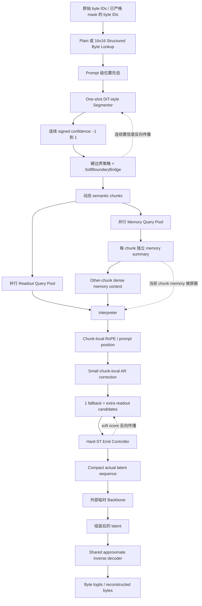
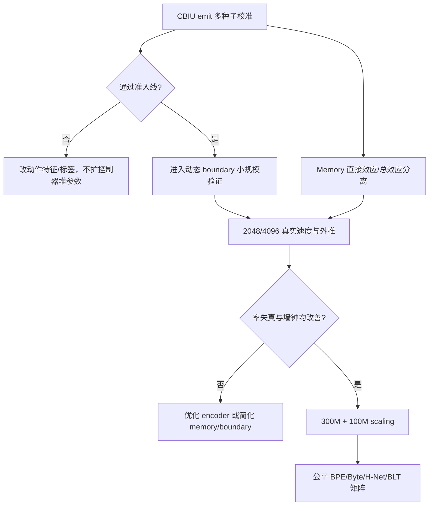

# FLUED 全量研究与工程交接文档

> 更新时间：2026-07-17  
> 项目主体：Alethic Insight  
> 仓库：`E:\projects\FLUED\FLUED`  
> 当前研究版本：FLUED v3.4  
> 文档性质：研究现状、实现口径、实验结论、资产位置和后续决策的单一交接入口
> 2026-07-17 复核修订：依据 07-15 迁移后总报告、07-16 归因矩阵与 CBIU V0，修订 lookup 默认值、decoder blocker 强度、两阶段故障机制、memory 位置/0.05 权重与 CBIU V0 结论（涉及 1.2/3.6/4.1/4.3/4.4/4.8/5.3/5.5/6/7.0/8.2/14.1/15）。

---

## 0. 如何使用本文

本文不是宣传稿，也不是只描述理想架构的设计稿。它回答五类实际问题：

1. FLUED 到底想解决什么，v1 到 v3.4 为什么连续改版；
2. 当前仓库中的 v3.4 实际执行了什么，而不是文档曾经设想过什么；
3. 哪些结论已经有公平实验支撑，哪些只是历史信号或待验证假设；
4. 训练、评估、日志、检查点、归档和环境分别在哪里；
5. 下一位研究者应从哪里继续，什么条件满足后才能升级公开 claim。

发生口径冲突时，按以下优先级判断：

1. **当前代码与测试**：`flued/v34/`、`tools/train/v3_4/`、`tests/`；
2. **带日期的最新实验报告**：尤其是 2026-07-17 的 CBIU 三轮报告；
3. **机器生成的原始 JSON/JSONL、曲线和归档清单**；
4. **本 handoff**；
5. 根目录 `README.md` 和版本索引；
6. 更早的架构草稿、会话记录和历史探索日志。

原因是 FLUED 的设计在短时间内快速迭代，早期文档中的“默认方案”可能已经被后续归因实验否定或降级。

---

## 1. 一页结论

### 1.1 FLUED 的核心目标

FLUED 不是要简单取代 tokenizer，也不只是把 tokenizer 包装成一个神经网络接口。它试图学习一个：

> **从原始字节流到更平滑、上下文相关、可逆连续语义表示空间的语言接口。**

理想状态下：

- 输入仍是无词表依赖的 byte；
- 分段和表达容量由数据驱动，而不是固定词表决定；
- readout latent 面向任意外部 backbone；
- backbone 在更高信噪比、更平滑的潜空间中学习；
- FLUED decoder 能把潜向量准确还原为 byte；
- memory 只作为 FLUED 内部解释上下文的多层次摘要，不向外部 backbone 直接开放；
- 压缩必须对应真实 backbone token 和计算量下降，而不是仅有连续 gate 数值变小。

### 1.2 截至 2026-07-17 的真实状态

| 项目 | 当前判断 |
|---|---|
| v1 最小假设 | 成立：可微 byte 边界与高精度重建可学；历史 E3 曾出现比 BPE 低 18.1% BPB 的强信号，但不是后来公平协议的复现结果。 |
| v2 稳定性 | 成立：三种子重建稳定；但去噪、压缩和边界动力学冲突，公平 D1 中落后 BPE。 |
| v3 严格 latent 接口价值 | 初步成立：v3.2.1 strict masked-source 下，小 backbone 的补全准确率由 byte baseline 的 0.1440 提升至 0.1898。 |
| v3.4 架构完成度 | 已有可运行、可配置、可消融的 38M 探针实现；333M/4096 配置存在，但尚不能称为已验证完整规模结果。 |
| Segmentor | 已是 one-shot DiT 风格上下文模型，不是逐 byte 独立 MLP；硬前向边界通过连续置信度桥接反传。 |
| 位置与顺序 | RoPE 是必要组件；小 AR 头不能替代位置编码，但与 RoPE 联合更合理。 |
| Emit | 硬发声并真实 compact 才是计算门控；soft gate 只缩放表示，不降低 token 数。 |
| Memory | 当前是并行逐 chunk 总结、interpreter 读取其他 chunk memory；其稳定收益尚未证明，仍是实验分支。 |
| Decoder | 当前 shared inverse 是近似共享逆，不是数学上的严格权重反转；decoder 不读 memory。同预算 0.20 latent/byte 下共享逆 21.00%/PPL 43.37，独立 decoder 40.92%/PPL 30.83，共享逆是当前最大 blocker，禁止直接扩 300M。 |
| CBIU | 已验证能学习弱但非随机的 emit 动作价值，并减少实际 backbone latent；尚未达到接管动态 boundary 的校准门槛。 |
| 当前最大风险 | 共享逆 decoder 同预算大幅落后、hard emit 课程前段容量坍缩、联合训练非平稳、边界课程梯度冲击、memory 内容因果性未证实、CBIU 校准不足、长上下文和大规模 scaling 未完成。 |

### 1.3 当前最强的公开证据

1. v2 三种子重建稳定：`eval_acc = 0.9993 +/- 0.0005`。
2. 公平 D1 结果必须诚实表述：BPE-8K 为 `0.8066 BPB`，FLUED v2 为 `0.8732 BPB`，当前公平协议下 FLUED 未击败 BPE。
3. v3.2.1 strict masked-source 是当前最干净的正证据：latent 接口让小 backbone 的 masked-byte 补全准确率提高 `0.0458`，交叉熵降低 `0.2358`。
4. v3.4 CBIU 第三轮 MLP-64 控制器达到 `AUC=0.584`、`Spearman=0.240`、`ECE=0.149`，证明动作效用信号不是纯噪声，但仍低于边界接管准入线。

---

## 2. 研究问题与非目标

### 2.1 研究问题

传统 tokenizer 把离散字符串切为词元，再用固定 embedding 承载大量可能词义。它工程成熟，但存在几类结构限制：

- 词表和切分固定，局部语义变化只能由 backbone 后续纠正；
- byte、字符、词、实体和代码符号的信息密度不同，但 token 预算缺少连续调节；
- 多义词的全部先验集中在同一 embedding 上，可能增加下游优化冲突；
- 词表外实体、多语言、代码和噪声文本的边界不天然统一；
- token 数、KV cache 和接口可逆性之间存在固定折中。

FLUED 的研究问题是：

> 能否在保留 byte 级开放性和可逆性的同时，学习上下文相关的动态语义段，把每段翻译为适合 backbone 学习的连续潜向量，并使真实计算预算可控？

### 2.2 明确非目标

当前 FLUED 不应被描述为：

- 已经全面优于 BPE/BLT/H-Net 的 tokenizer 替代品；
- 已经完成 300M/4096-byte 的稳定 scaling 验证；
- 已经证明切分边界具有语言学自然度；
- 已经证明 memory 一定改善外部 backbone；
- 已经实现完整长上下文推理加速；
- 已经用单一统一目标解决 boundary、emit、memory 和 AR 的所有信用分配。

---

## 3. 版本演进与关键转折

## 3.1 v1：最小假设验证

v1 是 soft boundary autoencoder。它验证了：

- 原始 byte 可以通过可微软切分形成动态单元；
- tied inverse 风格 decoder 可以学习高精度重建；
- 边界概率能从近常数走向非均匀分化；
- FLUED 的基本想法不是不可训练的。

代表结果：

| 指标 | 结果 | 口径 |
|---|---:|---|
| E1v5 重建准确率 | 0.9999 | 历史最小假设实验 |
| m/n | 0.379 | 历史软压缩指标 |
| 边界标准差 | 0.443 | 边界明显分化 |
| 历史 E3 FLUED | 1.2114 BPB | 旧 20K/fixed-token 协议 |
| 历史 E3 BPE | 1.4786 BPB | 同一旧协议 |
| 相对改善 | 18.1% | 仅限该历史协议 |

v1 的核心失败不是模型完全无效，而是“重建很好”不等于“latent 对下游语义任务友好”。短序列还原、固定压缩超参和下游训练口径都存在不足。

## 3.2 v2：去噪与大规模 tied model

v2 扩大到约 328M 参数，引入：

- 24 层 tied encoder/decoder；
- 1024 hidden、16 头；
- SwiGLU；
- 258 词表项：PAD、256 byte、MASK；
- 去噪重建；
- UTF-8、标点、字符类型等边界弱先验。

v2 证明了重建稳定性，但暴露了训练动力学问题：

1. `latent_consistency_weight=0.03` 曾使潜向量一致性均方误差爆炸到百万级；
2. 该梯度主导总损失后，边界概率坍缩到约 0.52 常数；
3. segmentation 失效使 decoder 输入分布突变，随后发生爆炸性遗忘；
4. 将 latent consistency 设为 0 后，纯去噪重新稳定收敛；
5. 去噪比例越高，模型往往倾向于输出更多单元，即重建和压缩目标存在张力；
6. 固定 compression weight 在部分设置下会在约 27K 步触发 NaN。

v2 三种子结果：

| Seed | Eval Acc | m/n |
|---:|---:|---:|
| 42 | 0.9991 | 0.470 |
| 123 | 0.9993 | 0.498 |
| 999 | 0.9996 | 0.491 |

公平 D1，统一为 2048 个原始 byte、100K 步：

| 方法 | BPB | 结论 |
|---|---:|---|
| BPE-8K | 0.8066 | 最佳公平基线 |
| BPE-16K | 0.8165 | 稳定基线 |
| BPE-32K | 0.8205 | 稳定基线 |
| FLUED v2 | 0.8732 | 稳定，但落后 BPE |
| BLT theta=0.3 | 2.3996 | 当前复刻质量不足，不能代表 BLT 上限 |

因此，v1 的历史 18.1% 优势不能覆盖 v2 的公平负结果。

## 3.3 v3/v3.1：从自编码器转向语言编码接口

v3 的思想转变是：

- readout 是给外部 backbone 的当前语义段连续表示；
- memory 是 FLUED 内部对语义段的摘要；
- segmentation、readout、memory 不再被局部重建一个目标全部牵引；
- 需要通过真实下游任务判断 latent 是否让 backbone 更容易学习。

v3.1 引入 active chunk、memory、ROI 可视化和小 backbone 探针。它产生了较清楚的切分热力图和若干 memory 正信号，但后续审计发现部分实验使用 clean encode 或 legacy objective，存在信息泄漏或口径不够严格的问题。

代表性 codec 探针：

| 指标 | 结果 |
|---|---:|
| loss | 6.3395 -> 0.9667 |
| reconstruction | 0.6469 |
| length accuracy | 0.9721 |
| boundary score | 0.9353 |
| units/byte | 0.1170 |

这些数据适合说明“系统能运行并形成可视边界”，不适合证明 memory 或语义质量已经解决。

## 3.4 v3.2/v3.2.1：严格 masked-source 纠偏

最关键的协议修正是：

> 先在原始 byte 输入上 mask，再让 FLUED 编码；FLUED 不能先看到 clean 文本后再遮 readout。

这样避免后续 readout 或 memory 间接泄漏被 mask 内容。严格任务中：

- FLUED encoder 只能翻译已知 byte 与显式 mask；
- backbone 负责补出缺失潜表示；
- decoder 从组装后的 latent 还原 byte；
- 可见 byte 保持率用于检查 backbone 是否破坏已知内容。

结果：

| 路线 | Mask Acc | 相对 byte baseline | CE | CE 改善 |
|---|---:|---:|---:|---:|
| Byte baseline | 0.1440 | - | 3.3782 | - |
| v3.2.1 no-memory | 0.1898 | +0.0458 | 3.1424 | +0.2358 |
| v3.2.1 memory | 0.1897 | +0.0457 | 3.1473 | +0.2308 |

这是当前最强、最干净的 v3-family 正证据：FLUED latent 可以降低一个小 backbone 的补全难度；memory 没有在该协议中形成额外稳定收益。

## 3.5 v3.3：职责边界定型

v3.3 明确了架构职责：

- Segmentor 只看本次 prompt 的 byte/context，不读 memory；
- 当前 chunk 编码为 readout 时可参考过去 memory；
- 当前 chunk 总结后形成 memory，供后续 chunk 使用；
- 当前 chunk 不能读取自己的 memory，避免自循环捷径；
- memory 是 FLUED 内部状态，不直接给 backbone；
- decoder 反向翻译 readout，不依赖 memory。

v3.3 仍保留 chunk 间串行 memory 更新，限制了 prefill 并行度。

## 3.6 v3.4：并行 memory、真实 emit 与统一效用探索

v3.4 的核心改动：

1. 每个 chunk 的 memory 只由本 chunk byte 并行产生；
2. 各 chunk memory 互不自回归依赖；
3. interpreter one-shot 读取其他 chunk memory，屏蔽当前 chunk memory；
4. prompt/局部位置编码和小 AR 修正用于保留顺序（byte lookup 见 4.1 的口径修订）；
5. 每 chunk 生成 1-16 个 readout 候选；
6. fallback readout 永远发声，extra readout 由硬前向、连续反传控制器决定；
7. backbone 只处理 compact 后真实发声的 latent；
8. shared inverse decoder 只反向翻译 readout，不读 memory；
9. CBIU 开始尝试用任务风险增量统一监督 emit 决策。

v3.4 并没有推翻 v3.3 的语言接口目标，而是把 prefill 内部状态从串行历史队列改为可并行的全局摘要集合。

---

## 4. 当前 v3.4 实际架构



### 4.1 Byte 输入

仓库同时保留两种入口：

- `PlainByteLookup`：传统离散 byte embedding；
- `StructuredByteLookup`：把 256 个 byte 映射到 16x16 结构坐标，再投影为模型表示。

**2026-07-17 复核修订**：structured lookup 的优势只来自 5K 结构消融（0.597 vs 0.436 identity）；07-15 修正版同预算 20K 实验中普通 lookup 反超（重建 26.06%/PPL 46.62 vs 21.50%/48.54），07-15 迁移后总报告已将默认改为**普通 byte lookup**。但 `configs/v3_4/v34_default_38m_20k.json` 仍为 `use_structured_lookup=true`，属于 canonical 配置与最新证据不一致的已知遗留（见 14.2），下一次正式训练前应显式决定。CBIU 三轮从 plain lookup 历史检查点续训，与该默认一致。

### 4.2 Segmentor

当前 Segmentor 是 one-shot DiT-style 上下文模块，而不是逐 byte 独立 MLP。它：

- 接收当前 prompt 的 byte 表示和位置先验；
- 不读取 memory；
- 输出 `[-1, 1]` 连续边界置信度；
- UTF-8 continuation byte 被强约束为不可切分；
- 标点获得偏正的弱先验；
- 普通字符级可切位置均值鼓励接近中性；
- 推理前向使用硬边界；
- 训练反向通过连续置信度和 `SoftBoundaryBridge` 塑形。

默认语义阈值：

- `tau_cut = 0.9`：chunk 切分；
- `tau_trans = 0.75`：chunk 内逻辑转折弱标记；
- `max_span = 128`：极端情况下强制切分，防止无限长 chunk。

历史实验显示逻辑转折标记的独立收益较弱。它仍存在于实现中，但不应被宣传为已验证核心贡献。

### 4.3 Boundary 的课程与编码率

当前 38M 推荐配置采用：

1. 0-3K：均匀边界预热，让 byte-readout-decoder 先建立对齐；
2. 3K-5K：从均匀边界逐步混合到置信度/边际编码率路径；
3. 5K 后：动态边界主导。

现有 `exact/diag/l2` 编码率实现均属于边际信息启发式。当前经验上 L2/对角近似比早期精确行列式更易训练，但不能把它等同于 ByteFlow 原始定义的完整复现。

已定位的问题是：课程切换前 Segmentor 主任务梯度可能接近 0；动态接管后梯度会突然高于 readout/backbone 一个数量级。边界坍缩并非简单欠训练，而是信用分配突变。

**2026-07-17 复核修订（07-16 归因矩阵，两阶段故障）**：坍缩不是单一事件。第一阶段发生在边界切换**之前**：hard emit 在 2.5K（uniform 边界，重建 81.13%、0.934 latent/byte）到 4.0K（仍为 uniform 边界，重建 21.00%、0.117 latent/byte）之间已把有效表达容量压垮；第二阶段才是 6K 动态边界接管后的 Segmentor 梯度冲击（原始梯度均值 1010、峰值 121391、211 次超过 1000）。40K 延长训练与 500 步短过渡均不能恢复，排除欠训练解释。结论是 hard emit 与动态边界是两个连续发生、必须分别处理的问题，建议课程拆为四条：codec 对齐 / emit 容量 / 边界前向 / 边界梯度（见 15.2 修订）。

### 4.4 Parallel Memory

每个 chunk 的 memory：

- 只读取该 chunk 的 byte 内容；
- 与其他 chunk 的 memory 并行生成；
- 不读取全文，也不读取其他 memory；
- 不形成 AR memory 队列；
- interpreter 读取其他 chunk memory 时屏蔽当前 chunk memory。

当前 memory 路径可选：

- `none`：不读 memory；
- `other_only`：只读其他 chunk memory，当前首选研究分支；
- current-memory 相关分支：用于消融，不是默认可信结论。

memory 可以采用 chunk-index RoPE 或基于原始 byte anchor 的双向 ALiBi。当前尚无充分证据证明哪种位置注入在长上下文中稳定占优。

**2026-07-17 复核修订**：07-16 归因矩阵确认当前实际运行为 `memory_use_position=false`，即 memory cross-attention **没有任何位置编码，是无位置集合**。因此"样本内 chunk 换序不改变结果"是置换不变性的数学必然，不能用来否定 memory 语义；反过来，无序集合对有序事件/代码的建模能力存疑，byte-anchor 有序化是待验证分支。另有工程观察：memory summarizer 原始范数从 5K 的约 92 膨胀到 20K 的约 1850，被 LayerNorm 完全掩盖，长训练尺度稳定性未闭环。

必须区分三件事：

1. memory gate/注意力比例不等于 memory 内容有用；
2. memory 改变 emit 数量可能间接改善指标，不等于 memory 直接提供语义；
3. 只有 zero/shuffle/stale/patching 等干预和同预算 fresh-backbone 对比，才能判断因果贡献。

### 4.5 Interpreter 与 Readout

Interpreter 是 FLUED 的核心翻译器：

- 输入当前 chunk 的 byte 表示、切分信息和其他 chunk memory context；
- one-shot 并行解释所有 chunk；
- 每 chunk 产生多个 readout 候选；
- readout 是给外部 backbone 的表示，memory 不直接暴露给 backbone。

当前探针默认最多 16 个 readout 候选。第一个 fallback 永远开启，其余为 extra readout。这样不会出现空 chunk，同时允许高信息密度片段使用更多表达容量。

### 4.6 位置编码与小 AR 头

已得到较清楚的结构结论：

- 无位置、无 AR：顺序恢复明显失败；
- 只有 RoPE：大幅改善；
- 只有小 AR：几乎不能替代位置编码；
- RoPE + 小 AR：当前更合理的联合方案。

小 AR 头来自 DSpark 式“并行主体 + 轻量串行修正”的思想，但当前实现是 chunk 内窄 GRU 修正，多个 chunk 仍可并行。它用于修复局部字节顺序，不应扩张为第二个大型 backbone。

### 4.7 Emit Controller

Emit 必须区分：

- **表达门控**：连续 gate 只缩放向量；
- **计算门控**：硬决定哪些 extra readout 真正进入 compact backbone 输入。

v3.4 使用硬前向、连续直通反传：

- fallback slot 必开；
- extra slots 根据 emit score 与阈值决定；
- hard mask 决定实际 backbone latent 数；
- soft score 提供梯度；
- 同时记录 `soft_readout_units_per_byte` 与 `actual_backbone_units_per_byte`。

当前控制器支持：

- 线性头；
- MLP-64；
- MLP-64 + slot embedding。

CBIU 第三轮后，MLP-64 是下一轮默认候选，但代码为了兼容旧实验仍保留 legacy 默认值。

### 4.8 Decoder

当前 `SharedInverseSpanDecoder`：

- 不读取 memory；
- 复用 interpreter block 和 readout pool 权重，按相反顺序近似执行；
- 不额外训练一套完整 decoder；
- 不是严格可证明的矩阵逆或完全 tied transpose；
- 仍可能在联合训练中与 encoder 发生梯度竞争。

**2026-07-17 复核修订**：07-15 迁移后总报告已将共享逆定性为**当前最大 blocker，禁止直接扩 300M**。同预算约 0.20 latent/byte 时：共享逆重建 21.00%/PPL 43.37，独立 decoder 重建 40.92%/PPL 30.83；独立 decoder 自身工作点达 48.08%/13.97% 补全/0.383 latent/byte。优势并非多发 latent 造成。冻结 readout 探针显示共享逆函数形态未失效（1K 可拟合至 56.28%），问题集中在联合训练非平稳；07-16 归因矩阵建议 decoder 预热、交替更新或梯度缩放，而不是继续全量同步反传。

“shared inverse”必须在论文和文档中写成**近似共享逆**，不能声称严格反转。

### 4.9 外部 Backbone

仓库中的 4.8M 或规划 107M backbone 是训练探针，不是 FLUED 产品绑定的主干。其作用是：

- 评估 latent 是否比 byte 更容易补全；
- 让下游困惑度/交叉熵梯度共同塑造 FLUED；
- 检查真实 latent 数与主干计算成本。

实际使用时可以冻结 FLUED，重新训练 billion/trillion 级 backbone。FLUED 的目标是通用语言接口，而不是把临时主干永久打包进 codec。

---

## 5. 训练任务、监督信号与梯度归属

### 5.1 三条主任务

| 任务 | 输入 | 目标 | 主要作用 |
|---|---|---|---|
| Identity / reconstruction | clean byte | 完整 clean byte | 保证 readout 可逆和局部细节完整 |
| Strict masked completion | 先在原始 byte 上 mask，再经 FLUED/backbone/decoder | 只对被 mask 位置补全 | 检验 latent 是否让 backbone 更易预测缺失内容 |
| Visible-byte preservation | 同 strict masked 输入 | 未 mask byte 保持不变 | 防止 backbone 在补缺失内容时破坏已知上下文 |

当前 canonical 权重为：

- identity：1.0；
- completion：2.0；
- preservation：0.5；
- mask 比例：5%；
- span 长度：1-8 byte。

实时困惑度来自 masked completion 的交叉熵，直接进入主损失并同时更新临时 backbone 与 FLUED。这里的目标不是让 FLUED 自己变成 next-byte LM，而是让潜空间对标准补全任务友好。

### 5.2 Boundary 专用信号

| 信号 | 更新对象 | 说明 |
|---|---|---|
| UTF-8 continuation 约束 | Segmentor | continuation byte 置信度接近 -1，绝不切分 |
| 标点弱先验 | Segmentor | 鼓励标点附近置信度偏正，但不是硬规则 |
| 普通字符中性先验 | Segmentor | 排除 continuation/标点后，字符级边界均值接近 0 |
| 边际编码率对齐 | Segmentor | 判断新位置是否增加表示方向 |
| 主任务软桥 | Segmentor | 通过连续置信度接收重建/补全反馈 |
| 计算/密度约束 | Segmentor | 历史路径，尚未稳定统一为最终目标 |

绝不能恢复 v2 那种让高权重重建或潜向量一致性直接支配所有边界的做法。

### 5.3 Memory 信号

当前 memory 的内容不使用直接“复制 readout”监督，因为低维表示的信息量不能由维度或均方误差直接判断。现有信号包括：

- 主任务梯度缓慢塑形；
- 可选 memory 注意力使用比例约束；
- zero/shuffle/stale/patching 干预分析；
- readout 与 memory 的注意力和残差范数记录。

曾经存在 `memory_usage_loss_weight=0.05` 的正信号，但它只能证明模型被迫使用 memory 后率失真可能变化，不能证明 memory 内容是语义摘要。当前 canonical 38M 配置将该权重设为 0，memory 继续作为待归因分支。

**2026-07-17 复核修订**：07-16 归因矩阵（3×20K + 严格 no-memory 对照）给出更细结论：权重 0 时 PPL 恶化 0.876、重建下降 2.72pp；权重 0.02 时 PPL 改善 0.528 但 latent 增加 13.7%；**权重 0.05 是唯一推进率失真前沿的候选**（PPL 改善 0.809、actual latent 降低 6.4%、重建仅降 0.26pp），已被列为候选默认，no-memory 保留为每轮严格对照。该结论为单种子 20K，需多种子与 2048/4096 确认后才能升级为架构结论。

后续如需比较 memory/readout 内容，应训练独立小翻译器或探针，分析实体、指代、变量名和主题信息，而不是直接比较向量维度或余弦相似度。

### 5.4 AR 信号

小 AR 头通过局部修正量和可选 `ar_delta_loss_weight` 受控。它必须满足：

- 只做小修正，不能成为主要生成器；
- 与 RoPE 联合存在；
- 记录修正前后重建和补全差值；
- 参数占比和串行延迟必须单独报告。

### 5.5 Emit 的 Legacy 信号

旧 emit value 由：

- 移除额外 readout 后的重建/补全损失增量；
- 编码率收益；
- 固定计算成本；

共同构造。它的问题是动作标签受主体当前状态影响，概率校准接近随机，容易把高熵噪声或细节复制当作价值。

**2026-07-17 复核修订（results 原始日志）**：20K 训练末期 `emit_value_mean` 退化到约 0（P4-B 终态约 -0.002，target 约 0.497），即 legacy 价值监督最终只学到均值基线、不再区分 slot 价值。这是 CBIU 替换 legacy target 的直接经验动机之一。

### 5.6 CBIU：统一效用信号

CBIU 在当前仓库中指基于反事实风险增量的 emit 动作效用。对每个 `(sample, chunk, extra slot)`：

1. 计算 rich/full-action 与 null/minimal-action 固定锚点；
2. 评估 clean reconstruction、strict masked completion、visible preservation 三项 BPB 风险；
3. 用锚点归一化各风险，避免不同量纲互相支配；
4. 取最差风险作为质量瓶颈；
5. 测量移除当前 action 后风险恶化量；
6. 减去真实计算成本的对偶价格；
7. 用连续效用训练 emit score，硬动作仍决定真实 compact。

形式上可写为：

```text
normalized_risk_k = (risk_k - rich_anchor_k) / (null_anchor_k - rich_anchor_k)
quality_risk      = max_k(normalized_risk_k)
utility(action)   = risk_without_action - risk_with_action - lambda_compute * cost(action)
```

CBIU 当前只在线接入 emit。它还没有接管 boundary、memory 或小 AR，原因是动作校准尚未达到准入线。

---

## 6. v3.4 已验证结构结论

| 架构细节 | 当前结论 | 证据强度 | 后续处理 |
|---|---|---|---|
| DiT-style Segmentor | 必须保留上下文建模；逐 byte MLP 不符合设计 | 代码审计 + 测试 | 保留 |
| 硬边界 + 连续桥接 | 方向正确，但课程切换会造成梯度冲击 | 5K/20K 归因 | 保留并改平滑课程 |
| 固定均匀边界 | 易训练、重建上限高，但几乎不压缩 | 5K/20K | 仅作为预热/上限对照 |
| L2/对角边际率 | 比早期精确率更均衡，后期有反超趋势 | 5K/20K | 作为动态边界候选 |
| RoPE | 对顺序恢复是必要组件 | 位置/AR 四组消融 | 默认开启 |
| 小 AR 单独使用 | 不能替代位置编码 | 四组消融 | 不单独使用 |
| RoPE + 小 AR | 当前最佳结构组合方向 | 四组消融 | 保留，仍需长程确认 |
| 16x16 structured lookup | 5K 消融优于 plain（0.597 vs 0.436 identity），但 07-15 修正版 20K 同预算被 plain 反超（26.06%/46.62 vs 21.50%/48.54） | 5K 结构消融 + 20K 修正版 | **当前默认 plain lookup**；canonical 配置尚未同步（见 8.2） |
| Soft emit | 不减少实际 token，不是计算门控 | 直接实现与日志 | 淘汰为部署方案 |
| Hard-ST emit | 可真实 compact backbone 输入；但课程前段即造成容量坍缩（4.0K 重建 81%→21%，先于边界切换） | 测试 + runtime probe + 07-16 归因矩阵 | 保留；emit 容量课程必须与边界课程解耦 |
| Emit value supervision | 关闭后重建显著下降 | 5K 消融 | 需要，但 legacy 标签需替换/校准 |
| Memory | 可改善部分重建或率失真，但补全收益不稳定 | 多轮 5K/20K | 可选分支，不能强 claim |
| Current-memory | 容易形成自循环捷径，早期快但后期平台低 | 20K 对比 | 非默认 |
| Other-only memory | 更符合信息隔离，当前更安全 | 代码审计 + 20K | 研究默认 |
| Decoder 近似共享逆 | 同预算大幅落后独立 decoder（21.00%/43.37 vs 40.92%/30.83），函数形态未失效，问题在联合优化 | 07-15 同预算 20K + 冻结 readout 探针 | **当前最大 blocker**；预热/交替更新/梯度缩放对照，禁止直接扩 300M |
| 去噪全程固定 | 短期损害重建，对补全可能有帮助 | 消融 | 应课程退火，不固定全程 |
| 只做重建 | 不能自动产生主干友好 latent | v1、v3.4 codec-only | 明确淘汰 |

---

## 7. CBIU 三轮实验完整结论

归档根目录：`K:\FLUED_archive\v34_cbiu_three_rounds_20260717`

### 7.0 前置：V0 离线验证（2026-07-16，冻结 m2 20K 检查点）

归档：`L:\FLUED_archive\v34_cbiu_v0_20260716`。在正式三轮之前，CBIU 先在冻结检查点上完成配对干预验证：

- 三风险 rich/null 锚点在所有被测检查点上有效分离（rich rho=0.00、null=1.00、policy=0.40）；
- **small AR 是最强正向组件**：总效应 +0.82，固定 emit 后直接效应 +0.73，no-memory 对照上 +1.22，证明其价值不是来自多开 readout 或 memory 替代；
- **定位 memory→emit 容量中介混淆**：stale memory 总效应为 -0.17（表面改善），但它把 readout/byte 从 0.17 抬到 0.19；固定 emit 后 stale 变为 +0.01、zero/skip 为 +0.03。正确 memory 只有弱正直接效用，旧 memory on/off 结论混入了容量中介；
- 槽位价值分化：slot 8/15 保留效用 +0.094/+0.123，slot 1/4/12 接近零；m2 上 Brier 0.2145、符号准确率 80%，但跨四检查点 pilot 符号准确率仅 20-60%，证明 legacy emit controller 未学会价值，CBIU 替换有必要性。

### 7.1 第一轮：联合训练 5K

| 实验 | 重建准确率 | 补全准确率 | PPL | 保持准确率 | 实际 latent/byte | 重建/补全/保持 BPB |
|---|---:|---:|---:|---:|---:|---|
| Legacy | 0.21001 | 0.12032 | 42.086 | 0.15189 | 0.23232 | 3.937 / 5.481 / 4.551 |
| CBIU quality | 0.21085 | 0.12217 | 42.495 | 0.14701 | 0.17406 | 3.976 / 5.568 / 4.604 |
| CBIU dual | 0.21004 | 0.12054 | 42.478 | 0.15093 | 0.19307 | 3.967 / 5.575 / 4.633 |

结论：CBIU 在联合训练中显著降低 latent 数，但三项风险略差。主要问题是主体表示和控制器同时变化，反事实标签非平稳，不能据此直接判定 CBIU 无效。

### 7.2 第二轮：冻结主体，只训练 emit 3K

线性控制器共 1,537 参数。动作校准集 950 个样本：

| 实验 | Spearman | AUC | Brier | ECE | 同号率 |
|---|---:|---:|---:|---:|---:|
| Legacy | 0.165 | 0.497 | 0.246 | 0.192 | 0.519 |
| CBIU quality | 0.189 | 0.528 | 0.243 | 0.186 | 0.572 |
| CBIU dual | 0.197 | 0.533 | 0.245 | 0.156 | 0.554 |

结论：严格 CBIU 标签包含弱但真实的排序信号；线性头容量不足，尚不能接管 boundary。

### 7.3 第三轮：控制器容量

| 控制器 | 参数 | latent/byte | BPB: recon/fill/keep | Spearman | AUC | Brier | ECE | 同号率 |
|---|---:|---:|---|---:|---:|---:|---:|---:|
| Linear | 1,537 | 0.12877 | 3.816 / 5.455 / 4.423 | 0.161 | 0.544 | 0.245 | 0.171 | 0.576 |
| MLP-64 | 33,921 | 0.13879 | 3.792 / 5.439 / 4.341 | 0.240 | 0.584 | 0.241 | 0.149 | 0.603 |
| MLP-64 + slot | 42,113 | 0.13118 | 3.796 / 5.437 / 4.340 | 0.251 | 0.582 | 0.241 | 0.164 | 0.613 |

当前候选：**MLP-64，不加 slot embedding**。原因是它在 AUC、ECE、简洁性之间最均衡；slot 版本只在 Spearman/同号率上略高。

### 7.4 边界接管准入线

CBIU 进入 dynamic boundary 前，至少要求多种子结果满足：

- Spearman >= 0.30；
- AUC >= 0.65；
- ECE <= 0.10；
- 同号率 >= 0.65。

当前最佳 `0.240 / 0.584 / 0.149 / 0.603`，未通过。

**2026-07-17 晚多种子复核（3 train seeds × 3 mask seeds，MLP-64）**：CBIU dual 均值 `0.184 / 0.546 / 0.166 / 0.594`，legacy 均值 `0.137 / 0.497 / 0.176 / 0.512`；18/18 cell 无一过线，但 9/9 配对 cell 上 CBIU 全部优于 legacy。结论：信号弱而真实、跨种子稳定、控制器容量不是瓶颈；下一步改动作特征与标签方差估计，boundary 接管无限期搁置。详见 followup 报告实验 B。

### 7.5 Runtime

RTX 5080，batch=8，seq_len=512：

| 路线 | 活跃 latent/byte | 每样本最大 latent | Encoder ms | Compact ms | Backbone ms | Decoder ms | 总计 ms |
|---|---:|---:|---:|---:|---:|---:|---:|
| Round1 Legacy | 0.1858 | 186 | 33.774 | 0.270 | 1.319 | 7.338 | 42.853 |
| Round3 MLP-64 | 0.1189 | 92 | 33.763 | 0.282 | 1.390 | 7.371 | 42.883 |

CBIU 已证明真实主干输入缩短，但当前临时 backbone 仅占约 1.4 ms，encoder 占约 79%，decoder 占约 17%，所以尚无端到端墙钟加速。只有在更大 backbone 或更长序列下，latent 压缩的收益才可能显现。

### 7.6 CBIU 现在能和不能说明什么

已经说明：

- 动作级效用标签不是纯噪声；
- MLP-64 比线性头更适合拟合该效用；
- hard emit 可以真实减少主干 latent；
- 联合训练存在明显共适应非平稳性；
- 控制器容量是瓶颈之一，但不是唯一瓶颈。

尚未说明：

- CBIU 可以取代边际编码率直接决定边界；
- CBIU 能统一监督 memory 和小 AR；
- 更少 latent 一定带来大模型更低 BPB；
- 更低风险对应更自然的语言学分段；
- 300M FLUED 上仍保持同样趋势。

---

## 8. 当前推荐配置与三个容易混淆的“默认值”

### 8.1 代码默认值

`FLUEDV34ProbeConfig` 和训练 CLI 的默认值主要为兼容历史测试，不代表当前最终研究推荐。例如：

- `readout_vectors=4`；
- `use_emit_controller=false`；
- `boundary_mode=threshold`；
- `decoder_mode=legacy_independent`；
- `emit_target_mode=legacy`。

直接不带 config 启动，不会得到当前完整推荐架构。

### 8.2 当前 38M/512/20K canonical 探针

配置：`configs/v3_4/v34_default_38m_20k.json`

关键设置：

- seq_len 512，stride 256，batch 8，20K；
- d_model 512，8 heads，FFN 1536；
- Segmentor 5 层，Interpreter 3 层；
- memory rank 4；
- 每 chunk 16 个 readout 候选；
- structured lookup（**注意**：与 07-15 修正版结论不一致，plain lookup 才是最新默认，下次正式训练前应显式决定，见 4.1）；
- prompt ALiBi + local RoPE；
- small AR hidden 128；
- other-only memory，LayerNorm，residual 0.1；
- 0-3K uniform，3K-5K 过渡到动态边界；
- hard-ST emit；
- shared approximate inverse decoder；
- 5% strict byte mask；
- fused AdamW，lr 2e-4；
- 约 38.3M FLUED + 4.78M 临时 backbone。

注意：此配置仍用 legacy emit target。CBIU MLP-64 尚未经过多种子验证，不能悄悄覆盖 canonical。同理，07-16 归因矩阵的 memory 使用率权重 0.05 候选默认也尚未进入此配置（当前为 0）。

### 8.3 333M/4096/50K 规划配置

配置：`configs/v3_4/v34_full_333m_backbone_107m_4096.json`

计划设置：

- seq_len 4096，batch 1，50K；
- d_model 1024，16 heads，FFN 3072；
- Segmentor 8 层，Interpreter 12 层；
- memory rank 8；
- readout 16；
- AR hidden 512；
- max_chunks 256；
- 临时 backbone 约 107M。

这是**规划入口，不是已完成结果**。当前不应声称“v3.4 300M full model 已训练并验证”。

### 8.4 CBIU 三轮实验配置

- Round1：`configs/v3_4/v34_cbiu_round1_emit_5k.json`；
- Round2：`configs/v3_4/v34_cbiu_round2_emit_only_3k.json`；
- Round3：`configs/v3_4/v34_cbiu_round3_controller_capacity_3k.json`。

这些实验从旧 20K plain-lookup checkpoint 续训或冻结训练，目的只是隔离 emit objective/controller，不是完整架构重训。

---

## 9. 数据集与数据协议

### 9.1 当前主语料

主语料：

```text
E:\projects\SoulMamba\soulvlm_project\temp\corpus_v3.txt
```

已知规模：

- 23,777,636,695 bytes；
- 约 22.14 GiB；
- 历史统计约 123M 行。

训练入口支持二进制流式随机 chunk，避免把 22GB 文本加载到内存。v3.4 现有大部分探针使用固定 512 byte、stride 256。4096-byte 外推仍需要正式训练和评估。

### 9.2 corpus v4

仓库存在：

```text
tools/data/build_corpus_v4.py
```

以及部分 v3.3/full 配置，但 corpus v4 还不是当前 v3.4 已完成实验的统一主语料。handoff 后续执行者必须在实验表中明确写 `corpus_v3` 或 `corpus_v4`，不能只写“全量语料”。

### 9.3 Strict mask 协议

- mask 必须在 FLUED 接触输入前作用于原始 byte；
- 不按 clean segment 先编码再遮 readout；
- mask 默认 5%，span 1-8 byte；
- 评估时固定 data seed 和 mask seed；
- visible preservation 与 masked completion 分开报告；
- completion PPL 必须说明是在 byte 位置还是 latent 位置计算。

---

## 10. 仓库结构与关键文件

```text
E:\projects\FLUED\FLUED\
├── README.md
├── AGENTS.md
├── FLUED_HANDOFF_20260717_CN.md       # 本文
├── pyproject.toml
├── flued/
│   ├── model.py                       # v2 主模型
│   ├── e1_stage_a.py                  # v2 E1 训练支持
│   ├── v33/                           # v3.3 原型
│   └── v34/
│       ├── model.py                   # v3.4 实际架构
│       └── rate_emit.py               # 编码率与 emit controller
├── tools/
│   ├── train/v3_4/
│   │   ├── train_v34_pos_ar_probe.py  # v3.4 主训练入口
│   │   └── cbiu.py                    # CBIU 状态、锚点与效用
│   ├── launcher/v3_4/                 # 矩阵启动器
│   ├── analysis/v3_4/                 # ROI、归因、CBIU、runtime 分析
│   └── data/                           # 语料构建工具
├── configs/v3_4/                      # 单实验和矩阵配置
├── docs/
│   ├── research/                      # 研究回顾与研究谱系
│   └── versions/v3.4/                 # v3.4 设计、审计、实验报告
├── results/v3.4/                      # 可公开的小型原始日志与曲线
├── tests/                              # 当前 118 个 pytest case
├── checkpoints/                        # 本地历史检查点，不是整洁发布目录
├── bpe_baseline/
└── blt_baseline/
```

### 10.1 v3.4 文档阅读顺序

1. 本文；
2. `docs/versions/v3.4/README.md`；
3. `FLUED_V3_4_IMPLEMENTATION_BASELINE_CN.md`；
4. `FLUED_V3_4_ARCHITECTURE_GRADIENT_DECISION_TRACE_CN.md`；
5. `FLUED_V3_4_FULL_SELF_AUDIT_20260714_CN.md`；
6. `FLUED_V3_4_CORE_CORRECTION_AND_RERUN_20260714_CN.md`；
7. `FLUED_V3_4_ATTRIBUTION_MATRICES_RESULTS_20260716_CN.md`；
8. `FLUED_V3_4_CBIU_DESIGN_AND_VALIDATION_PLAN_20260716_CN.md`；
9. `FLUED_V3_4_CBIU_THREE_ROUND_RESULTS_20260717_CN.md`；
10. `FLUED_V3_4_FOLLOWUP_EXPERIMENTS_20260717_CN.md`（decoder 解耦、CBIU 多种子、emit 容量课程三组后续实验）。

早于 2026-07-14 的 v3.4 报告仍有研究价值，但可能描述被后续修复的实现，必须和 correction/self-audit 一起阅读。

---

## 11. 检查点、日志与归档

### 11.1 K 盘

最新 CBIU 完整归档：

```text
K:\FLUED_archive\v34_cbiu_three_rounds_20260717
```

内容包括：

- 三轮正式日志与检查点；
- `three_round_summary.json/csv/md`；
- 三张训练曲线；
- runtime、action calibration 和离线策略结果；
- 正式 CBIU 报告副本；
- SHA256 manifest。

已校验：

- manifest 中 118 个正式文件全部通过 SHA256；
- 非 smoke/dry-run 归档约 11.73 GiB；
- 若计入 smoke 检查点，共 48 个 `.pt`，约 13.23 GiB；
- 2026-07-17 时 K 盘剩余约 309 GB。

其他重要目录：

```text
K:\FLUED_archive\v2_final_seeds
K:\FLUED_archive\v3_strict_backbone_full_table_20260703
K:\FLUED_archive\v32_strict_backbone_20260703_masked_codec_15k
K:\FLUED_archive\v3_checkpoint_audit_20260703
K:\FLUED_archive\v31_language_codec_2m_20260702
```

历史文档曾记录公平 D1 云端归档为：

```text
K:\FLUED_archive\cloud_5090_D1_20260610
```

但 2026-07-17 路径核验时该目录在当前 K 盘挂载中不存在。D1 汇总指标仍镜像在根目录
`README.md` 和研究回顾中，但在找到原始日志/checkpoint 的新位置前，不能把上述旧路径写成现存资产，
也不能据此执行清理。该目录可能在此前硬盘迁移中被移动，属于待重新定位的归档缺口。

### 11.2 L 盘

硬盘迁移后的 v3.4 中期实验主要在：

```text
L:\FLUED_archive\v34_attribution_matrices_20260716
L:\FLUED_archive\v34_cbiu_v0_20260716
L:\FLUED_archive\v34_memory_usage_supervision_20k_20260715
L:\FLUED_archive\v34_boundary_schedule_40k_20260715
L:\FLUED_archive\v34_attribution_20260715
L:\FLUED_archive\v34_decoder_rate_final_20k_20260715
L:\FLUED_archive\v34_memory_final_20k_20260715_rerun
L:\FLUED_archive\v34_lookup_emit_5k_20260715_rerun
```

### 11.3 X 盘

X 盘曾计划承接早期大体积检查点，但当前审计时没有形成可依赖的主归档。不要把“计划迁移”写成“已经归档”。

### 11.4 仓库内 checkpoints

`checkpoints/` 当前约：

- 65 个 `.pt`；
- 78.94 GB；
- 以 v2/v3 历史探索为主。

这不是整洁的发布目录。删除前必须先按 SHA256 与 K/L 盘归档比对，不能按文件名猜测。

---

## 12. 环境与复现

### 12.1 推荐环境

- Windows 11 / PowerShell；
- Conda 环境：`soulvlm`；
- Python 3.11+；本机 GPU 环境实际为 Python 3.12；
- PyTorch CUDA 12.8 开发版，用于 RTX 5080；
- GPU：RTX 5080 16GB；
- `numpy>=2.0`、`tokenizers>=0.20`、`torch>=2.6`、`tqdm`；
- 分析依赖：`matplotlib`；
- 测试依赖：`pytest`。当前 `soulvlm` 环境未安装 pytest，本机完整测试使用独立 Python 3.14 环境。

Windows 上建议：

```powershell
$env:KMP_DUPLICATE_LIB_OK = "TRUE"
$env:OMP_NUM_THREADS = "4"
$env:MKL_NUM_THREADS = "4"
```

本机 `python` 与 `py` 指向不同解释器。GPU 工作优先使用：

```powershell
conda run -n soulvlm python ...
```

### 12.2 测试

```powershell
Set-Location E:\projects\FLUED\FLUED
$env:KMP_DUPLICATE_LIB_OK = "TRUE"
py -3.14 -m pytest -q
```

最近一次完整结果：

```text
118 passed, 28 warnings
```

warning 主要来自 PyTorch nested tensor，不是测试失败。若后续选择在 `soulvlm` 中统一测试，需先显式安装
pytest；不要把 `No module named pytest` 误判为代码回归。

### 12.3 38M/20K canonical 训练

```powershell
conda run -n soulvlm python tools/train/v3_4/train_v34_pos_ar_probe.py `
  --config configs/v3_4/v34_default_38m_20k.json `
  --data-path E:\projects\SoulMamba\soulvlm_project\temp\corpus_v3.txt `
  --out-dir outputs/v34_default_38m_20k
```

配置文件中的 `data/corpus.txt` 是占位符，正式运行必须显式传真实 `--data-path`。

### 12.4 矩阵训练

```powershell
conda run -n soulvlm python tools/launcher/v3_4/run_v34_pos_ar_matrix.py `
  --matrix configs/v3_4/v34_position_ar_5k.json `
  --data-path E:\projects\SoulMamba\soulvlm_project\temp\corpus_v3.txt `
  --out-root outputs/v34_position_ar_5k
```

先用 `--dry-run` 检查覆盖参数和输出目录。

### 12.5 CBIU 汇总与分析

```powershell
conda run -n soulvlm python tools/analysis/v3_4/summarize_v34_cbiu_three_rounds.py `
  --archive-root K:\FLUED_archive\v34_cbiu_three_rounds_20260717
```

动作校准与运行时入口：

```text
tools/analysis/v3_4/probe_v34_cbiu_action_calibration.py
tools/analysis/v3_4/probe_v34_cbiu_runtime.py
tools/analysis/v3_4/probe_v34_cbiu.py
```

### 12.6 训练日志和检查点要求

正式实验至少保存：

- 每 20-100 步训练指标；
- 3K/6K/9K/12K/15K/18K/20K 或等比例 milestone；
- `latest.pt` 与最终 checkpoint；
- config 快照；
- Git commit 和 dirty diff；
- data path、文件大小、可选 hash；
- train seed、eval mask seed；
- GPU、PyTorch、CUDA、精度、batch、梯度累积；
- actual/soft latent 数；
- 重建、补全、保持三个独立指标；
- 墙钟吞吐与分模块 runtime。

---

## 13. 当前 Git 与发布状态

审计时：

```text
branch: copilot/implement-stage-a-experiments
HEAD:   658fd67 docs: add research lineage and CTM-OCR trigger
remote: https://github.com/wdd9700/FLUED.git
status: local ahead of origin by 2 commits
```

当前未提交的已跟踪修改：

```text
docs/versions/v3.4/README.md
flued/v34/model.py
flued/v34/rate_emit.py
tests/test_v34_architecture.py
tools/launcher/v3_4/run_v34_pos_ar_matrix.py
tools/train/v3_4/train_v34_pos_ar_probe.py
```

当前未跟踪的 CBIU 文件：

```text
configs/v3_4/v34_cbiu_round1_emit_5k.json
configs/v3_4/v34_cbiu_round2_emit_only_3k.json
configs/v3_4/v34_cbiu_round3_controller_capacity_3k.json
docs/versions/v3.4/FLUED_V3_4_CBIU_DESIGN_AND_VALIDATION_PLAN_20260716_CN.md
docs/versions/v3.4/FLUED_V3_4_CBIU_THREE_ROUND_RESULTS_20260717_CN.md
docs/versions/v3.4/FLUED_V3_4_CBIU_V0_RESULTS_20260716_CN.md
tests/test_v34_cbiu.py
tools/analysis/v3_4/probe_v34_cbiu.py
tools/analysis/v3_4/probe_v34_cbiu_action_calibration.py
tools/analysis/v3_4/probe_v34_cbiu_runtime.py
tools/analysis/v3_4/summarize_v34_cbiu_three_rounds.py
tools/train/v3_4/cbiu.py
```

因此当前状态是：**代码和实验已验证，但 CBIU 工作尚未 commit/push。** 下一次提交前必须：

1. 再跑完整测试；
2. 检查 `git diff --check`；
3. 确认没有 checkpoint、语料或密钥进入 Git；
4. 将本 handoff 和 CBIU 工作作为清晰提交；
5. push 后核对远端 commit，而不是只相信本地命令返回。

---

## 14. 已知问题与阻塞项

### 14.1 设计问题

1. **Boundary 信用分配仍非平稳**：均匀预热期梯度弱，动态接管时 Segmentor 梯度突增；且 07-16 矩阵确认 hard emit 在边界切换前已先行压垮容量，两阶段故障必须分别处理。
2. **CBIU 校准不足**：已有弱信号，但未达到 boundary 准入线。
3. **Memory 因果价值未闭环**：使用率、注意力比例和内容贡献仍混在一起；当前 memory 是无位置集合，gate 监督不等于内容依赖。
4. **Decoder 共享逆同预算大幅落后**：同预算 20K 重建 21.00% vs 独立 40.92%，函数形态未失效但联合优化互相拖拽，是当前最大 blocker。2026-07-17 晚复核实验进一步证伪预热/交替/梯度缩放三种廉价解耦（见 followup 报告实验 A），decoder 路线需要结构性决策。
5. **主任务之间竞争**：重建倾向保留细节，补全倾向平滑抽象，压缩倾向减少容量。
6. **语义自然度未直接优化**：编码率和任务收益不自动等于语言学边界。
7. **动态 chunk 数未完全实现为批次级率失真约束**：固定预算/阈值仍可能产生捷径。

### 14.2 工程问题

1. 代码默认值、canonical config 和 CBIU 候选不一致，误用风险高。
2. 38M 探针仍以 512 byte 为主，不能代表 4096 长上下文行为。
3. 编码器本身占当前 runtime 约 79%，仅压缩 backbone token 不会自动加速端到端。
4. CBIU 反事实标签增加训练成本；需要稀疏采样和离线/在线混合。
5. 训练入口参数很多，组合空间大，必须通过 schema/matrix 管理，不能手写长命令后忘记覆盖项。
6. `checkpoints/` 占用近 79GB，且历史口径混杂。
7. docs index 和根 README 尚未完整纳入 CBIU 三轮结论。
8. planned full config 的显存、吞吐和恢复机制尚未在 333M/4096 上完成压力测试。

### 14.3 证据问题

1. v1 的强 BPB 是历史协议，不能作为当前公平 SOTA claim。
2. v2 公平 D1 明确落后 BPE。
3. BLT 复刻结果过差，只能说明当前复刻失败，不能攻击 BLT 方法本身。
4. v3.2.1 是小模型、单一严格补全任务的正证据，不等于通用 LLM scaling 已证明。
5. v3.4 多数结构结论来自单 seed、38M、512 byte、5K/20K。
6. CBIU 第三轮从历史 plain-lookup checkpoint 续训，不等同于 fresh canonical v3.4。

---

## 15. 下一步建议与严格决策链

### 15.1 P0：Decoder 路线决策与 CBIU emit 的可信验证

**2026-07-17 晚复核实验更新**（详见 `docs/versions/v3.4/FLUED_V3_4_FOLLOWUP_EXPERIMENTS_20260717_CN.md`）：

- decoder 预热/交替/梯度缩放三种廉价解耦已证伪（实验 A），decoder 需要结构性决策（独立 decoder / 共享初始化+独立参数 / 分阶段交替）；
- CBIU MLP-64 多种子未过准入线，但稳定优于 legacy（实验 B）；下一轮改动作特征与标签方差估计；
- emit 容量阶跃 warmup 已证伪（实验 C），坍缩由 hard emit 容量阶跃直接造成，必须实现连续预算退火。

更新后的执行顺序：

0. Decoder 路线结构性决策（禁止扩 300M 维持不变）；
0.5. emit 连续预算退火旋钮（`emit_budget_curriculum`），在 uniform 全容量预热上做 3K-8K 渐减；
1. MLP-64 新动作特征/标签，至少 3 train seeds x 3 mask seeds；
2. 同一 frozen FLUED、同一 latent budget，训练 fresh backbone；
3. 比较 Legacy、CBIU quality、CBIU dual；
4. 报告校准、三风险 BPB、actual latent、收敛曲线；
5. 只有达到准入线，才允许 CBIU 进入 boundary。

### 15.2 P1：Memory 的直接效应与总效应分离

固定 emit 后比较：

- no-memory；
- other-only memory；
- zero memory；
- shuffle within sample；
- shuffle across sample；
- stale memory；
- byte-anchor positional memory。

同时训练 fresh backbone，比较同 seed、同参数、同 latent budget 的 perplexity。必须区分：

- memory 直接改善 readout；
- memory 仅改变 emit 数量；
- memory 只注入位置而不含语义；
- memory 复制当前 byte 形成捷径。

### 15.3 P2：Boundary 平滑接管

建议四阶段：

1. 固定均匀边界，建立 codec 对齐；
2. 固定 chunk 数，逐渐由 uniform 位置混合到 L2/置信度位置；
3. 分桶动态 chunk 数，约束 batch 平均实际计算；
4. 完全动态阈值，仅保留 UTF-8、max_span、max_chunks 安全限制。

训练过程中对 Segmentor 单独设置梯度缩放或优化器组，避免课程切换的数量级冲击。

### 15.4 P3：长上下文与真实速度

在 2048/4096 byte 上测：

- Segmentor FLOPs；
- interpreter/memory FLOPs；
- actual latent 数；
- 大 backbone prefill 时间；
- decoder 时间；
- 峰值显存；
- 端到端吞吐；
- 位置外推与边界稳定性。

如果 encoder 仍占 70% 以上，应优先优化局部/线性注意力、FlashAttention、编译融合和 query pooling，而不是继续压缩一个很小的临时 backbone。

### 15.5 P4：Scaling

只有 P0-P3 通过后，再运行 300M FLUED + 100M backbone：

- 先 512/2048 小规模确定稳定超参；
- 再 4096/50K；
- 至少 2 个种子；
- 与 BPE/Byte/H-Net/BLT 同原始 byte、同 backbone FLOPs、同训练 token/byte 数比较；
- 同时报 BPB、PPL、KV/1KB、actual latent/byte、训练吞吐和推理延迟。



---

## 16. 禁止重犯的错误

1. 不允许 FLUED 先看 clean byte，再在 readout/segment 上 mask。
2. 不允许把 soft gate 当作真实计算压缩率。
3. 不允许只报告重建准确率，不报告补全、保持和 actual latent。
4. 不允许把 v1 历史 E3 和 v2 公平 D1 混在同一 claim 中。
5. 不允许把 BLT 当前失败复刻写成 BLT 理论上限。
6. 不允许让当前 chunk 读取自己的 memory 后，用重建提升证明 memory 有效。
7. 不允许用 memory 注意力占比替代 memory 内容因果性。
8. 不允许把共享逆 decoder 写成严格数学逆。
9. 不允许无 config 直接使用训练脚本默认参数后称为“完整 v3.4”。
10. 不允许只看 5K 终点，不看 1K-20K 曲线和历史检查点。
11. 不允许边界课程硬切换后只通过延长训练掩盖梯度冲击。
12. 不允许在未达到动作校准门槛前让 CBIU 同时接管 emit、boundary、memory 和 AR。
13. 不允许删除本地大 checkpoint，除非与 K/L 盘 hash 校验通过。
14. 不允许把 planned 333M 配置写成已完成实验。

---

## 17. 对外 claim 建议

### 17.1 可以公开

- FLUED 探索可逆、上下文相关的 byte-to-latent 语言接口；
- v1 证明可微 byte 边界和高精度重建可学；
- v2 三种子证明 denoising boundary autoencoder 稳定，但公平 D1 仍落后 BPE；
- v3.2.1 strict masked-source 证明 latent 接口可降低小 backbone 补全难度；
- v3.4 提供并行 memory、硬 emit、位置/AR、共享近似逆 decoder 和完整消融入口；
- CBIU 初步证明反事实动作效用可用于真实 latent 计算门控。

### 17.2 必须附限制

- v1 18.1% BPB 改善属于历史旧协议；
- v3.4 证据主要来自 38M/512/single-seed 探针；
- memory 与动态边界仍未形成最终结论；
- 300M/4096 是下一阶段计划；
- CBIU 尚未通过 boundary 准入线。

### 17.3 暂时不能公开为结论

- FLUED 已经达到 byte-level tokenizer/interface SOTA；
- FLUED 已经全面优于 BPE；
- FLUED 已经解决长上下文 prefill；
- FLUED 的边界就是自然语义边界；
- memory 已形成稳定多层次语义；
- CBIU 已统一所有模块监督。

---

## 18. 交接执行清单

接手后第一天：

- [ ] 阅读本文和最新 CBIU 报告；
- [ ] 运行 118 项测试；
- [ ] 保存 `git status`、commit、环境版本；
- [ ] 校验 K 盘 CBIU manifest；
- [ ] 用 `--dry-run` 检查 canonical 和 CBIU matrix；
- [ ] 不修改历史归档。

开始新实验前：

- [ ] 明确使用 plain 还是 structured lookup；
- [ ] 明确是 fresh train、resume 还是 frozen probe；
- [ ] 固定 train seed、data seed、mask seed；
- [ ] 明确 512/2048/4096 byte；
- [ ] 同时记录 soft/actual latent；
- [ ] 将 clean reconstruction、strict completion、visible preservation 分开；
- [ ] 记录 memory/emit/boundary 的开关和梯度范围；
- [ ] 检查当前 chunk memory 是否被屏蔽；
- [ ] 检查 decoder 是否意外读取 memory；
- [ ] 保存完整 config 和 Git diff。

形成新结论前：

- [ ] 检查是否为同 seed、同参数、同数据、同实际计算预算；
- [ ] 检查是否只看短程终点而忽略曲线交叉；
- [ ] 检查是否存在 clean-source 泄漏；
- [ ] 检查是否把相关性写成因果性；
- [ ] 检查是否跨训练范围比较并误称公平；
- [ ] 将原始日志、图、summary、checkpoint 和 manifest 一并归档。

---

## 19. 术语表

| 术语 | 本项目中的含义 |
|---|---|
| Segmentor | 根据当前 prompt byte/context 产生连续边界置信度的 one-shot DiT 风格模块 |
| Chunk | 硬边界前向形成的局部语义候选片段 |
| Readout | 当前 chunk 面向外部 backbone 的连续潜向量 |
| Memory | FLUED 内部的 chunk 摘要，不直接给 backbone |
| Interpreter | 结合当前 chunk byte 与其他 chunk memory 生成 readout 的核心翻译器 |
| Emit | 决定 extra readout 是否真实进入 backbone 的计算门控 |
| Fallback readout | 每 chunk 至少保留的一个必开潜向量 |
| SoftBoundaryBridge | 硬边界前向下，把主任务梯度桥接回连续边界置信度的机制 |
| Strict masked-source | 在 FLUED 接触输入前直接 mask 原始 byte 的无泄漏协议 |
| Shared inverse | 复用 encoder/interpreter 权重的近似反向 decoder，不是严格矩阵逆 |
| BPB | Bits Per Byte，每原始 byte 的负对数似然比特数，越低越好 |
| CBIU | 当前实现的反事实、归一化多风险动作效用，用于 emit 控制 |
| Actual latent/byte | hard compact 后真正进入 backbone 的潜向量数除以原始 byte 数 |
| Soft latent/byte | 连续 emit 概率之和对应的软使用量，不代表真实计算量 |

---

## 20. 最终判断

FLUED 目前不是“已经做完的 tokenizer 替代品”，而是一条已经跨过最小可行性、暴露过训练动力学失败、完成严格泄漏纠偏，并进入可归因架构阶段的研究路线。

最值得保留的成果不是某个单点重建数字，而是逐步明确了：

1. byte 边界可以可微学习；
2. 重建不能单独保证语义友好；
3. strict masked-source 是评估 latent 接口的必要协议；
4. readout、memory、boundary、emit 必须有明确职责和信息隔离；
5. 真实计算压缩必须作用于 hard compact 后的 backbone token；
6. 位置编码是顺序建模的基础，小 AR 只能轻量纠偏；
7. 统一效用目标有潜力，但必须先通过动作校准，再扩大控制范围；
8. 下一阶段的核心不是继续增加组件，而是完成多种子、同预算、长上下文和大主干上的因果验证。

当前最稳妥的研究主线是：

```text
v3.2.1 strict latent 正证据
-> v3.4 并行架构与真实 emit
-> CBIU emit 多种子校准
-> memory 因果拆分
-> 2048/4096 真实速度
-> 300M/100M scaling
-> 公平 BPE/Byte/H-Net/BLT 比较
```

在这些门槛通过之前，应保持结论克制；一旦通过，FLUED 才能从“有深度的语言接口研究原型”升级为“可公平比较、可扩展、可部署的 byte-to-latent 系统”。
