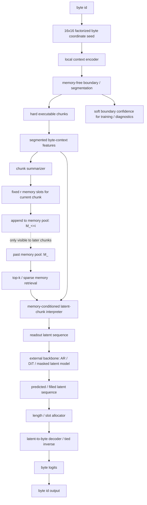
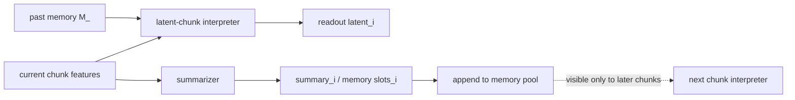

# FLUED v3.2 设计补充：手写图标准化版本

日期：2026-07-03

本文承接 2026-07-02 手写图与后续讨论，用于固化 v3.2 的设计口径。

执行目标、迁移路径和验收标准见：

```text
FLUED_V3_2_EXECUTION_GOALS_CN.md
```

核心目标不变：

```text
FLUED 是语言编码器 / codec。
它把字节流翻译为神经网络更容易处理的连续潜空间表示，
并且这个潜空间表示应能反向还原为字节流。
```

## 1. 本轮最终定下的五条约束

```text
Boundary is memory-free.
  边界 / chunk 切分只看当前 byte seed 与当前局部上下文，不读取过去 memory。

Interpretation is memory-conditioned.
  当前 chunk 翻译为 readout latent 时读取过去 memory pool。

Summary is causal append-only.
  当前 chunk 被 summarize 后写入 memory pool，只供后续 chunk 使用。

Backbone only sees readout latent.
  外部 backbone 只消费 readout latent，不直接看 FLUED memory。

Decoder does not depend on encoder memory.
  decoder 只根据 latent unit / length / slot 信息还原 byte，不重新分段，不读取 encoder memory。
```

这五条是 v3.2 主线约束。后续消融可以验证替代方案，但不能把替代方案混成主线。

## 2. 标准架构图



对应手写图中的组件：

```text
byte ID
-> byte embedding / MLP projector
```

在 v3.2 中改口径为：

```text
byte ID
-> 16x16 factorized byte coordinate seed
```

```text
diffusion segmentation
-> semantic chunk
```

在 v3.2 中改口径为：

```text
memory-free boundary / segmentation
-> hard executable chunk + soft confidence
```

```text
diffusion latent-chunk interpreter
```

在 v3.2 中保留为核心模块：

```text
segmented byte-context features + past memory
-> memory-conditioned latent-chunk interpreter
-> readout latent
```

```text
byte embedding / diffusion summarizer
-> low rank memory
-> memory pool
```

在 v3.2 中改口径为：

```text
chunk contextual feature
-> summarizer
-> fixed r memory slots
-> append-only memory pool
```

## 3. 16x16 byte coordinate seed

本轮判断：

```text
不要再把 byte 入口理解成传统 NLP 的 256 类 embedding lookup。
byte 本身不承载语义，字节流和上下文才承载语义。
```

建议第一版使用 factorized byte seed：

```text
byte b in [0, 255]
hi = b >> 4
lo = b & 15

seed = row_embed[hi] + col_embed[lo] + byte_type_feature
```

这不是完整的 16x16 learnable table。完整 `E[16,16,d]` 本质仍是 256-way lookup，只是排成矩阵。

第一版建议：

```text
row_embed: 16 x d
col_embed: 16 x d
byte_type_feature:
  ascii / utf8_start / utf8_continuation / digit / letter / punctuation / other
```

好处：

```text
1. 参数少。
2. 比 256 lookup 更不鼓励单 byte 偷懒承载语义。
3. 对 UTF-8、ASCII、数字、符号有更自然的结构先验。
4. 后续语义必须从 byte stream 和上下文中形成。
```

开放问题：

```text
是否需要额外的 raw byte scalar / normalized byte value？
是否需要区分 UTF-8 start 的 2/3/4-byte 类型？
是否允许小的 residual byte lookup 作为消融？
```

主线第一版不加 residual byte lookup。

## 4. Boundary / segmentation：memory-free

最终选择：

```text
segmentation 只看当前 byte seed / local context，不读取过去 memory。
```

原因：

```text
1. cache 语义干净。
2. 当前输入怎么切不依赖历史 memory，部署更稳定。
3. 术语 / 实体一致性主要交给 interpreter 处理，而不是强行改变边界。
4. chunk 内可以并行，chunk 间只在 memory retrieval 上保持因果。
5. 避免 boundary 和 memory 过早耦合导致训练难调。
```

切分执行口径：

```text
训练:
  hard executable chunk 作为实际 segment。
  soft boundary confidence 保留，用于辅助损失、ROI、稳定性和不确定性分析。

推理:
  hard executable chunk 仍是主路径。
  soft confidence 只作为 confidence / refinement / fallback 信号。
```

注意：

```text
推理不建议使用真正的全 soft segmentation。
否则 prefill KV、decoder span、memory commit 和 cache 复用都会变得不干净。
```

开放问题：

```text
hard boundary 的训练梯度如何处理：
  straight-through estimator
  boundary weak labels + learned confidence
  Gumbel / top-k relaxation
  reinforcement-style value target

第一版建议继续使用可执行 hard segment + soft confidence loss，
不要直接把 segmentation 做成完全端到端 soft assignment。
```

## 5. Latent-chunk interpreter：读取过去 memory

主线结构：

```text
segmented byte-context features
+ retrieved past memory
-> latent-chunk interpreter
-> readout latent
```

关键边界：

```text
interpreter 读取 M_<i。
summarizer 写入 summary_i。
summary_i 不能反哺当前 chunk 的 interpreter。
```

这避免了同一 chunk 内部的强自循环。



## 6. Memory pool：chunk memory 序列

本轮结论：

```text
memory pool 不是一个固定大矩阵，也不是每步互相污染的全局状态。
memory pool 是按 chunk 追加的 memory 序列。
```

推荐口径：

```text
memory_pool = [memory_1, memory_2, ..., memory_i]
```

第一版不要做动态 memory gate。原因：

```text
1. 动态 gate 会显著增加训练信号复杂度。
2. gate 容易变成新的压缩率调参难题。
3. 推理时会引入不稳定的分支和性能瓶颈。
4. 当前更需要验证 memory-conditioned interpretation 是否有效。
```

第一版建议固定容量：

```text
每个 chunk 固定 r 个 memory slots。
r = 2 或 4。
```

语义解释：

```text
slot 0: chunk summary / topic
slot 1: entity / identifier / number detail
slot 2: structure / relation / position
slot 3: optional residual detail
```

这只是解释，不强制手写规则。训练中由模型自己分配。

开放问题：

```text
实体、变量名、专业名词密集的 chunk 是否会被固定 r 过度压缩？
是否需要后续增加 overflow slots？
是否需要 memory dump / downsample 机制压缩长期历史？
```

当前策略：

```text
先固定 r，跑 memory-case 诊断。
如果实体密集 case 明显失败，再引入 overflow / adaptive slots。
```

## 7. Memory retrieval：DSA / top-k sparse attention

DSA 在本路线中不先进入 byte segmentation，也不先进入 decoder。

最合适的第一落点：

```text
current chunk query
-> top-k retrieve from past memory slots
-> interpreter consumes retrieved memory
```

原因：

```text
memory pool 会随文本增长，必须稀疏读取；
segmentation 应保持当前输入局部、可执行、memory-free；
decoder 不应依赖 encoder memory；
interpreter 正是需要历史语境的位置。
```

第一版建议：

```text
top_k = 4 或 8
retrieval query = chunk feature projection
memory key/value = memory slot projections
```

必须记录的指标：

```text
memory_slots_per_byte
retrieval_topk
retrieval_entropy
retrieved_distance_distribution
zero/shuffled/stale memory ablation
entity / identifier memory-case delta
```

## 8. DSpark-style small AR head

DSpark 对 FLUED 的启发不是照搬 speculative decoding。

可借鉴点：

```text
parallel proposal
+ lightweight serial correction
+ confidence / scheduling
```

在 FLUED 中的定位：

```text
small AR head 只能是小修正头，不是主生成路径。
```

允许位置：

```text
1. latent-chunk interpreter 后，对 readout latent 做小 residual correction。
2. decoder 局部 byte 展开阶段，对 byte slots 做小范围顺序修正。
```

不允许位置：

```text
1. 逐 byte 主生成。
2. 替代外部 backbone。
3. 让 FLUED 自己变成 next-byte LM。
```

硬约束：

```text
AR delta norm 必须限幅。
AR 参数量占比要记录。
AR latency 要单独统计。
AR 前后 decoder CE / span acc 要对比。
如果收益不清楚，默认关闭。
```

第一版 v3.2 可以先不启用 AR，只保留接口和消融位。

## 9. 三种预算必须拆开

不要再只看一个 `m/n`。

v3.2 至少拆成三种预算：

```text
readout_budget:
  readout units / byte。
  直接决定 backbone 输入长度、KV cache 和训练成本。

memory_budget:
  memory slots / byte。
  决定 FLUED encoder 后续参考成本。

decoder_span_budget:
  byte span / readout unit。
  决定 decoder 还原难度。
```

当前 v3.1 `units/byte≈0.117` 只能描述 readout 的粗压缩率，不能说明 memory 成本。

v3.2 summary 必须记录：

```text
readout_units_per_byte
memory_slots_per_byte
avg_span_len
long_span_recon_acc
retrieval_topk
retrieval_entropy
memory_case_delta
```

## 10. 与当前 v3.1 代码的差异

当前 v3.1 已有：

```text
weak boundary
segment representation
readout latent
summary / causal memory
length head
slot decoder
memory ablation
minimal backbone comparison
```

当前 v3.1 缺少：

```text
16x16 factorized byte seed
memory-free learned segmentation as a clean module
past-memory-conditioned interpreter
chunk memory sequence with fixed r slots
top-k sparse memory retrieval
separate readout_budget / memory_budget metrics
DSpark-style small AR correction interface
```

重要判断：

```text
v3.1 mean:
  memory 依赖更明显，但长 span reconstruction 弱。

v3.1 mean_first_last:
  reconstruction 和长 span 明显增强，但 memory 依赖变弱。

v3.2 目标:
  保留长 span 能力，同时恢复 memory-conditioned interpretation 的作用。
```

## 11. v3.2 第一版最小实现边界

第一版要做：

```text
1. FactorizedByteSeed
2. MemoryFreeSegmenter
3. ChunkFeatureBuilder
4. ChunkMemorySummarizer with fixed r slots
5. SparseMemoryRetriever
6. MemoryConditionedInterpreter
7. Readout decoder path
8. Metrics for readout / memory / retrieval budget
```

第一版不做：

```text
1. segmentation 读取 memory
2. decoder 读取 memory
3. 动态 memory gate
4. overflow memory slots
5. full soft segmentation at inference
6. large AR head
7. full diffusion multi-step training
```

## 12. 第一轮实验矩阵

统一公平口径：

```text
batch_size = 128
seq_len = 128
max_span = 16
模型规模约 2M
训练步数先 1k / 3k / 10k
```

对比：

```text
A. v3.1 mean baseline
B. v3.1 mean_first_last baseline
C. v3.2 factorized byte seed only
D. v3.2 + fixed r memory slots, no retrieval
E. v3.2 + top-k memory retrieval
F. v3.2 + optional small AR correction
```

验收指标：

```text
codec:
  recon_acc
  length_acc
  long_span_recon_acc
  invalid_pred_utf8_ratio

memory:
  memory_case_delta
  zero/shuffled/stale memory ablation
  retrieval entropy
  retrieved distance distribution

backbone:
  byte/span masked-source byte baseline
  byte/span masked-source latent infill
  keep byte accuracy
  masked byte accuracy after frozen decoder

efficiency:
  steps/s
  samples/s
  bytes/s
  max_memory_allocated_mb
  readout_units_per_byte
  memory_slots_per_byte
```

失败归因：

```text
如果 codec 弱:
  先看 byte seed / decoder path。

如果 codec 强但 memory-case 弱:
  看 summarizer / memory slots / retrieval。

如果 codec 强但 backbone 弱:
  看 readout latent predictability / decoder-aligned loss。

如果 memory 强但速度慢:
  看 retrieval top-k / memory slots per byte / chunk count。
```

## 13. 当前最重要的实现原则

```text
不要把所有好想法一次性塞进模型。
先验证结构分工是否成立：

memory-free boundary
+ memory-conditioned interpreter
+ causal append-only summary
```

只要这三者成立，FLUED v3.2 才是一个清晰的语言编码器，而不是又回到 reconstruction autoencoder 或小 byte LM。

## 14. 当前证据状态

```text
截至 2026-07-03:

已成立:
  strict masked-source codec training 是当前最强正信号。
  在 byte/span mask 先作用于输入的严格口径下，
  v3.2.1 latent backbone 明显强于 byte baseline。

未成立:
  active memory / top-k retrieval 尚未证明为默认主线收益。
  15k 通用语料上 no-memory 与 top-k memory 基本打平；
  strict backbone 回测中 no-memory 还略高。

局部成立:
  memory stress 中 top-k full 优于 zero / shuffled / stale，
  尤其中文重复术语样本。
  这说明 memory path 不是死代码，但还没有转化为总体收益。

当前默认路线:
  no-memory masked-source codec 作为最强最简主线。

当前 memory 路线:
  保留为实验分支。
  后续只有在长程 / 代码 / 实体密集任务中取得清晰 gain，
  或者新的训练信号让 memory-case 与 backbone 同时提升时，
  才重新进入默认主线。
```
