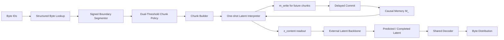

# FLUED: FLexible Unified Encoder-Decoder

**FLUED** is an Alethic Insight research project on tokenizer-free language interfaces.

The project studies whether a raw byte stream can be translated into a compact,
decoder-compatible latent representation before it reaches a language-model
backbone.  The goal is not simply to replace BPE with another tokenizer.  The
central question is:

```text
Can a learnable byte-to-latent interface reduce the backbone's alignment burden
while preserving reversible byte-level input/output behavior?
```

FLUED is currently published as a research archive and architecture record.  It
contains code, experiments, failed directions, corrected evaluation protocols,
and the current v3.3 architecture proposal.

[](LICENSE)
[](https://www.python.org/)
[](https://pytorch.org/)

## Current Public Position

FLUED should be read as a research exploration, not as a claim of state-of-the-art
language-model performance.

Current defensible claims:

1. FLUED v1 showed a historical positive signal: E1v5 learned non-uniform
   differentiable byte boundaries, and an older E3 run reported FLUED `1.2114`
   BPB versus BPE `1.4786` BPB.
2. FLUED v2 learns stable differentiable byte-boundary behavior under denoising
   reconstruction.
3. A fair 2048-original-byte downstream comparison shows FLUED v2 is stable, but
   still behind the BPE baselines on bits-per-byte.
4. v3.2.1 strict masked-source training is the first FLUED v3-family result that
   clearly makes a small latent backbone outperform a byte baseline.
5. v3.3 is the current architecture endpoint: a byte-to-latent decision interface
   that separates segmentation, interpretation, backbone decision, memory, and
   decoding.

Non-claims:

1. FLUED does not currently beat BPE as a production tokenizer replacement.
2. FLUED does not currently beat BLT, H-Net, ByteFlow, Bolmo, or other recent
   tokenizer-free systems.
3. The memory branch is not the default mainline until causal memory gains are
   shown under strict paired-backbone tests.
4. The historical v1 BPB signal should not be treated as reproduced under the
   current fair 2048-original-byte / 100K downstream protocol.

## Research Timeline

| Stage | Main idea | What we learned |
| --- | --- | --- |
| v0.4 / v1 | Soft boundary autoencoder over raw bytes | Minimum hypothesis succeeded: E1v5 reached recon_acc 0.9999, m/n 0.379, bp_std 0.443, and a historical E3 run showed 1.2114 BPB vs BPE 1.4786; reconstruction alone was still not enough. |
| v2 | 328M denoising reconstruction with tied inverse decoder and type-aware boundary priors | Stable E1 reconstruction and three-seed consistency, but compression control and downstream BPB remained weak. |
| v3 / v3.1 | Small language-codec prototypes with readout latent, summary memory, and minimal backbone tests | Memory appeared useful in early clean-codec tests, but the evidence was not leakage-safe enough. |
| v3.2 | Factorized byte seed, memory-free boundary, memory-conditioned interpreter, causal memory branch | The architecture boundary became clearer, but memory did not show universal gain. |
| v3.2.1 | Strict masked-source codec and paired backbone evaluation | Masked-source training produced the strongest validated latent-interface result. |
| v3.3 | Byte-to-latent decision interface | Current architecture target for public documentation and future implementation. |

See [docs/FLUED_RESEARCH_RETROSPECTIVE_CN.md](docs/FLUED_RESEARCH_RETROSPECTIVE_CN.md)
for the full v1-v3.3 research narrative.

## Key Results

### Historical v1 Signals

v1 should be read as a minimum-hypothesis result: differentiable byte boundaries
can be learned and decoded back to bytes, but this did not prove semantic
tokenization or production replacement for BPE.

| Result | Value | Interpretation |
| --- | ---: | --- |
| E1v5 reconstruction accuracy | 0.9999 | Near-lossless codec behavior |
| E1v5 m/n | 0.379 | About 2.64x compression |
| E1v5 bp_std | 0.443 | Non-collapsed boundary distribution |
| Historical E3 FLUED BPB | 1.2114 | Older downstream positive signal |
| Historical E3 BPE BPB | 1.4786 | Historical comparison baseline |

This is a historical result, not the current fair downstream conclusion.

### v2 Reconstruction Stability

All v2 A-class runs used `latent_consistency_weight=0`, mixed clean/denoising
reconstruction, fixed 512-byte chunks, and a 328M tied Transformer autoencoder.

| Seed | Eval Acc | m/n | bp_std | CJK bp |
| --- | ---: | ---: | ---: | ---: |
| 42 | 0.9991 | 0.470 | 0.407 | 0.122 |
| 123 | 0.9993 | 0.498 | 0.391 | 0.182 |
| 999 | 0.9996 | 0.491 | 0.394 | 0.092 |
| Mean | 0.9993 +/- 0.0005 | 0.486 +/- 0.028 | 0.397 +/- 0.016 | 0.132 +/- 0.090 |

Important correction: a latent-consistency mean-squared-error objective was
tested and rejected.  It caused loss spikes, boundary collapse, and catastrophic
forgetting.

### Fair Downstream D1 Comparison

The fair downstream comparison controls the original-byte context budget
(`2048` original bytes) and training steps (`100K`).  Lower BPB is better.

| Method | Context Budget | Steps | BPB | KV / 1KB | Interpretation |
| --- | --- | ---: | ---: | ---: | --- |
| BPE-8K | 2048 original bytes | 100K | **0.8066** | 164.0 | Current strongest baseline |
| BPE-16K | 2048 original bytes | 100K | 0.8165 | 149.1 | Fair byte-denominator fix applied |
| BPE-32K | 2048 original bytes | 100K | 0.8205 | 135.6 | Fair byte-denominator fix applied |
| FLUED v2 | 2048 original bytes | 100K | 0.8732 | 546.1 | Stable, but behind BPE |
| BLT theta=0.3 | 2048 original bytes | 100K | 2.3996 | 554.9 | Reproduction is weak; not a BLT claim |

The older fixed-token BPE runs are not valid for fair comparison because
`--max-seq-len 2048` meant 2048 BPE tokens, not 2048 original bytes.

### v3.2.1 Strict Masked-Source Backbone

This is the most important v3-family validation.  Masking happens on the byte
input before FLUED sees the sequence; the small backbone only sees FLUED readout
latents.

| Run | family | memory | mask_acc | delta_acc vs byte | byte_CE | delta_CE vs byte |
| --- | --- | --- | ---: | ---: | ---: | ---: |
| v3.2.1 no-memory masked 15k | v32 | false | **0.1898** | **+0.0458** | **3.1424** | **+0.2358** |
| v3.2.1 memory masked 15k | v32 | true | 0.1897 | +0.0457 | 3.1473 | +0.2308 |
| v3.1 codec10k pool-MFL | v31 | false | 0.1468 | +0.0028 | 3.4551 | -0.0770 |
| v3.2 stage3 memory 10k | v32 | true | 0.1458 | +0.0018 | 3.4666 | -0.0885 |
| byte baseline | byte | false | 0.1440 | 0.0000 | 3.3782 | 0.0000 |

Interpretation:

```text
v3.2.1 masked-source codec is the first route that clearly reduces the small
backbone's masked-byte completion difficulty.
```

## FLUED v3.3 Architecture

FLUED v3.3 is the current stopping point for architecture documentation.  It is
a byte-to-latent decision interface:



Main principles:

1. Segmentor is lightweight and memory-free.
2. Interpreter is the semantic byte-to-latent interface.
3. Backbone makes decisions in latent space.
4. Decoder translates latent back to bytes.
5. Memory is causal and experimental: current chunk can read only past memory;
   current memory writes are visible only to future chunks.

See [docs/FLUED_V3_3_ARCHITECTURE_CN.md](docs/FLUED_V3_3_ARCHITECTURE_CN.md)
for the full public architecture document.

## Public Documentation Map

| Document | Purpose |
| --- | --- |
| [docs/FLUED_RESEARCH_RETROSPECTIVE_CN.md](docs/FLUED_RESEARCH_RETROSPECTIVE_CN.md) | v1-v3.3 experiments, reasoning, failures, and iteration process |
| [docs/FLUED_V3_3_ARCHITECTURE_CN.md](docs/FLUED_V3_3_ARCHITECTURE_CN.md) | Current final architecture and evaluation protocol |
| [docs/FLUED_V3_3_ABLATION_INTERFACE_CN.md](docs/FLUED_V3_3_ABLATION_INTERFACE_CN.md) | v3.3 train/config/matrix interface for direct ablations |
| [docs/FLUED_WEBSITE_SHOWCASE_CN.md](docs/FLUED_WEBSITE_SHOWCASE_CN.md) | Website-ready project showcase copy for Alethic Insight |
| [FLUED_V3_FULL_METRIC_TABLE_REEVALUATION_CN.md](FLUED_V3_FULL_METRIC_TABLE_REEVALUATION_CN.md) | Detailed v3 checkpoint re-evaluation table |
| [FLUED_V3_CHECKPOINT_REEVALUATION_CN.md](FLUED_V3_CHECKPOINT_REEVALUATION_CN.md) | Earlier v3 checkpoint audit and conclusion correction |
| [FLUED_REBUILD.md](FLUED_REBUILD.md) | v2 semantic rebuild notes |

## Repository Map

```text
flued/model.py                         FLUED v2 model
flued/v33/                             v3.3 byte-to-latent interface prototype
flued/e1_stage_a.py                    v2 denoising reconstruction trainer
flued/e3_train.py                      downstream language-model training
flued/e3_downstream.py                 FLUED/BPE/BLT downstream wrappers
tools/analysis/train_v31_*.py          v3.1 prototype training scripts
tools/analysis/train_v32_*.py          v3.2 / v3.2.1 prototype training scripts
tools/analysis/train_v3_strict_*.py    strict paired-backbone evaluation
tools/eval/                            ROI, memory, boundary, probe diagnostics
tools/launcher/                        local/cloud launchers, including historical runs
tools/train/train_v33.py               v3.3 train / eval entrypoint
configs/v33_ablation_2m.json           v3.3 core ablation matrix
docs/                                  public research documentation
```

## Quick Start

Install a CUDA-compatible PyTorch stack and run a CPU smoke test:

```bash
pip install torch --index-url https://download.pytorch.org/whl/cu128
pip install tokenizers numpy tqdm
python -m flued.e1_stage_a --preset smoke_cpu
```

Run a v3.3 public smoke test:

```bash
python tools/train/train_v33.py \
  --config configs/v33_no_memory_smoke.json \
  --device cpu \
  --max-steps 2
```

Run the v3.3 2M ablation matrix on GPU:

```bash
python tools/launcher/run_v33_ablation_matrix.py \
  --matrix configs/v33_ablation_2m.json \
  --data-path /path/to/corpus_v3.txt \
  --device cuda \
  --batch-size 128 \
  --amp
```

Summarize v3.3 ablations:

```bash
python tools/analysis/summarize_v33_ablation.py --root checkpoints/v33_2m_core
```

Representative v2 E1 run:

```bash
python -m flued.e1_stage_a \
  --preset class300m_16gb \
  --data-path /path/to/corpus_v3.txt \
  --ckpt-dir checkpoints/e1_v2_seed42 \
  --max-steps 50000 \
  --seq-len 512 \
  --stride 256 \
  --grad-accum-steps 12 \
  --denoise-prob 0.7 \
  --corrupt-rate 0.15 \
  --latent-consistency-weight 0 \
  --amp --amp-dtype bf16
```

## Known Limitations

1. v2 soft assignment still builds a full `[B, T, T]` matrix internally.
2. Compression control is weak; target compression does not reliably control
   the final `m/n`.
3. v3.3 is an architecture endpoint, not yet a fully trained SOTA model.
4. Memory remains a branch until it beats no-memory under strict paired-backbone
   and causal patching tests.
5. The current public claim is research-process depth and architecture clarity,
   not benchmark dominance.

## License

MIT. See [LICENSE](LICENSE).
