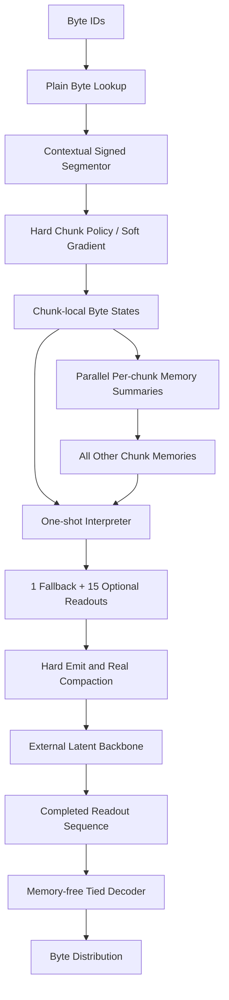

# FLUED: Fluid Language Unified Encoder-Decoder

> **当前状态唯一事实源：[`docs/CURRENT_STATE.md`](docs/CURRENT_STATE.md)**（默认配置、
> 证据注册表、闸门与待裁定队列；凡与历史文档冲突以该文为准）。

**FLUED** is an Alethic Insight research project on tokenizer-free language interfaces.

The project studies whether a raw byte stream can be translated into a compact,
decoder-compatible latent representation before it reaches a language-model
backbone.  The goal is not simply to replace BPE with another tokenizer.  The
central question is:

```text
Can a learnable byte-to-latent interface reduce the backbone's alignment burden
while preserving reversible byte-level input/output behavior?
```

FLUED is currently published as a research archive and architecture record.  It
contains code, experiments, failed directions, corrected evaluation protocols,
and the current v3.4 implementation and ablation archive.

[](LICENSE)
[](https://www.python.org/)
[](https://pytorch.org/)

## Current Public Position

FLUED should be read as a research exploration, not as a claim of state-of-the-art
language-model performance.

Current defensible claims:

1. FLUED v1 showed a historical positive signal: E1v5 learned non-uniform
   differentiable byte boundaries, and an older E3 run reported FLUED `1.2114`
   BPB versus BPE `1.4786` BPB.
2. FLUED v2 learns stable differentiable byte-boundary behavior under denoising
   reconstruction.
3. A fair 2048-original-byte downstream comparison shows FLUED v2 is stable, but
   still behind the BPE baselines on bits-per-byte.
4. v3.2.1 strict masked-source training is the first FLUED v3-family result that
   clearly makes a small latent backbone outperform a byte baseline.
5. v3.4 implements parallel per-chunk memory, marginal coding-rate boundary
   selection, plain byte lookup (structured lookup lost the corrected 20K
   same-budget comparison), and hard readout emission with real backbone
   compaction.
6. In a corrected 38M / 20K single-seed probe, normalized historical
   other-chunk memory reaches `96.89%` reconstruction and `35.76` masked-byte
   completion perplexity at `0.58` actual latent/byte. In the fixed-mask
   threshold scan, it also outperforms no-memory at the matched `0.58-0.59`
   latent/byte point. This is not a scaling claim.
7. CBIU (counterfactual byte-interface utility) shows a learnable but weak
   emit-action value signal: the MLP-64 controller reaches `AUC=0.584`,
   `Spearman=0.240`, `ECE=0.149` with about 40% fewer actual latents than the
   legacy target. It does not yet pass the boundary-takeover admission bar.
   The shared approximate-inverse decoder remains the largest blocker: at a
   matched `0.20` latent/byte budget it reaches `21.00%` reconstruction /
   `43.37` PPL versus `40.92%` / `30.83` for an independent decoder.

Non-claims:

1. FLUED does not currently beat BPE as a production tokenizer replacement.
2. FLUED does not currently beat BLT, H-Net, ByteFlow, Bolmo, or other recent
   tokenizer-free systems.
3. The current-memory/self-memory branch is not the default. The supported
   v3.4 route reads only normalized summaries of other chunks.
4. The historical v1 BPB signal should not be treated as reproduced under the
   current fair 2048-original-byte / 100K downstream protocol.

## Research Timeline

| Stage | Main idea | What we learned |
| --- | --- | --- |
| v0.4 / v1 | Soft boundary autoencoder over raw bytes | Minimum hypothesis succeeded: E1v5 reached recon_acc 0.9999, m/n 0.379, bp_std 0.443, and a historical E3 run showed 1.2114 BPB vs BPE 1.4786; reconstruction alone was still not enough. |
| v2 | 328M denoising reconstruction with tied inverse decoder and type-aware boundary priors | Stable E1 reconstruction and three-seed consistency, but compression control and downstream BPB remained weak. |
| v3 / v3.1 | Small language-codec prototypes with readout latent, summary memory, and minimal backbone tests | Memory appeared useful in early clean-codec tests, but the evidence was not leakage-safe enough. |
| v3.2 | Factorized byte seed, memory-free boundary, memory-conditioned interpreter, causal memory branch | The architecture boundary became clearer, but memory did not show universal gain. |
| v3.2.1 | Strict masked-source codec and paired backbone evaluation | Masked-source training produced the strongest validated latent-interface result. |
| v3.3 | Byte-to-latent decision interface | Current architecture target for public documentation and future implementation. |
| v3.4 | Parallel memory, marginal coding rate, position/AR probes, hard emit control | Corrected 20K tests favor normalized no-self historical memory; current-memory helps early but plateaus lower. 2026-07-16 attribution matrices: hard emit collapses capacity before the boundary switch; memory usage weight 0.05 is the first rate-distortion improvement. 2026-07-17 CBIU three rounds: learnable emit-action utility, not yet calibrated enough for boundary takeover. |

See [docs/research/FLUED_RESEARCH_RETROSPECTIVE_CN.md](docs/research/FLUED_RESEARCH_RETROSPECTIVE_CN.md)
for the full v1-v3.3 narrative; v3.4 evidence is indexed separately below.

## Key Results

### Historical v1 Signals

v1 should be read as a minimum-hypothesis result: differentiable byte boundaries
can be learned and decoded back to bytes, but this did not prove semantic
tokenization or production replacement for BPE.

| Result | Value | Interpretation |
| --- | ---: | --- |
| E1v5 reconstruction accuracy | 0.9999 | Near-lossless codec behavior |
| E1v5 m/n | 0.379 | About 2.64x compression |
| E1v5 bp_std | 0.443 | Non-collapsed boundary distribution |
| Historical E3 FLUED BPB | 1.2114 | Older downstream positive signal |
| Historical E3 BPE BPB | 1.4786 | Historical comparison baseline |

This is a historical result, not the current fair downstream conclusion.

### v2 Reconstruction Stability

All v2 A-class runs used `latent_consistency_weight=0`, mixed clean/denoising
reconstruction, fixed 512-byte chunks, and a 328M tied Transformer autoencoder.

| Seed | Eval Acc | m/n | bp_std | CJK bp |
| --- | ---: | ---: | ---: | ---: |
| 42 | 0.9991 | 0.470 | 0.407 | 0.122 |
| 123 | 0.9993 | 0.498 | 0.391 | 0.182 |
| 999 | 0.9996 | 0.491 | 0.394 | 0.092 |
| Mean | 0.9993 +/- 0.0005 | 0.486 +/- 0.028 | 0.397 +/- 0.016 | 0.132 +/- 0.090 |

Important correction: a latent-consistency mean-squared-error objective was
tested and rejected.  It caused loss spikes, boundary collapse, and catastrophic
forgetting.

### Fair Downstream D1 Comparison

The fair downstream comparison controls the original-byte context budget
(`2048` original bytes) and training steps (`100K`).  Lower BPB is better.

| Method | Context Budget | Steps | BPB | KV / 1KB | Interpretation |
| --- | --- | ---: | ---: | ---: | --- |
| BPE-8K | 2048 original bytes | 100K | **0.8066** | 164.0 | Current strongest baseline |
| BPE-16K | 2048 original bytes | 100K | 0.8165 | 149.1 | Fair byte-denominator fix applied |
| BPE-32K | 2048 original bytes | 100K | 0.8205 | 135.6 | Fair byte-denominator fix applied |
| FLUED v2 | 2048 original bytes | 100K | 0.8732 | 546.1 | Stable, but behind BPE |
| BLT theta=0.3 | 2048 original bytes | 100K | 2.3996 | 554.9 | Reproduction is weak; not a BLT claim |

The older fixed-token BPE runs are not valid for fair comparison because
`--max-seq-len 2048` meant 2048 BPE tokens, not 2048 original bytes.

### v3.2.1 Strict Masked-Source Backbone

This is the most important v3-family validation.  Masking happens on the byte
input before FLUED sees the sequence; the small backbone only sees FLUED readout
latents.

| Run | family | memory | mask_acc | delta_acc vs byte | byte_CE | delta_CE vs byte |
| --- | --- | --- | ---: | ---: | ---: | ---: |
| v3.2.1 no-memory masked 15k | v32 | false | **0.1898** | **+0.0458** | **3.1424** | **+0.2358** |
| v3.2.1 memory masked 15k | v32 | true | 0.1897 | +0.0457 | 3.1473 | +0.2308 |
| v3.1 codec10k pool-MFL | v31 | false | 0.1468 | +0.0028 | 3.4551 | -0.0770 |
| v3.2 stage3 memory 10k | v32 | true | 0.1458 | +0.0018 | 3.4666 | -0.0885 |
| byte baseline | byte | false | 0.1440 | 0.0000 | 3.3782 | 0.0000 |

Interpretation:

```text
v3.2.1 masked-source codec is the first route that clearly reduces the small
backbone's masked-byte completion difficulty.
```

## FLUED v3.4 Architecture

v3.4 keeps FLUED as a reversible byte-to-latent interface while moving memory
construction off the serial critical path:



Main principles:

1. Segmentation depends on the byte sequence, not memory.
2. Each memory summarizes only its own chunk; memory generation is parallel.
3. The interpreter may read other chunks' memories but never the current chunk's
   memory, preventing the direct self-copy shortcut.
4. Readout emit controls the number of latent vectors that actually enter the
   backbone; the fallback readout is always retained.
5. The decoder reverses byte-to-readout translation and does not consume memory.

See the [v3.4 documentation index](docs/versions/v3.4/README.md) for the full
reading order. Current highest-priority entries:

- [CBIU three-round results](docs/versions/v3.4/FLUED_V3_4_CBIU_THREE_ROUND_RESULTS_20260717_CN.md) (2026-07-17)
- [Attribution matrices](docs/versions/v3.4/FLUED_V3_4_ATTRIBUTION_MATRICES_RESULTS_20260716_CN.md) (2026-07-16)
- [Post-migration experiment report](docs/versions/v3.4/FLUED_V3_4_POST_MIGRATION_EXPERIMENTS_20260715_CN.md) (2026-07-15)

Documents dated before 2026-07-14 describe pre-correction implementations
(fixed Top-K boundary bypass, energy-proxy `l2`, independent decoder skeleton)
and must be read together with the self-audit and correction reports.

### v3.4 5K Structural Screen

| Variant | Reconstruction | Masked completion | Actual latent / byte | Reading |
| --- | ---: | ---: | ---: | --- |
| Exact marginal rate, full | 0.5970 | 0.1343 | 0.7852 | Stable boundaries, early suboptimal lock-in |
| **L2 marginal rate** | **0.7041** | **0.1477** | **0.6804** | Best candidate in this historical 5K screen |
| Uniform boundaries | 0.9873 | 0.1485 | 0.9694 | Near-no-compression upper control |
| Soft emit, no compaction | 0.6795 | 0.1334 | 1.0752 | Soft gates do not save backbone compute |

All 17 raw logs and curve artifacts are published under
[`results/v3.4/5k_ablation/`](results/v3.4/5k_ablation/README.md).

### v3.4 Corrected 20K Memory Comparison

All groups below were trained from scratch with the same 38.3M FLUED, 4.8M
temporary backbone, seed, data, 512-byte context, 5% strict source masking, and
20K learning-rate schedule.

| Variant | Reconstruction | Masked completion | PPL | Actual latent / byte |
| --- | ---: | ---: | ---: | ---: |
| No memory | 0.8743 | 0.1164 | 45.05 | **0.4356** |
| **Normalized other-only memory** | **0.9689** | **0.1380** | **35.76** | 0.5834 |
| Other + detached current memory | 0.8544 | 0.1295 | 38.63 | 0.5288 |

The 20K trajectory reverses the provisional 5K preference for a detached
current-memory channel. Historical no-self memory becomes the best long-run
route after a substantial 9K-12K representation reorganization. Raw logs and
all 21 checkpoint-threshold evaluations are under
[`results/v3.4/memory_position_20k_20260713/`](results/v3.4/memory_position_20k_20260713/README.md).

## Public Documentation Map

| Document | Purpose |
| --- | --- |
| [Documentation index](docs/README.md) | Versioned map and evidence status |
| [Research retrospective](docs/research/FLUED_RESEARCH_RETROSPECTIVE_CN.md) | v1-v3.3 reasoning, failures, and iteration process |
| [v3.4 doc index](docs/versions/v3.4/README.md) | Current v3.4 reading order and evidence status |
| [CBIU three-round results](docs/versions/v3.4/FLUED_V3_4_CBIU_THREE_ROUND_RESULTS_20260717_CN.md) | Latest emit-utility evidence and admission bar |
| [v3.4 attribution matrices](docs/versions/v3.4/FLUED_V3_4_ATTRIBUTION_MATRICES_RESULTS_20260716_CN.md) | Two-stage failure, memory usage weights, interventions |
| [v3.4 post-migration report](docs/versions/v3.4/FLUED_V3_4_POST_MIGRATION_EXPERIMENTS_20260715_CN.md) | Corrected 20K defaults (plain lookup, decoder, memory) |
| [v3-family checkpoint audit](docs/research/evidence/v3-family/FLUED_V3_FULL_METRIC_TABLE_REEVALUATION_CN.md) | Strict historical checkpoint re-evaluation |
| [v2 rebuild](docs/versions/v2/FLUED_REBUILD.md) | v2 semantic rebuild notes |

## Repository Map

```text
flued/model.py                         FLUED v2 model
flued/v33/                             v3.3 byte-to-latent interface prototype
flued/v34/                             v3.4 rate/emit and parallel-memory extension
flued/e1_stage_a.py                    v2 denoising reconstruction trainer
flued/e3_train.py                      downstream language-model training
flued/e3_downstream.py                 FLUED/BPE/BLT downstream wrappers
tools/*/v3_0...v3_4/                   versioned experiment utilities
tools/train/v3_4/                      current v3.4 training entrypoint
configs/v3_3/, configs/v3_4/           versioned experiment matrices
docs/versions/                         version-frozen design and result records
results/v3.4/5k_ablation/              public raw logs and curve artifacts
results/v3.4/memory_position_20k_20260713/ corrected P3/P4 logs and threshold trajectories
```

## Quick Start

Install a CUDA-compatible PyTorch stack and run a CPU smoke test:

```bash
pip install torch --index-url https://download.pytorch.org/whl/cu128
pip install tokenizers numpy tqdm
python -m flued.e1_stage_a --preset smoke_cpu
```

Run a v3.4 short smoke test:

```bash
python tools/train/v3_4/train_v34_pos_ar_probe.py \
  --config configs/v3_4/v34_rate_emit_40m_probe.json \
  --data-path /path/to/corpus.txt \
  --out-dir outputs/v34_smoke \
  --device cpu --max-steps 2
```

Run the current 38M / 20K recommended v3.4 route:

```bash
python tools/train/v3_4/train_v34_pos_ar_probe.py \
  --config configs/v3_4/v34_default_38m_20k.json \
  --data-path /path/to/corpus.txt \
  --out-dir outputs/v34_default_38m_20k
```

The direct configuration is intentionally explicit. Bare command-line defaults
remain backward-compatible with historical checkpoints and are not the current
recommended experiment.

Run the v3.4 matrix on GPU:

```bash
python tools/launcher/v3_4/run_v34_pos_ar_matrix.py \
  --matrix configs/v3_4/v34_rate_emit_all_ablation_5k.json \
  --out-root outputs/v34_5k \
  --batch-size 8
```

Rebuild the public curve summary:

```bash
python tools/analysis/v3_4/analyze_v34_5k_curves.py \
  --root outputs/v34_5k --out-dir outputs/v34_5k/analysis
```

Representative v2 E1 run:

```bash
python -m flued.e1_stage_a \
  --preset class300m_16gb \
  --data-path /path/to/corpus_v3.txt \
  --ckpt-dir checkpoints/e1_v2_seed42 \
  --max-steps 50000 \
  --seq-len 512 \
  --stride 256 \
  --grad-accum-steps 12 \
  --denoise-prob 0.7 \
  --corrupt-rate 0.15 \
  --latent-consistency-weight 0 \
  --amp --amp-dtype bf16
```

## Known Limitations

1. v2 soft assignment still builds a full `[B, T, T]` matrix internally.
2. Compression control is weak; target compression does not reliably control
   the final `m/n`.
3. v3.4 evidence is still one seed, 20K steps, 512-byte sequences, and a 38M
   FLUED probe rather than the planned 300M / 4096-byte scale.
4. L2 marginal rate and hard emit reorganize substantially between 9K and 12K;
   semantic boundary quality is not established by long-context downstream tasks.
5. Historical no-self memory improves the current paired probe, but the result
   has not yet been confirmed across seeds, data domains, context lengths, or
   larger backbones. Raw memory norms also continue to grow before normalization.
6. The current public claim is a traceable research process and executable
   architecture, not benchmark dominance.

## License

MIT. See [LICENSE](LICENSE).
