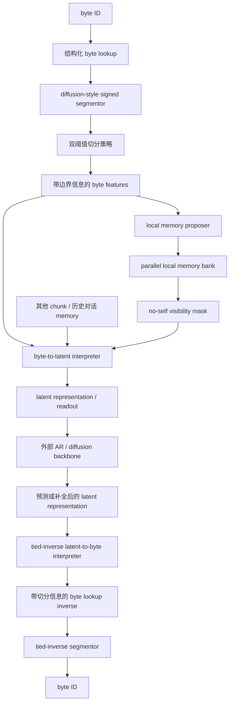
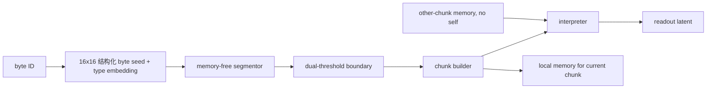
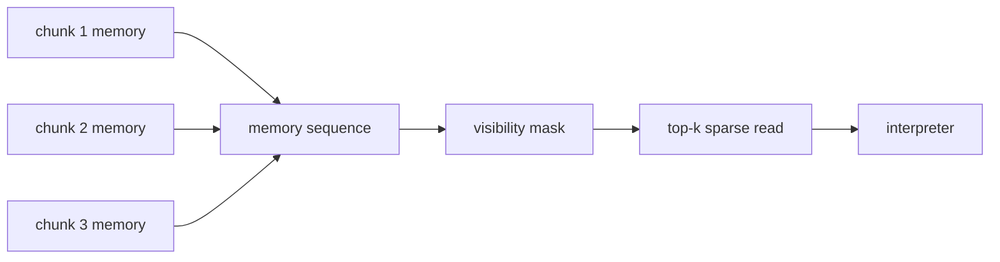

# FLUED v3.3 架构说明

FLUED v3.3 的定位是“字节流到潜空间表示的语言编码接口”。它不是传统 tokenizer，也不是无 codec 的端到端字节级语言模型。它的核心任务是：

```text
把 byte stream 翻译成神经网络更容易处理、可压缩、可还原、带局部语义和位置信息的 latent representation。
```

## 1. 核心思想

传统 tokenizer 把语言当成离散分类问题：先切成 token，再查表得到 embedding。这个过程把大量语义先验固定在 embedding 表里，容易出现局部语境和全局语境不一致时的不可逆错误。

FLUED 的目标不同：

1. 输入仍然是 byte，保留所有字符和语言的可达性。
2. byte 本身不强行承载语义，语义来自字节流局部结构和上下文解释。
3. 输出不是 token id，而是连续 latent representation。
4. latent representation 必须能被 decoder 还原成 byte。
5. 外部 backbone 理论上只需要看 readout latent，不需要直接读 FLUED 的内部 memory。

## 2. v3.3 总流程



## 3. 编码阶段



### 3.1 结构化 byte lookup

v3.3 暂时使用 `StructuredByteLookup`：

```text
byte id -> high 4bit seed + low 4bit seed + byte type embedding
```

这比单纯的 256 类 embedding 更接近用户手稿里的 16x16 思路：byte 本身不直接承载完整语义，只提供可学习但弱结构化的底层表示。

### 3.2 Segmentor

segmentor 输出 signed confidence，而不是简单概率：

```text
正值：倾向切分
负值：倾向延续
接近 0：软过渡
```

原则：

1. segmentor 不读 memory。
2. segmentor 只决定边界和过渡，不直接改 byte embedding。
3. 前向路径使用双阈值后的 hard boundary / transition / force-continue 结果形成干净 chunk。
4. 连续 confidence 不作为内容特征喂给 interpreter；它只用于监督、诊断和 backward-only 的 plastic credit assignment。
5. 主任务的重建 / backbone 难度可以通过 detached token loss 给普通边界分配软目标，从而塑形 confidence 场，但不改变当前 forward 的硬切分执行路径。

### 3.3 Interpreter

interpreter 是 FLUED 的核心。它把当前 chunk 的 byte features 翻译为：

```text
z_content: 给外部 backbone 的 readout latent
m_write:   给未来 chunk 使用的 memory 写入
```

更准确地说，memory 是 encoder 侧的上下文索引，不是 decoder 侧的补全工具。当前 chunk 的 readout 可以参考其他 chunk 的 memory，包括当前 prompt 内的未来 chunk memory，也可以参考历史对话 memory；但不能参考当前 chunk 自己的 memory。这样既保留 encoder 的全局上下文能力，又避免：

```text
chunk_i -> memory_i -> interpreter_i -> readout_i
```

这种自我复读捷径。

interpreter 可以看到双阈值产生的 transition / force-continue 标记作为 chunk 内弱先验，但不直接接收连续 confidence 数值。这样避免把边界置信度混成内容表示。

## 4. Memory 设计

v3.3 当前采用“低秩序列 memory”而不是一个固定 memory pool：



设计理由：

1. 避免不同 chunk 的内容在固定矩阵里互相污染。
2. 保留历史顺序，便于后续定位和因果分析。
3. 读取时可以使用 top-k sparse attention，工程上接近 DSA 一类稀疏机制。
4. 当前 memory 是实验分支，不是默认 claim。

当前 public skeleton 中，memory 有两种可见性：

```text
parallel_local + bidirectional_no_self:
  prompt encoding / prefill 主模式。
  所有 chunk 并行生成 local memory。
  interpreter_i 可读 memory_j, j != i。

causal_current + past_only:
  严格流式或传统自回归兼容模式。
  interpreter_i 只能读历史 memory。
```

必须注意：`bidirectional_no_self` 只允许 memory proposer 本身是 local 的。不能先让 memory generator 在当前 prompt 内全局互相注意，再声明 interpreter 屏蔽 self memory，因为那样 self 信息可能经由其他 chunk memory 绕回。

## 5. Decoder / 反向使用

FLUED 解码不是让 backbone 直接吐 byte。合理流程是：

```text
backbone 产生或修正 latent representation
-> latent-to-byte interpreter / tied-inverse decoder
-> byte-level distribution
-> 还原 / 补全 byte
```

需要注意：

1. 编码必须使用 segmentor/interpreter。
2. 解码不读 memory。
3. decoder 只执行 readout latent 到带切分先验的 byte lookup matrix，再还原 byte。
4. 补全任务中，FLUED encoder 只能看到已经在 byte 输入层面 mask 后的文本。

memory 只服务 encoder interpreter 的上下文理解。decoder 如果读取 memory，就可能根据上下文猜 byte，而不是从 readout 精确还原 byte，这会破坏 codec 角色。

当前 public skeleton 的 decoder 已经遵守“不读 memory”，并在输出端 tied 到结构化 byte lookup；但它还不是严格数学意义上的完整 interpreter 权重反转，中间仍包含独立 MLP。公开 claim 应写成：

```text
byte-lookup-tied latent-to-byte decoder skeleton
```

而不是过早声称已经实现完整 tied-inverse interpreter。

## 6. Backbone 关系

FLUED 不是 backbone。backbone 可以是：

```text
AR Transformer
Diffusion backbone
ELF-like latent model
小型 probe backbone
```

FLUED 训练时使用哪个 backbone 不是本体定义的一部分。backbone 的作用是检验 latent representation 是否真的让下游任务更容易，而不是让 FLUED 退化成字节级语言模型。

## 7. v3.3 保留和放弃的内容

必须保留：

1. 严格 masked-source 协议。
2. readout latent 可还原。
3. segmentor 不读 memory。
4. interpreter 可读 other-chunk memory，但屏蔽当前 chunk 自身 memory。
5. prompt encoding 默认使用 parallel-local memory bank。
6. no-memory 与 memory 分支公平对比。

暂不作为主线：

1. v2 latent consistency MSE（均方误差）损失。
2. clean encode 后再遮 readout 的评估方式。
3. 让 memory 直接服务 next-byte 预测的端到端字节语言模型路线。
4. 复杂 latent canvas 或多轮 diffusion，除非 1-step 版本已经证明不够。

待验证：

1. memory 是否在严格协议下稳定提升。
2. readout latent 数量预算是否应从固定 target 改为自适应。
3. 低秩 memory 的 rank 是否需要随 chunk 内容复杂度动态变化。
4. diffusion-style segmentor 是否比轻量 AR 修正更稳定。
5. 外部 diffusion backbone 是否比 AR backbone 更适配连续 latent。

## 8. 训练和评估原则

v3.3 的评估不能只看 reconstruction accuracy。最低评估表应包括：

| 类别 | 指标 |
| --- | --- |
| Codec | masked reconstruction CE/acc，visible reconstruction CE/acc，length acc |
| Backbone | byte baseline CE/acc，latent backbone CE/acc，delta acc |
| Latent | clean-oracle gap，扰动稳定性，probe/MDL |
| Memory | zero/shuffle/stale memory ablation，patching causal effect |
| Boundary | confidence 与 hard boundary 关联，扰动稳定性，ROI 热力图 |
| Efficiency | steps/sec，readout units/byte，KV/1KB，显存 |

其中最关键的是：所有补全评估都必须从 byte 输入层面 mask，不能让 FLUED 接触 clean 输入。

## 9. 当前 public code 范围

当前公开代码提供的是完整可运行 skeleton：

```text
flued/v33/byte_lookup.py
flued/v33/segmentor.py
flued/v33/threshold_policy.py
flued/v33/chunk_builder.py
flued/v33/interpreter.py
flued/v33/memory.py
flued/v33/decoder.py
flued/v33/model.py
tools/train/train_v33.py
tools/launcher/run_v33_ablation_matrix.py
```

它足够用于 2M 级结构验证和消融，但不是最终工程化高性能实现。CUDA kernel、稀疏 attention、跨 chunk pipeline 和更强 diffusion backbone 都属于后续优化。
