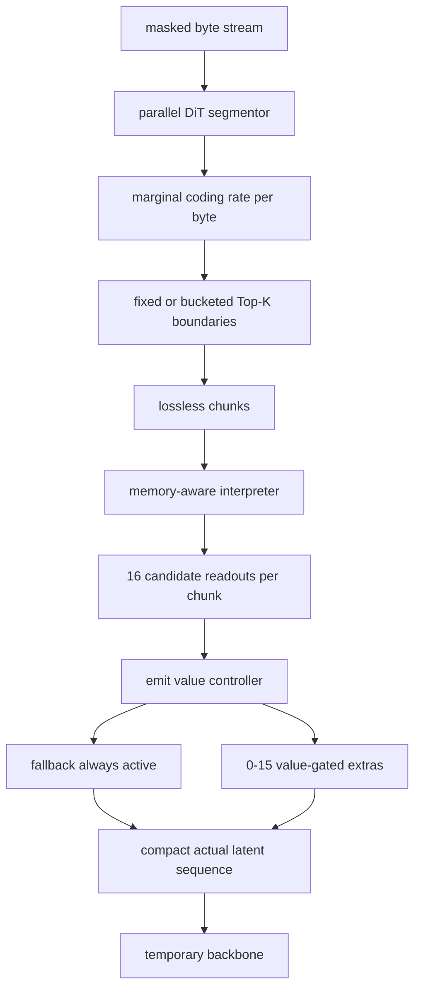

# FLUED v3.4 边际编码率与 Readout Emit 修正

## 修正原因

旧实现对所有 active readout 做全局编码率最大化。它只能鼓励表示分散，无法回答“哪个 byte 位置值得切分”，还可能奖励高熵噪声。该实现与 ByteFlow 的 coding-rate chunking 不同，已经从新路线移除。

ByteFlow 定义前缀表示的有损编码率：

```math
R_\epsilon(h_{1:t}) = \frac{1}{2}\log\det\left(I + \frac{d}{\epsilon^2}H_{1:t}H_{1:t}^{\top}\right)
```

位置 `t` 的边际编码率为：

```math
\Delta R_t = R_\epsilon(h_{1:t}) - R_\epsilon(h_{1:t-1})
```

FLUED 在低维投影空间并行计算所有前缀的对数行列式，在固定或按长度分桶的 `K` 预算内选择 Top-K 信息边界。UTF-8 continuation byte 不参与候选。

参考：[ByteFlow](https://arxiv.org/abs/2603.03583)。

## 两级决策



第一级只决定 chunk 位置；第二级决定每个 chunk 需要多少表示容量。增加 chunk 不再自动免费获得 16 个 backbone token。

## Emit 监督

对于轮换采样的 extra readout `r_j`，分别强制开启和关闭，计算：

```math
V_j = (L_{off}-L_{on}) + \lambda_R \widetilde{\Delta R}_{chunk} - C_{backbone}(N)
```

- `L` 同时包含 masked-input identity、masked-byte completion 和 visible-byte preservation。
- `Delta R` 是该 chunk 起点的边际编码率，仅作为信息价值项。
- `C_backbone(N)` 随当前实际 latent 数量增加，近似额外 token 对 backbone 的边际成本。
- `sigmoid(V_j / temperature)` 是 emit controller 的连续目标。
- 前向采用硬 emit；反向采用直通估计。

这同时阻止两条捷径：仅复制局部细节不会自动抵消计算成本；制造高熵 readout 也无法在移除反事实中获得任务收益。

## 500 步机制验证

配置：约 42.0M 总参数，512 byte，batch 8，32 个信息边界预算，最多 40 个包含安全兜底的 chunk，每 chunk 16 个候选 readout。

| 指标 | 结果 |
|---|---:|
| 信息边界/byte | 0.0625 |
| 实际 chunk/byte | 0.0663 |
| 软 readout/byte | 0.4314 |
| 实际 backbone latent/byte | 0.2576 |
| 批内 padding 后 latent/byte | 0.3594 |
| extra 净价值均值 | -0.0699 |
| 连续目标开启率 | 0.4348 |
| identity accuracy | 0.2167 |
| masked completion accuracy | 0.1059 |
| 截断 byte | 0 |
| 训练速度 | 10.51 step/s |
| 峰值显存 | 5.66GB |

实际每 chunk 平均约 3.9 个 readout 进入 backbone，证明 controller 既未全部关闭，也未全部开启。该结果只验证机制可训练和计算量可观测，不证明 32-chunk 预算、计算成本权重或 500 步精度最优。

## 尚未解决

1. `C_backbone(N)` 当前是解析近似，后续应由不同 latent 长度的实测耗时/FLOPs 拟合。
2. 需要比较 fixed-K、长度分桶 K 和不同 bytes/chunk 预算。
3. 最小 no-rate、no-value、no-cost、soft-only、hard-ST 消融已完成；仍需三种子和更长训练确认精度/计算量前沿。
4. 需要画 byte 文本、边际编码率、Top-K 边界、每 chunk emit 数量的统一热力图。
5. 4096 byte 训练时应验证安全 chunk 不会显著改变信息预算，并报告批内 padding 浪费。

## 500 步消融结果

| 组别 | identity | completion | soft units/byte | actual units/byte | padded units/byte |
|---|---:|---:|---:|---:|---:|
| 边际编码率 + 硬 emit + 完整价值 | **0.2167** | 0.1059 | 0.4314 | **0.2576** | 0.3594 |
| 无计算成本 | 0.2080 | 0.1060 | 0.3585 | 0.2813 | 0.3462 |
| 无 emit 价值监督 | 0.2050 | 0.1050 | 0.3883 | 0.3191 | 0.4612 |
| 软 emit、不裁 token | 0.2150 | 0.1071 | **0.2231** | 1.0615 | 1.0938 |
| 均匀边界、同 K | 0.1877 | **0.1172** | 0.6343 | 0.8537 | 1.0000 |

解读：

1. 去掉价值监督或计算成本都会增加实际 backbone latent，同时没有带来可见精度收益。
2. 软 emit 的分数看似最稀疏，但 backbone 仍计算所有候选，证明软 gate 不能代表真实计算压缩。
3. 均匀边界用约 3.3 倍实际 latent 换来 0.011 的补全准确率提升，identity 反而更差。边际编码率当前主要改善精度/计算量前沿，而不是在不计成本时取得最高短程 accuracy。
4. 完整组不是最少 soft units，但它把硬 emit、反事实价值和实际压紧计算统一起来；`soft/actual/padded` 三个量必须同时报告。
5. 全部实验截断为 0。当前结论仍限于单种子、500 步和 512 byte。
