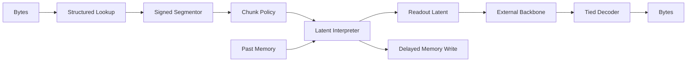

# FLUED 官网展示文案

本文档给 Alethic Insight 官网使用，避免官网页面过度宣传。

## 标题

```text
FLUED
Byte-to-Latent Decision Interface
```

## 一句话定位

```text
FLUED 不是新的 tokenizer，而是一条从 byte stream 到可还原 latent representation 的语言编码器研究路线。
```

## 展示摘要

FLUED 研究如何把原始字节流翻译成神经网络更容易处理的连续潜空间表示，同时保留字节级可还原能力。项目从 v1 最小假设开始：证明 soft boundary codec 能否学出非均匀、类型相关、可还原的 byte boundary；之后进入 v2 denoising tied decoder，暴露去噪、压缩与边界分化之间的训练动力学冲突；再通过 v3 strict masked-source 纠偏，把问题重新定义为 byte-level language encoder 的计算复杂度、语义自然度、训练难度三角；最终暂时收束到 v3.3 的 byte-to-latent decision interface。

当前结果不主张 FLUED 已经替代 BPE。更准确的官网主线是：v2 证明了可微边界和 tied decoder 的稳定性；公平 D1 下 FLUED-v2 0.8732 BPB 仍落后 BPE-8K 0.8066 BPB；v3.2.1 在严格 byte-level mask 协议下证明 latent readout 可以帮助小 backbone 超过 byte baseline；v3.3 则给出了更清晰、可消融、可继续扩展的架构边界。v1 的 FLUED 1.2114 BPB vs BPE 1.4786 BPB 属于历史强阳性和反例材料，应放在 History/Appendix，不作为官网主证据。

## 关键数字

| 指标 | 数值 |
| --- | --- |
| v2 参数量 | 328M |
| v2 三种子 reconstruction | 0.9993 +/- 0.0005 |
| fair D1 BPE-8K BPB | 0.8066 |
| fair D1 FLUED-v2 BPB | 0.8732 |
| v3.2.1 no-memory mask acc | 0.1898 |
| byte baseline mask acc | 0.1440 |
| v3.3 状态 | 架构与消融入口 |

## 展示结构

1. Research question：为什么 byte-to-latent。
2. Timeline：v1 -> v2 -> v3.1 -> v3.2.1 -> v3.3。
3. Evidence：展示稳定结果和失败结论。
4. Architecture：展示 v3.3 编码/解码路径。
5. Claims / non-claims：明确不宣传 SOTA。
6. Open-source：链接代码和文档。

## 官网 claim 边界

可以说：

1. Alethic Insight 的 tokenizer-free language interface 研究项目。
2. 公开包含代码、实验日志、失败分析和架构迭代。
3. 体现研究从假设、实验、纠错到重新定义问题的完整过程。
4. v2 是稳定但未击败 BPE 的公平对比，v3.2.1 是当前最干净的 latent interface 正证据。

不要说：

1. 已经超过 BPE。
2. 已经超过 BLT、ByteFlow、H-Net 等近期系统。
3. 已经是生产 tokenizer。
4. memory 已经被证明必要。
5. v3.3 已经完成系统实验。
6. v1 历史 E3 结果可以替代当前公平 D1 结论。

## 推荐按钮

```text
Read Architecture
Open Repository
View Evidence
```

## Mermaid


