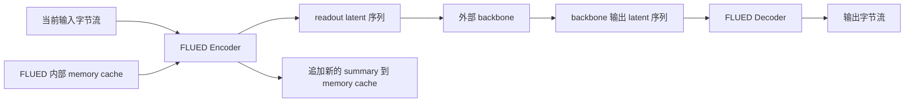
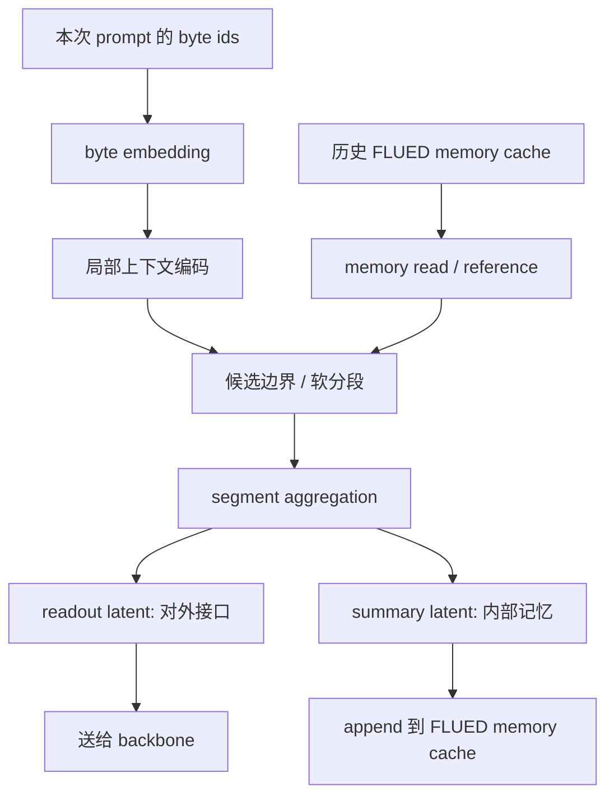
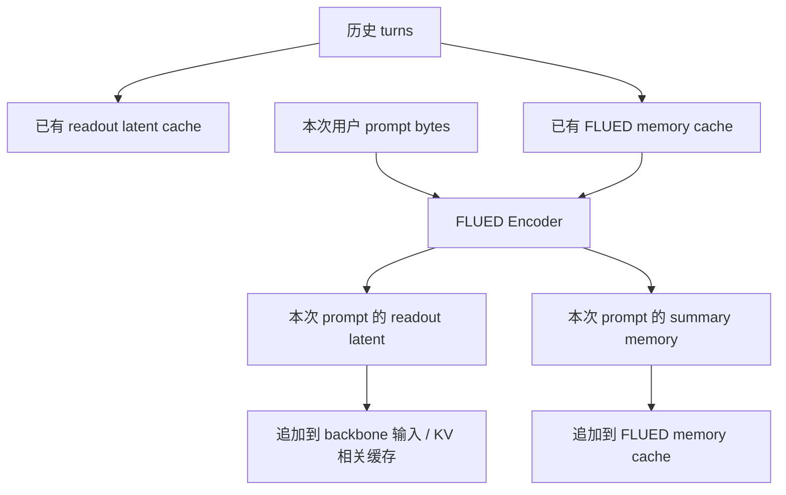
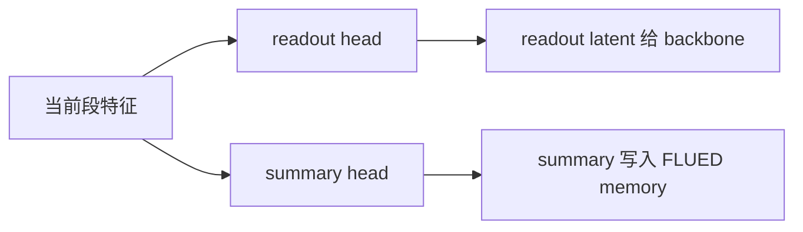
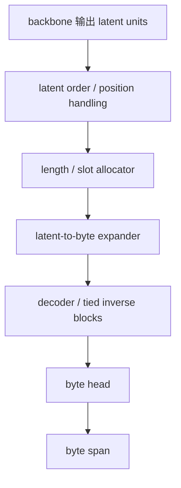
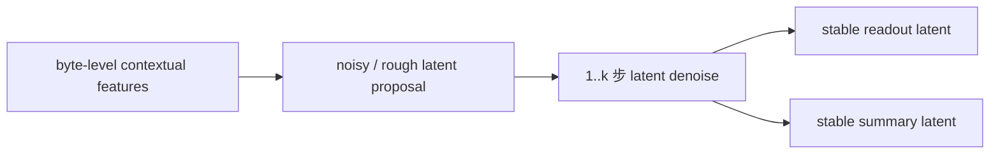
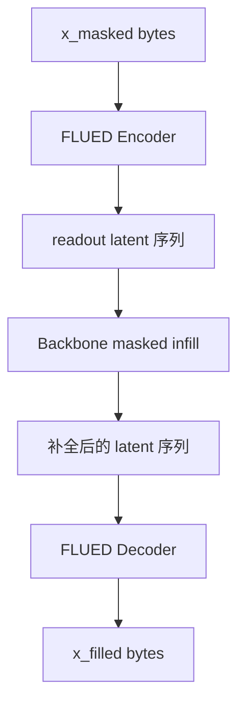

# FLUED v3.1 当前架构中文说明

日期：2026-07-02

本文修正 2026-07-01 版本中的关键误解。旧版本把 FLUED 内部 memory 写成了 backbone 可见输入，并把 backbone masked infill 写得过于像 FLUED 的本体推理流程，这是错误的。

本文当前口径：

```text
FLUED 是语言编码器 / codec。
它把字节流翻译为上下文条件化的连续潜空间序列。
外部 backbone 只消费 FLUED 输出的 readout latent 序列。
FLUED 内部 memory 只服务编码过程，不直接暴露给 backbone。
解码时反向使用 FLUED decoder，把 latent 序列还原为 byte。
```

## 0. 核心思想

FLUED 要解决的不是“怎么再造一个 tokenizer”，而是：

```text
能否把传统静态离散 tokenizer，
升级为一个可学习、可上下文条件化、可反解码的语言编码器。
```

传统 tokenizer 的核心问题不是它完全无效，而是它把大量语义先验固定在离散词表和静态 embedding 入口里：

```text
同一个 token type 初始 embedding 固定；
多义词、歧义切分、领域语义、指代关系需要交给 backbone 后续层修正；
错误切分或错误先验会让 backbone 从较差的优化起点开始学习；
byte-level 虽然可逆，但把低层组合和高层语义理解都压给 backbone。
```

FLUED 的目标是让语言进入 backbone 前，先经过一个动态的语言编码过程：

```text
字符 / 字节流
-> 参考局部上下文和历史语义 memory
-> 在当前输入内做软分段
-> 每个段生成 readout latent 给 backbone
-> 每个段生成 summary 写入 FLUED 内部 memory
-> decoder 可把 readout latent 反向还原为 byte span
```

这里的 `byte embedding` 只是底层实现的初始表征，不是最终 latent。

## 1. 高层关系



关键约束：

```text
backbone 只看 readout latent 序列；
backbone 不直接看 FLUED memory；
backbone 不直接看 boundary / summarize / commit 概率；
FLUED memory 是 encoder 内部状态，用来帮助后续输入的分段和编码；
FLUED decoder 只负责 latent -> byte，不重新执行 encoder 分段。
```

## 2. 编码时的真实流程

编码不是：

```text
byte -> 语义段表示 -> 再分段
```

这在逻辑上是错的，因为还没有分段时不存在“当前语义段表示”。

更合理的顺序是：

```text
byte id
-> 初始 byte embedding
-> 局部 / 窗口上下文特征
-> 读取历史 FLUED memory 作为语境参考
-> 当前输入内部的候选边界 / 软分段
-> 按段聚合
-> readout latent 给 backbone
-> summary latent 写入 FLUED memory
```



这里的两个出口必须分清：

```text
readout latent:
  当前段的对外潜空间表示。
  这是 backbone 的输入。

summary latent:
  当前段的内部摘要。
  这是 FLUED encoder 后续处理新输入时可参考的 memory。
```

## 3. 对话场景下的编码边界

LLM 的真实交互不是一次性重读所有历史文本。FLUED 应该支持缓存。

每次新用户输入时：

```text
分段范围：
  只在本次用户 prompt 内部做分段。

memory 参考范围：
  可以读取历史所有 turn 已经写入的 FLUED memory。
```



重要约束：

```text
历史 memory 可以影响当前 prompt 的理解；
当前 prompt 的分段不能跨越到历史 prompt 里重新切；
当前编码不能改写历史已经输出给 backbone 的 readout latent；
否则缓存不可复用，prefill 成本会失控。
```

历史 memory 的作用更像“语境参考”：

```text
帮助处理指代；
保持术语、实体、风格和局部语义一致；
帮助当前输入中模糊字节 / 字符序列形成正确 readout latent；
不作为 backbone 直接输入。
```

## 4. readout、summary、memory、commit 的定义

当前建议逐步把 `commit` 口径改成 `summarize`，因为它不是提交给 backbone，而是将当前段总结进 FLUED 内部 memory。

```text
boundary / segment proposal:
  在当前 prompt 内提出候选段。
  可以是软边界，不一定是硬 tokenizer。

readout:
  当前段翻译成给 backbone 使用的 latent unit。
  它应该保留语义、位置、结构，并可由 FLUED decoder 还原为 byte span。

summary / summarize:
  当前段压缩成内部 memory 的摘要。
  它服务未来编码，不直接暴露给 backbone。

FLUED memory:
  encoder 内部历史语义摘要缓存。
  它帮助后续 prompt 或后续段的分段、消歧和 readout 形成。
```



## 5. 解码流程

解码时不是把 encoder 反着完整跑一遍。因为：

```text
输入已经是 latent unit；
段边界已经体现在 latent 序列里；
没有原始 byte stream 可供重新分段；
encoder memory 是读入文本时的内部状态，不应成为 decoder 必需依赖。
```

合理解码流程：

```text
backbone 输出 latent unit
-> FLUED decoder 接收 latent unit
-> 预测或读取该 latent 对应的 byte span 长度 / slots
-> latent-to-byte expansion
-> decoder / inverse blocks
-> byte logits
-> byte span
```



解码可以使用：

```text
readout latent unit；
latent 内部位置 / 顺序信息；
长度或 slot 分配器；
latent-to-byte expander；
decoder blocks / tied inverse；
byte head；
可选的局部一致性修正。
```

解码不应依赖：

```text
boundary detector：
  解码时 latent 已经是段级单位，不应重新发现 byte 边界。

summarize / commit policy：
  这是编码时写 memory 的机制，解码时不需要决定是否写 memory。

FLUED encoder memory：
  它是读取历史 byte 时形成的内部状态；decoder 应该主要由 latent 自身决定输出。

future / surprise / coding-rate 诊断：
  这些可用于训练或分析边界质量，不是 decoder 必需组件。

外部 backbone loss：
  这是训练/验证信号，不是解码组件。
```

如果为了生成连续性需要极小的局部自回归修正，它应该只作用在 decoder 的 byte 展开局部，不应变成主生成模型。

## 6. 扩散 / 去噪在 FLUED 中的含义

FLUED 里的扩散不应理解为“用 diffusion 生成文本”。更准确是：

```text
扩散 / 去噪是 latent refinement。
它把粗糙的 byte-level 特征整理成更稳定、更语义化、更可解码的 readout / summary latent。
```

它的作用位置主要在 encoder 内部：



为什么倾向扩散而不是纯自回归编码：

```text
扩散式 refinement 可以在当前窗口 / 当前候选段内并行处理；
它不天然把任务变成 next byte prediction；
它适合作为语言编码器里的“表示整理”机制；
目标推理形态可以逐步压缩到 1-2 步，以降低 prefill 成本。
```

纯自回归编码的风险：

```text
容易退化为小 byte LM；
逐字更新导致并行性差；
把 FLUED 从语言 codec 拉向语言模型；
有效参数被 encoder/decoder/状态更新切分后，未必比标准 backbone 更优。
```

## 7. 半自回归修正的定位

半自回归不是主生成方式，也不应照搬投机解码的接受率叙事。

在 FLUED 中，它最多是：

```text
对边界 / readout / summary latent 做少量顺序修正；
修正局部不一致；
补偿完全并行 refinement 对顺序结构的不足。
```

它不应该：

```text
逐 byte 生成文本；
替代 backbone；
替代 decoder；
成为主能力来源；
要求一个大模型实时验证接受率。
```

合理评价方式：

```text
加入半自回归前后，readout latent 是否更可解码；
summary 是否更稳定；
边界是否更一致；
推理延迟增加多少；
是否仍可压缩到 1 次或极少次数修正。
```

## 8. 训练时如何使用 backbone

训练时可以使用任意 backbone 来验证或辅助 FLUED，但 backbone 不是 FLUED 架构的一部分。

更准确的关系：

```text
FLUED 定义语言到 latent 的接口；
backbone 在 latent 空间学习；
训练时用哪个 backbone 都可以；
最终证明要看 FLUED latent 是否让不同 backbone 更容易学习。
```

masked infill 可以作为训练/验证任务，但要注意：

```text
FLUED 自身不负责补出 MASK；
FLUED encoder 应忠实编码 MASK；
backbone 在 readout latent 空间补全；
FLUED decoder 把 backbone 输出的 latent 解码回 byte。
```



这条训练路径中：

```text
backbone 输入不包含 FLUED memory；
FLUED memory 只在 encoder 内部帮助形成 readout latent；
decoder 只根据补全后的 latent 序列还原 byte；
非 mask 区域应尽量保持不变；
mask 区域由 backbone 负责补对。
```

## 9. 当前代码与目标架构的差距

旧实验脚本：

```text
tools/analysis/v3_0/train_v3_segmental_diffusion_2m.py
```

它已经有一些接近目标的组件：

```text
boundary_z / commit_probs：
  类似候选边界或 summarize 概率。

memory_z / memory_write / hist_memory：
  类似内部 memory 写入与历史摘要。

readout_z / byte_head：
  类似 readout latent 与 decoder 的早期形态。

ParallelDenoiseBlock：
  类似 latent refinement。

SmallARCorrection：
  类似可选的轻量顺序修正。
```

但它还不是最终 v3.1 架构：

```text
1. 当前 commit 仍是逐位置概率，不是真正段级 summarize。
2. hist_memory 是加权前缀均值，可能退化为平滑历史池化。
3. readout_z 仍有较强 h -> byte 的重建捷径。
4. future_head 容易让训练误解成 FLUED 自己做 next byte prediction。
5. 当前脚本还没有清晰实现“只给 backbone 输出 readout latent，memory 只作内部参考”的接口边界。
6. 当前 decoder 还不是完整 latent unit -> variable byte span 的反编译器。
```

新的第一版 codec 原型：

```text
tools/analysis/v3_1/train_v31_language_codec_2m.py
```

它实现了当前工作决策中的最小闭环：

```text
byte ids
-> weak boundary starts
-> shared segment representation
-> readout latent
-> summary latent
-> internal causal summary memory
-> explicit length / slot allocator
-> latent-to-byte decoder
-> byte span reconstruction
```

接口边界：

```text
readout latent:
  是对外 backbone 接口。

summary / memory:
  是 FLUED encoder 内部机制。

decoder:
  只从 readout latent 和 length/slot 信息反编译 byte span。

future_head:
  新脚本不再使用。
```

当前实现仍是原型，尚未完成：

```text
1. boundary 目前使用 UTF-8 / 标点 / 长度弱规则生成训练标签，还不是完全自学习。
2. summary 目前只形成因果内部 memory，还没有独立的摘要质量目标。
3. UTF-8 合法性只体现在弱边界上，decoder 尚未加入 DFA 状态约束。
4. backbone masked latent infill 尚未接入。
5. conversation-level memory cache 协议尚未实现为独立 runtime API。
```

smoke test：

```text
命令：
  python tools/analysis/v3_1/train_v31_language_codec_2m.py
    --out-dir <archive-root>\smoke_v31_language_codec
    --device cpu --seq-len 64 --batch-size 4 --max-steps 2
    --d-model 64 --hidden 64 --encoder-layers 1 --max-span 8

结果：
  2 steps completed
  latest.pt / summary.json / train_log.jsonl saved
  smoke params = 193,355
  default params = 2,010,899
```

2026-07-02 2M codec 小规模验证：

```text
训练脚本：
  tools/analysis/v3_1/train_v31_language_codec_2m.py

诊断脚本：
  tools/analysis/v3_1/summarize_v31_language_codec.py
  tools/eval/v3_1/eval_v31_language_codec_roi.py
  tools/eval/v3_1/eval_v31_language_codec_decoder.py
  tools/eval/v3_1/eval_v31_language_codec_memory_ablation.py

结果目录：
  <archive-root>\v31_language_codec_2m_20260702

当前有效 run：
  codec_10k_utf8clean
```

关键结果：

```text
参数量：              2,010,899
训练步数：            10,000
训练吞吐：            19.03 step/s，本地 RTX 5080
streaming eval acc：  0.5063
length acc：          0.9725
boundary acc：        0.9354
units/byte：          0.1170
```

这说明第一版 codec 闭环已经能学：

```text
byte span
-> segment representation
-> readout latent
-> length / slot decoder
-> byte span
```

已经通过第一轮门槛：

```text
recon_acc > 0.5
length_acc > 0.7
loss 持续下降
无 NaN / 爆炸
units_per_byte 没有全切或全合并
```

但这不是最终成功。当前明确缺陷：

```text
1. 长 span 重建明显弱：
   streaming long_span_recon_acc 约 0.326。

2. fixed-text 泛化弱于 streaming eval：
   fixed-text recon_acc 约 0.328。

3. memory 有可见但较小作用：
   zero / shuffled / stale memory 只造成约 1.6%-2.0% loss 变差。

4. raw boundary probability 不能直接当实际切分：
   ROI 现在使用 constrained boundary decode：
     模型概率提供倾向；
     UTF-8 合法性和 max_span 作为工程约束；
     最终 model_start 是可执行切分。

5. decoder 仍未加入更强 UTF-8 状态约束：
   目前 target UTF-8 合法率已修到 0 非法，
   但 predicted span 仍有少量 UTF-8 非法。
```

本轮修正：

```text
1. DataLoader collate 阶段在 CPU worker 中构造 weak boundary 和 segment target，
   避免 GPU 上 Python loop / .item() 同步。

2. streaming dataset 随机 mmap 采样优先从行首或 UTF-8 codepoint 边界开始。

3. weak boundary 生成时预估当前 UTF-8 codepoint 长度，
   避免 max_span 截断时切坏中文字符。

4. collator 使用 complete_utf8_edge_valid 掩盖 chunk 边缘不完整 UTF-8 字节。

5. checkpoint 除 latest.pt 外，按 ckpt_every 保存 stepN.pt，
   当前 10k run 保留 step3000 / step6000 / step9000 / latest。
```

2026-07-02 最小 backbone 验证：

```text
训练脚本：
  tools/analysis/v3_1/train_v31_min_backbone.py

汇总脚本：
  tools/analysis/v3_1/summarize_v31_min_backbone.py

复现实验：
  tools/launcher/v3_1/run_v31_min_backbone_5080.ps1

结果目录：
  <archive-root>\v31_backbone_20260702
```

实验口径：

```text
byte baseline:
  raw byte -> small Transformer -> masked byte infill

latent backbone:
  raw byte -> frozen FLUED codec -> readout latent
  -> small Transformer -> filled readout latent
  -> frozen FLUED decoder -> byte span metrics

严格约束：
  backbone 不接收 FLUED memory；
  FLUED codec 冻结；
  byte CE 不反向训练 FLUED encoder；
  readout latent 是唯一 backbone 输入。
```

公平性修正：

```text
随机 byte mask 会显著偏易。

byte_3k:
  random byte mask
  mask_acc = 0.3035

byte_3k_segmentmask:
  segment span mask，和 latent 任务遮挡同类连续缺口
  mask_acc = 0.1498

因此当前公平比较必须用 segment-mask byte baseline。
```

当前 3k 对比：

```text
byte_3k_segmentmask:
  mask_acc = 0.1498
  params   = 1.014M

latent_3k:
  latent MSE only
  mask_acc = 0.1563
  params   = 0.977M

latent_3k_byteaux01:
  latent MSE + 0.1 * masked decoder CE
  mask_acc = 0.1659

latent_3k_byteaux1:
  latent MSE + 1.0 * masked decoder CE
  mask_acc = 0.1784
```

解释：

```text
1. 如果 byte baseline 随机遮单个 byte，它会显著强于 latent，
   但这不是公平任务，因为 latent 遮的是整个 segment。

2. 在公平 segment-mask 下，FLUED latent backbone 已经略优于 byte baseline。

3. 单纯 latent MSE 不够强。
   readout 空间的欧氏距离下降，不等价于 decoder 可还原 byte 正确。

4. decoder-aligned 训练信号有用。
   但该信号只经过冻结 decoder 训练 backbone，不反向更新 FLUED encoder。

5. 这只是第一轮正信号，不是最终证明。
   下一步需要拉长训练、改变 mask 难度、检查 fixed-text 泛化，并评估更强 codec 后是否放大优势。
```

2026-07-02 40k codec 验证：

```text
run:
  <archive-root>\v31_language_codec_2m_20260702\codec_40k_utf8clean

streaming eval:
  recon_acc:        0.5451
  length_acc:       0.9869
  units/byte:       0.1171
  steps/s:          19.84

decoder streaming:
  recon_acc:                 0.5478
  exact_span_acc:            0.5278
  long_span_recon_acc:       0.3527
  invalid_target_utf8_ratio: 0.0000
  invalid_pred_utf8_ratio:   0.0260

decoder fixed-text:
  recon_acc:                 0.3509
  exact_span_acc:            0.0632
  long_span_recon_acc:       0.3289
  invalid_target_utf8_ratio: 0.0000
  invalid_pred_utf8_ratio:   0.0691
```

相对 10k：

```text
streaming recon_acc:
  0.5063 -> 0.5451

streaming long_span_recon_acc:
  0.3257 -> 0.3527

fixed-text recon_acc:
  0.3280 -> 0.3509
```

判断：

```text
继续训练有收益，但收益主要是缓慢提升，不足以解决长 span 弱点。
长 span 仍是当前 codec 的主要结构性短板。
fixed-text 泛化仍明显弱于 streaming eval。
```

40k codec 接入最小 backbone：

```text
latent_3k_codec40k:
  latent MSE only
  mask_acc = 0.1641

latent_3k_byteaux1_codec40k:
  latent MSE + 1.0 * masked decoder CE
  mask_acc = 0.1779
```

判断：

```text
40k codec 提高了 keep 区域解码质量：
  keep_byte_acc 约 0.51 -> 0.548。

但 masked infill 的最终准确率没有继续超过 10k codec：
  10k codec + byteaux1: 0.1784
  40k codec + byteaux1: 0.1779

这说明当前 backbone 瓶颈不只是 codec 重建精度，
更可能是 readout latent 的可预测性 / 可插值性不足，
或者 masked latent infill 的训练目标仍不够直接。
```

2026-07-02 段聚合消融：

```text
旧聚合：
  pool_mode = mean

新聚合：
  pool_mode = mean_first_last
  segment representation = mean(h_segment), first(h_segment), last(h_segment)
  readout 外部接口不变，仍是一段一个 latent。
```

动机：

```text
mean pooling 对长 span 不够。
长段内的顺序、边缘、首尾信息被平均后严重丢失，
导致 length=15/16 的 byte span 重建长期偏弱。
```

结果：

```text
codec_10k_pool_mfl:
  params:                    2.085M
  streaming recon_acc:        0.6469
  streaming long_span_acc:    0.5104
  fixed-text recon_acc:       0.5184
  fixed-text long_span_acc:   0.4984
  invalid target UTF-8:       0.0000
  invalid pred UTF-8:         0.0227 streaming / 0.0601 fixed-text
```

相对旧 mean：

```text
10k mean:
  streaming recon_acc:      0.5063
  streaming long_span_acc:  0.3257
  fixed-text recon_acc:     0.3280
  fixed-text long_span_acc: 0.3089

40k mean:
  streaming recon_acc:      0.5451
  streaming long_span_acc:  0.3527
  fixed-text recon_acc:     0.3509
  fixed-text long_span_acc: 0.3289

10k mean_first_last 已明显超过 40k mean。
```

但它暴露了一个更重要的问题：

```text
memory ablation:
  10k mean:
    memory_effect = visible
    zero/shuffled/stale memory 造成约 1.6%-2.0% loss 变差

  40k mean:
    memory_effect = visible
    zero/shuffled/stale memory 造成约 2.45%-2.76% loss 变差

  10k mean_first_last:
    memory_effect = weak
    zero/shuffled/stale memory 只造成约 0.27%-0.42% loss 变差
```

backbone 对比：

```text
best byte segment baseline:
  mask_acc = 0.1498

best mean latent:
  latent_3k_byteaux1
  mask_acc = 0.1784

mean_first_last latent:
  latent_3k_pool_mfl:
    MSE only mask_acc = 0.1425

  latent_3k_byteaux1_pool_mfl:
    decoder-aligned mask_acc = 0.1678
```

判断：

```text
mean_first_last 是优秀的 codec 重建改进，但不是无代价改进。

它让 readout 更像可解码的局部 payload，
但也可能让 readout 更少依赖 summary/memory，
并降低 masked latent infill 的可预测性。

这说明 v3.1 后续不能只优化 reconstruction。
必须同时看：
  1. readout -> byte 的重建；
  2. memory ablation 的影响；
  3. masked latent infill 是否优于 byte segment baseline；
  4. fixed-text 泛化；
  5. 长 span 重建。
```

## 10. 当前工作决策

本节把 2026-07-02 的讨论收束为当前可执行方案。它不是最终论文结论，但足够指导下一轮代码实现和小规模实验。

### 10.1 分段如何从无到有

当前决定：

```text
第一版使用逐 byte soft boundary / summarize probability。
不再把全 [B,T,T] 软分配矩阵作为主线。
不做复杂 span-proposal DP。
不让 readout 和 summary 各自学习一套边界。
```

boundary proposal 可以依赖：

```text
byte embedding；
局部上下文特征；
UTF-8 / Unicode 字符边界合法性；
空格、标点、换行、数字串、camelCase 等弱先验；
历史 FLUED memory 的只读参考；
目标压缩率、最小段长、最大段长。
```

训练初期可以 warm start：

```text
surprisal / 熵尖峰；
BPE / Unigram / SentencePiece 弱标签；
UTF-8 合法边界；
标点、空白、换行弱先验。
```

这里借鉴 BLT、Charformer / GBST、Dynamic Token Pooling、ByteFlow 等方向，但不照搬它们的 next-byte 训练目标。

### 10.2 readout 与 summary 的关系

当前决定：

```text
readout 和 summary 初期共享同一段划分。
先得到一个 shared segment representation。
再分成 readout projection 和 summary projection。
```

二者职责不同：

```text
readout:
  对外接口，交给 backbone。
  需要可解码、保留语义、位置、结构和当前 span 内容。

summary:
  内部接口，写入 FLUED memory。
  需要服务后续编码中的指代、实体一致性、术语延续和上下文消歧。
```

不能让 readout 和 summary 完全塌缩成一个东西。第一版用共享 segment 表示 + 两个不同 head，后续通过消融检查：

```text
只用 readout 是否能重建当前 span；
只用 summary 是否能帮助后续编码；
打乱 / 置零 memory 后 readout 是否明显受损；
summary 是否携带 readout 不需要但后续指代需要的信息。
```

### 10.3 memory cache 更新

当前决定：

```text
当前段只读旧 memory；
当前段编码完成后，才把 summary 写入 memory；
同一次编码中不能写完又读自己。
```

用户 prompt 的协议：

```text
read old FLUED memory
-> encode current prompt
-> emit readout latents to backbone
-> append prompt summaries to FLUED memory cache
```

assistant 输出的协议：

```text
生成过程中不写长期 memory；
只有已生成且被接受的输出才进入 FLUED memory；
流式生成可先进短期缓存；
完整回复结束后再抽取 summary 写长期 memory。
```

跨轮 memory 分层：

```text
短期 memory:
  最近若干段 / turn 的高分辨率 summary。

长期 memory:
  更老内容压缩成事件、实体、用户偏好、任务状态。
```

裁剪和合并不能只靠 embedding 相似度，还应考虑：

```text
recency；
salience；
relevance；
conflict / overwrite；
是否被用户确认。
```

这条协议与 Transformer-XL、Compressive Transformer、Infini-attention、RMT、Memorizing Transformer 的“先读旧状态，段后写新状态”一致。

### 10.4 decoder 长度问题

当前决定：

```text
第一版显式预测或携带 span length。
每个 readout latent unit 对应 1..Lmax 个 byte slot。
decoder 不自由生成无限 byte。
```

解码路径：

```text
readout latent unit
-> length / slot allocator
-> latent-to-byte expansion
-> decoder / tied inverse blocks
-> byte logits
-> byte span
```

UTF-8 最保守方案：

```text
segment boundary 不跨 Unicode codepoint；
内部仍可使用 UTF-8 byte；
但 boundary 只能落在合法 codepoint 起止位置；
decoder 输出用 UTF-8 状态约束避免非法 continuation / overlong / surrogate。
```

第一版优先使用显式 length head，因为它比 CTC / EOS slots 更容易调试和可视化。CTC / blank / EOS 方案可以作为后续消融。

### 10.5 训练目标如何避免把 FLUED 变成 byte LM

当前决定：

```text
训练分阶段，先 codec，后 backbone。
byte 重建 loss 不直接成为 backbone 联训的主信号。
future / surprise 只作为 boundary 诊断或弱信号，不作为 FLUED 主目标。
```

阶段建议：

```text
Stage 1: FLUED codec
  byte / char span -> readout latent -> byte / char span
  学边界、长度、readout、summary 和可逆性。

Stage 2: frozen or semi-frozen FLUED + backbone
  backbone 只在 readout latent 空间学习 masked infill / LM。
  FLUED memory 仍只在 encoder 内部服务 readout 形成。

Stage 3: 轻量联训
  用很小学习率更新 FLUED。
  防止 byte CE 把 FLUED 拉回 byte LM。
```

明确禁止的第一版主线：

```text
FLUED memory -> future_head -> next byte CE 作为主目标。
```

这会把 FLUED 拉回无 codec 的端到端 byte LM。FLUED 的主目标应是：

```text
readout latent 可解码；
summary memory 有助于后续编码；
readout latent 能降低外部 backbone 的学习负担；
编码和解码都比 byte-level 主干更高效。
```

## 11. 当前一句话总结

```text
FLUED 是动态语言编码器：
它在当前输入内部做软分段，
参考历史 memory 形成上下文条件化的 readout latent，
把 readout latent 序列交给任意 backbone，
同时把当前段 summary 写入内部 memory 供后续编码参考；
解码时则由 FLUED decoder 把 backbone 输出的 latent 反编译回 byte。
```

最重要的接口边界：

```text
readout latent 是对外接口；
summary / memory 是 FLUED 内部机制；
backbone 不直接看 memory；
decoder 不重新做分段；
扩散是 latent refinement，不是文本生成；
半自回归是局部修正，不是主生成范式。
```
