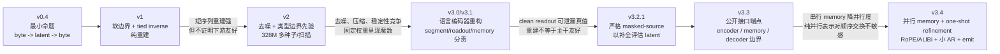
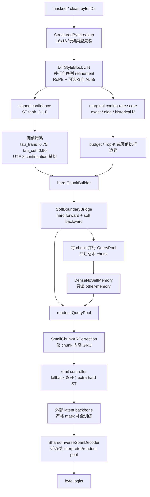
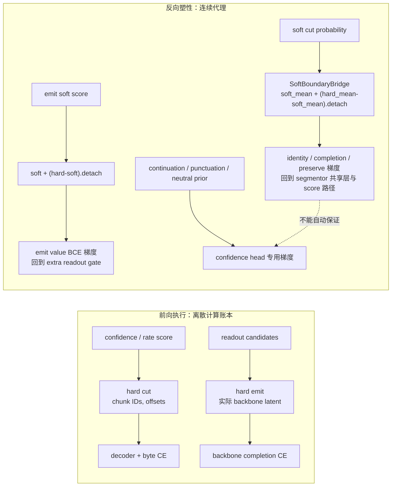

# FLUED v0.4-v3.4：架构、训练信号与梯度决策追踪

> 本文面向复现者和审阅者。它把“版本为何变化、当前代码具体如何执行、哪些损失实际更新哪些模块、哪组实验推翻了哪项假设”放在同一条可复核链路中。
>
> 代码锚点以当前分支 `copilot/implement-stage-a-experiments` 为准；早期数值均保留证据等级，不能跨口径外推。

## 1. 版本演化不是堆组件



| 阶段 | 架构主张 | 训练或评估的关键修正 | 被保留 / 被推翻的结论 |
| --- | --- | --- | --- |
| v0.4 | 研究 byte 流能否被连续潜表示精确翻译 | 建立自编码与压缩实验计划 | 仅为问题定义，不含性能 claim |
| v1 | 软边界与 tied inverse 足以形成可逆 codec | 纯重建 E1；历史 E2/E3 | 可高保真还原；历史 E3 不可替代后续公平 BPB |
| v2 | 加去噪可避免恒等映射，边界可由类型先验启动 | 3 seeds、去噪/压缩扫描、D1 | 重建稳定；去噪会削弱压缩；公平 D1 仍落后 BPE |
| v3.1 | readout 是外部语义接口，memory 是内部摘要 | ROI、轻量 codec、早期 backbone probe | 发现潜表示可能帮助补全，但边界仍偏符号/容量 |
| v3.2.1 | 先在原始 byte mask，才可评估下游帮助 | strict masked-source | no-memory latent 0.1898 vs byte 0.1440；阻断 clean 编码泄漏 |
| v3.3 | 先拆职责再讨论规模：segmentor 不读 memory，decoder 不读 memory | 公开架构、消融接口、风险探针 | 是接口端点，不是完整结果 |
| v3.4 | 以并行 one-shot 取代逐 chunk 串行链；以位置与窄 AR 修复局部顺序 | 位置×AR、emit、边界/decoder/memory 归因 | 结构候选已定位；动态边界与共享逆联合训练仍未闭环 |

## 2. v3.4 的当前前向路径

v3.4 不是“多步扩散语言模型”。准确术语是 **one-shot diffusion-style refinement**：对 byte payload 注入一次训练态噪声，DiT-style block 以噪声标量条件并行细化；部署形态只走一次前向。它保留扩散的并行表征优势，但不假称已经通过多步采样获得收益。



### 2.1 并行与隔离边界

- **Segmentor 不读 memory**：边界先由当前输入的 byte/context 决定，避免术语记忆直接把切分器变成跨 chunk 检索器。
- **Memory 是并行生成**：每个 chunk 的 memory 只由自身 span 生成，`DenseNoSelfMemory` 再让 interpreter 读取其他 chunk memory；当前 chunk 的 memory 默认被屏蔽。
- **Decoder 不读 memory**：解码只反向翻译 readout，不给 decoder 增加跨 chunk 记忆捷径。
- **临时 backbone 只是训练载体**：它负责补全被掩码的 byte 对应 latent；FLUED 训练稳定后，外部 backbone 可以替换，不把 4.8M 验证主干当作最终模型能力。

## 3. hard 前向与连续反向：梯度到底怎样走



关键事实：硬 decision 本身不提供普通导数。当前实现通过直通估计器让**前向使用硬 chunk / 硬 emit**，但**反向借用连续 soft 路径**。这避免“为了可微而把所有 latent 都送入 backbone”的伪压缩，但同时引入前向计算选择与反向信用分配可能错位的风险。

| 训练信号 | 直接对象 | 梯度是否经离散代理回流 | 当前目的 | 代码锚点 |
| --- | --- | --- | --- | --- |
| identity CE | readout / inverse decoder / encoder | 经 `SoftBoundaryBridge` 回 segmentor 共享表征 | 已知 byte 的忠实翻译 | `train_v34_pos_ar_probe.py:500-528`；`model.py:179-239` |
| masked completion CE | backbone、readout、编码器 | 同上；输入 byte 已先 mask | 判断 latent 是否让主干更易补全 | `train_v34_pos_ar_probe.py:512-527` |
| preserve CE | 未 mask 但受影响槽位 | 同上 | 防止补全时改写前后文 | `train_v34_pos_ar_probe.py:525-528` |
| continuation / punctuation / neutral prior | signed confidence 头 | **直接**更新 confidence 支路 | 结构性禁止/弱先验与启动支架 | `train_v34_pos_ar_probe.py:187-245, 726-743` |
| coding-rate / budget / calibration | score 或 confidence | 对偶变量 `detach` 更新，损失经软代理回流 | 控制切分与计算预算 | `train_v34_pos_ar_probe.py:272-471, 757-764` |
| emit-value BCE | extra readout gate | `target.detach()`，gate 保持可塑 | 仅让确有边际价值的 extra readout 发声 | `train_v34_pos_ar_probe.py:678-716`；`rate_emit.py:148-173` |
| AR delta penalty | 小 AR 输出 | 直接回 AR | 约束修正为轻度残差，不变成第二个主干 | `train_v34_pos_ar_probe.py:733-752` |

### 3.1 已观察到的梯度风险

1. 历史默认 Top-K 路径曾让 score 分支承担主任务梯度，但 signed-confidence 头主要只吃专用先验，出现“置信度看似存在、却不控制默认边界”的断裂。
2. 40K 归因显示 hard emit 先减少有效表示容量，动态边界接管后再出现 segmentor 梯度尖峰；把两者锁在同一课程开关中，不能靠延长训练解决。
3. `detach()` 的用途必须区分：它用于冻结价值目标、对偶价格和诊断比值，避免“用自身可移动的目标给自身打分”；但任何把 readout 或 memory 主路径整体 `detach` 的实验都应单列为 ablation，不能偷换成完整端到端结论。

## 4. 从纯并行 one-shot 到 RoPE + 小 AR

初始设想希望把编码尽量完全并行化：one-shot DiT-style segmentor/interpreter 通过全局注意力完成翻译，避免 byte 级自回归的串行开销。这条路线对 chunk 间并行有利，但**仅靠集合式 pooling / 没有位置的并行表示**无法可靠区分局部排列，例如相邻字母交换后 readout 与 memory 可能近似不变。

为定位这一问题，历史 1K 位置×AR 矩阵固定了 chunk 内 `reads / raeds / rxyds` 的交换探针：

| RoPE | 小 AR | identity | completion | chunk 内 readout 交换响应比 | 含义 |
| ---: | ---: | ---: | ---: | ---: | --- |
| 关 | 关 | 0.3205 | 0.1124 | 0.0000 | 近似排列不敏感 |
| 关 | 开 | 0.3054 | 0.1122 | 0.0014 | 小 AR 不能凭空创造稳定位置坐标 |
| 开 | 关 | 0.3507 | 0.1108 | 0.0579 | 显式相对位置提供弱顺序信息 |
| 开 | 开 | **0.4120** | **0.1148** | **0.6404** | 位置坐标 + 轻量因果校正出现协同 |

这组是**早期定位实验**，不是迁移后 v3.4 的最终性能数字。它支撑的仅是设计决策：

```text
one-shot 并行细化负责全局、可并行的表示；
RoPE / prompt 级位置给每个 byte 与 readout 明确坐标；
小 AR 只在每个 chunk 的有限 span 内做低幅度残差修正；
不能把小 AR 当作替代位置编码或第二个语言主干。
```

因此目前保留 `RoPE + SmallChunkARCorrection` 成组候选，同时继续比较 prompt 位置、局部位置和 memory byte-anchor 的分工。ALiBi 仅作为双向距离偏置实验路径，尚没有足够长期证据取代 RoPE。

## 5. 关键实现索引

| 功能 | 代码位置 | 审阅要点 |
| --- | --- | --- |
| 结构化 byte lookup 与普通 lookup 消融 | `flued/v33/byte_lookup.py`；`flued/v34/model.py:14-28` | 结构先验是输入坐标，不等于预置词义 |
| one-shot DiT-style 并行块、噪声条件、RoPE/ALiBi | `flued/v34/model.py:92-177` | 单次 refinement，不应宣传为多步 diffusion sampler |
| `[-1,1]` 置信度直通饱和 | `flued/v34/model.py:68-72` | 前向有界、反向不陷入 `tanh` 饱和 |
| 硬 chunk / 软桥 | `flued/v34/model.py:179-239` | `hard_mean` 执行，`soft_mean` 提供梯度 |
| 双阈值和 UTF-8 禁切 | `flued/v34/model.py:241-269` | `tau_trans < tau_cut`；continuation 是硬 guard |
| 并行 no-self memory | `flued/v34/model.py:310-402` | 当前 chunk memory 默认不可见；memory 不是 backbone token |
| 小 AR 残差修正 | `flued/v34/model.py:404-459` | chunk 间并行、chunk 内 GRU；门控初始很小 |
| shared inverse decoder | `flued/v34/model.py:492-566` | 复用 readout pool 与 interpreter 的一阶近似逆，非严格可逆 |
| coding rate / hard emit ST | `flued/v34/rate_emit.py:17-139,148-173` | `l2` 是历史能量代理；hard emit 才改变实际主干 token 数 |
| 严格 mask、联合损失、对偶更新 | `tools/train/v3_4/train_v34_pos_ar_probe.py:500-764` | 原始 byte 先 mask；主损失与专用梯度并存 |

## 6. 哪些实验支持哪些决策

| 决策 | 支撑实验 | 可以说什么 | 不能说什么 |
| --- | --- | --- | --- |
| 采用 strict masked-source | v3.2.1 byte 0.1440 vs latent no-memory 0.1898 | 潜 readout 在无真值泄漏下帮助小主干补全 | 不证明大型 backbone 已受益 |
| 保留 one-shot 并行形式 | 实现审计与计算路径 | 该路线避免 chunk 间逐步自回归 memory 依赖 | 不证明其已优于多步扩散或 AR |
| 引入位置 + 小 AR | 1K 顺序交换矩阵 | 纯并行集合式表示有顺序盲点；两者协同是候选 | 不把早期 1K 数值写成最终 v3.4 SOTA |
| 使用 hard emit | soft emit 的 actual latent/byte 反例 | 只有硬发声才会真正减少 backbone 输入 | hard emit 的课程已经稳定，不会伤害表示容量 |
| 分离边界与 emit 课程 | 40K S0/S1 归因 | 当前单一开关的非平稳耦合被证伪 | 已找到最终动态预算控制器 |
| memory 保留为分支 | 20K usage + 同检查点干预 | 存在小的联合训练/即时影响候选 | memory 已形成带序语义压缩 |

## 7. 对外表述模板

> FLUED v3.4 是一个正在归因的 byte-to-latent 编码器：其 one-shot DiT-style segmentor、显式位置和窄 AR 修正用于在保持并行度的同时恢复局部顺序；其硬执行/软反传机制使切分与 readout 发声进入真实计算账本。当前实验已经定位了边界信用、硬 emit 容量与共享逆 decoder 的耦合风险，因此 v3.4 公开为可复现的研究系统，而不是已完成的通用 tokenizer 替代品。
