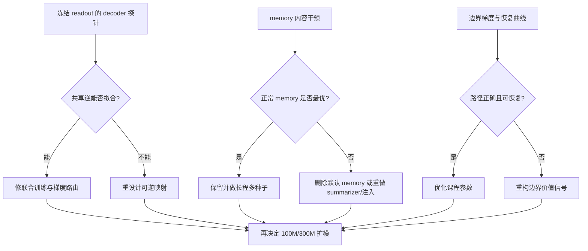

# FLUED v3.4 扩模前最小归因计划

日期：2026-07-15

## 1. 目的

硬盘迁移后的修正版实验已经证明若干组件具有稳定增量，但尚不能直接启动 300M 扩模。
本轮先区分三类问题：扩大参数、步数和数据即可回答的问题；消融能够定位但不能自动解决的
问题；必须修改结构或训练信号的问题。

本轮不是继续搜索最高单点准确率，而是减少架构决策的不确定性。所有比较必须使用同一语料、
掩码、评估批次和实际潜向量预算。

## 2. 问题分类

### 2.1 扩大实验规模即可回答

| 问题 | 所需实验 | 验收结果 |
| --- | --- | --- |
| 单种子偶然性 | 3--5 个种子 | 均值、标准差和失败率 |
| 是否欠训练 | 20K 延长至 50K/100K | 饱和、继续增长或后期坍缩曲线 |
| 参数规模趋势 | 36M、100M、300M | 同数据预算下的重建、补全与计算前沿 |
| 数据覆盖不足 | 控制每字节训练次数后扩大语料 | 区分数据收益与参数收益 |
| 主干友好度 | 4.9M、30M、100M 主干 | byte 基线与 FLUED 潜空间的困惑度差值 |
| 长度外推 | 512、2048、4096 bytes | 边界、吞吐、显存和无损率随长度的变化 |
| 语义边界自然度 | 多场景 ROI 与扰动样本 | 人工可解释性和边界稳定性 |

这些实验提高证据强度，不负责修复错误的结构约束。

### 2.2 必须先做归因

| 问题 | 最小归因 | 决策条件 |
| --- | --- | --- |
| 共享非严格反向 decoder 落后 | 固定同一个冻结 encoder 的 readout，只拟合两类 decoder | 固定输入仍明显落后：逆映射函数形态不足；差距消失：联合优化冲突 |
| memory 负收益 | 同一 memory 检查点上执行正常、置零、chunk 打乱、batch 错位 | 正常优于全部干预才说明内容有用；差异接近零说明被忽略；错误 memory 更好说明存在污染 |
| 动态边界切换后坠落 | 比较均匀、渐进切换和动态阶段的梯度及恢复曲线 | 梯度存在且能恢复属于课程问题；梯度错位或长期不恢复属于目标问题 |
| L2 编码率溢出 | 对角、L2、任务收益校准 L2 | 校准后稳定属于监督尺度问题，否则需改边界价值定义 |
| 小 AR 的真实作用 | 位置编码乘小 AR 的长程配对 | 只在有位置时稳定增益才保留为顺序修正器 |

### 2.3 当前已经暴露的设计问题

1. 编码率不等于边界任务价值。新增表示方向、重建收益和真实计算成本不能继续混成一个代理量。
2. 硬边界前向与连续置信度反向仍可能优化不同目标，必须用梯度探针和课程恢复曲线检查。
3. memory 的职责尚未被证实。当前 summarizer 与 other-only residual 可能被忽略或污染 readout。
4. 重建、补全、压缩和编码率存在目标竞争，需要课程或模块化梯度路由，不能仅增加固定损失权重。
5. 若 4096-byte Segmentor 仍使用全局二次注意力，扩大参数和数据不能解决实际吞吐瓶颈。

## 3. 第一轮最小实验

### A. 冻结 readout 的 decoder 函数形态探针

来源：20K `no-memory + shared inverse + diag` 检查点。

```text
冻结 encoder -> 产生相同 readout/chunk/emit
  -> 共享逆函数形态的可训练副本
  -> 独立跨度 decoder
```

两条分支读取完全相同的 readout，在同一批次同步更新，只计算可见输入的重建交叉熵。记录：

- 训练与固定评估重建交叉熵；
- 重建准确率；
- 100/250/500/1000 步的收敛曲线；
- 两条 decoder 的可训练参数量和吞吐。

判定：共享逆在固定 readout 上仍长期显著落后，说明函数形态或共享约束本身不足；若差距大幅
缩小，则原 20K 失败主要来自 encoder、边界和 decoder 的联合非平稳优化。

### B. Memory 内容干预探针

来源：20K `other-memory` 检查点。保持权重、输入、掩码和发声阈值不变，只改变送入
interpreter 的 memory 内容：

| 模式 | 操作 | 解释 |
| --- | --- | --- |
| normal | 原始 memory | 基线 |
| zero | 全部置零 | 测量是否真正依赖 memory |
| shuffle-chunk | 样本内打乱 chunk memory | 测量位置与内容对应关系 |
| stale-batch | 使用其他样本的 memory | 测量错误语义是否污染 readout |

记录重建、补全、困惑度、潜向量/字节和 memory 残差比例。只有 normal 稳定优于三种干预，
才能宣称当前 memory 内容有效。

### C. 边界课程与梯度路径定位

不重新训练长矩阵，先读取共享对角、独立对角和共享 L2 的现有 20K 日志，并在里程碑检查点
测量：

- Segmentor 共享层、置信度头、编码率投影和 decoder 的梯度范数；
- 3K 切换前后重建损失、实际切分、溢出和潜向量数；
- 6K、12K、18K、20K 的恢复斜率。

判定：置信度头无主任务梯度属于路径错误；梯度存在但共享 decoder 不恢复属于优化或逆映射
问题；L2 恢复同时伴随溢出，不能判为有效解决。

## 4. 暂不启动的实验

- 300M FLUED + 100M 主干；
- 4096-byte 正式训练；
- memory 内容监督网络；
- 动态计算预算和对偶控制器；
- 新一轮大规模超参数扫描。

这些实验必须等待 A/B/C 给出归因，否则只会放大当前不确定性。

> **2026-07-15复核更新：** A/B/C第一轮已经完成，但用户指出时间轴、memory监督和位置接口
> 仍有缺口。后续新增40K时间轴对照、memory使用率监督对照和位置机制解耦矩阵，完整修正见
> [`FLUED_V3_4_MINIMAL_ATTRIBUTION_RESULTS_20260715_CN.md`](FLUED_V3_4_MINIMAL_ATTRIBUTION_RESULTS_20260715_CN.md)
> 第7--8节。所有工作继续归属于v3.4，不新开版本号。

## 5. 下一步决策链


