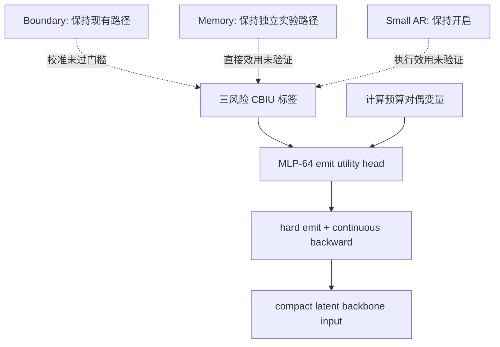

# FLUED v3.4 CBIU 三轮自主实验报告

> 日期：2026-07-17  
> 状态：三轮实验、离线反事实审计、动作校准和运行时测量均已完成  
> 存档：`K:\FLUED_archive\v34_cbiu_three_rounds_20260717`  
> 结论级别：单种子、小模型、512-byte 控制实验；可决定 emit 路线，不能外推为完整 v3.4 或大模型结论

## 1. 一句话结论

CBIU（Counterfactual Byte-Interface Utility，反事实字节接口效用）已经证明对 **extra readout
是否值得进入主干** 存在可学习信号；非线性轻量控制器能在更低 latent 预算下改善三项接口风险。
但当前动作排序和概率校准仍不够强，CBIU **尚不能接管 boundary，也尚未验证为 memory 和小 AR
的统一监督**。

本轮得到的默认候选是：

```text
CBIU 三风险标签
-> 64 hidden 的小 MLP emit controller
-> hard emit 前向
-> 连续分数反向传播
-> fallback readout 永远保留
-> 计算预算使用独立对偶变量
```

slot embedding 暂不进入默认路径。它减少了少量潜向量并略微改善部分 BPB，但没有同时改善 AUC、
ECE 和所有三项风险，证据不足以抵消额外参数与结构复杂度。

## 2. 本轮到底验证什么

三轮都从同一个 20K v3.4 检查点出发，使用同一份冻结 rich/null 三风险锚点、同一语料、同一
mask 规则和同一随机种子。模型约 35.9M，临时主干约 4.9M，序列长 512 byte，batch 8。

CBIU 对一次 extra-readout 动作比较开和关两条严格重算路径：

```text
干净重建 BPB
严格掩码补全 BPB
受影响 chunk 的可见字节保持 BPB
-> rich/null 锚点归一化
-> 取三项最坏风险 rho
-> U = rho(off) - rho(on) - compute_price
```

其中：

- `U > 0` 表示该 readout 值得保留；
- 动作是 `(样本, chunk, extra slot)`，不是整槽位的全局开关；
- 被 mask 位置必需的可写槽不参与删除动作；
- 关闭后会真实 compact 主干输入，不用“乘零但仍计算”的伪压缩；
- CBIU 标签停止梯度，模型不能通过修改标签生成路径作弊；
- rich/null 锚点与来源检查点绑定，加载不一致会拒绝训练。

这覆盖了接口质量、动作可辨识性、概率校准、真实 latent 数、训练稳定性和墙钟时间。它没有覆盖
多种子、2048/4096 byte、fresh backbone、300M 模型、完整语义任务或 boundary/memory 的严格
反事实训练。

## 3. 第一轮：联合训练会发生什么

### 3.1 设计

从同一检查点联合训练 FLUED 与主干 5K 步：

| 实验 | 发声监督 | 计算控制 |
|---|---|---|
| Legacy | 旧版 loss-delta + 固定 rate/cost | 固定权重 |
| CBIU quality | 三风险最坏项反事实效用 | 无对偶价格 |
| CBIU dual | 三风险反事实效用 | 预算 0.18 latent/byte 的对偶变量 |

### 3.2 最终结果

| 实验 | 重建准确率 | 补全准确率 | 补全困惑度 | 实际 latent/byte | 重建 BPB | 补全 BPB | 保持 BPB |
|---|---:|---:|---:|---:|---:|---:|---:|
| Legacy | 0.2100 | 0.1203 | 42.086 | 0.2323 | 3.937 | 5.481 | 4.551 |
| CBIU quality | 0.2108 | 0.1222 | 42.495 | 0.1741 | 3.976 | 5.568 | 4.604 |
| CBIU dual | 0.2100 | 0.1205 | 42.478 | 0.1931 | 3.967 | 5.575 | 4.633 |

CBIU quality 将实际 latent 数降低约 25%，但三项原始 BPB 均略差。曲线没有显示后期反超：联合
优化时，控制器、接口和主干共同漂移，降低容量的动作会立刻改变后续标签分布。第一轮因此不能
证明 CBIU 优于旧目标，只证明它确实能强力改变计算策略。

### 3.3 第一轮后的决策

第二轮冻结 FLUED 和主干，只训练 1,537 参数的线性 emit controller。这样将“标签是否可学”与
“联合训练信用分配是否非平稳”分开。

## 4. 第二轮：隔离 CBIU 标签是否可学

### 4.1 最终接口结果

| 实验 | 重建准确率 | 补全准确率 | 补全困惑度 | 实际 latent/byte | 重建 BPB | 补全 BPB | 保持 BPB |
|---|---:|---:|---:|---:|---:|---:|---:|
| Legacy emit-only | 0.2161 | 0.1188 | 43.496 | 0.1888 | 3.928 | 5.449 | 4.434 |
| CBIU quality emit-only | 0.2232 | 0.1192 | 43.789 | 0.1840 | 3.983 | 5.447 | 4.404 |
| CBIU dual emit-only | 0.2214 | 0.1189 | 43.840 | 0.1800 | 4.000 | 5.447 | 4.422 |

### 4.2 950 个严格动作的校准

| 实验 | Spearman | AUC | Brier | ECE | 0.5 阈值同号率 | Top-25% 重合率 |
|---|---:|---:|---:|---:|---:|---:|
| Legacy | 0.165 | 0.497 | 0.246 | 0.192 | 0.519 | 0.527 |
| CBIU quality | 0.189 | 0.528 | 0.243 | 0.186 | 0.572 | 0.464 |
| CBIU dual | 0.197 | 0.533 | 0.245 | 0.156 | 0.554 | 0.468 |

CBIU 相比旧目标得到正向但很弱的排序信号。它不是随机，但线性头不足以把局部 chunk 内容、
槽位候选和三风险效用映射成可靠动作。

为防止错误接管高影响结构，本报告使用以下保守准入门槛：

```text
Spearman >= 0.30
AUC >= 0.65
ECE <= 0.10
同号率 >= 0.65
```

第二轮没有通过，因此第三轮只扩大 emit controller 的函数容量，不让 CBIU 进入 boundary。

## 5. 第三轮：问题是不是控制器太弱

### 5.1 设计

仍冻结 40.8M 主体，从相同初始检查点重新初始化 emit controller，训练 3K 步：

| 实验 | 可训练参数 | 结构 |
|---|---:|---|
| Linear | 1,537 | 单线性层 |
| MLP-64 | 33,921 | 512 -> 64 -> 1 |
| MLP-64 + slot | 42,113 | MLP-64 + 槽位嵌入 |

### 5.2 接口风险

| 实验 | 重建准确率 | 补全准确率 | 保持准确率 | latent/byte | 重建 BPB | 补全 BPB | 保持 BPB |
|---|---:|---:|---:|---:|---:|---:|---:|
| Linear | 0.2245 | 0.1195 | 0.1631 | 0.1288 | 3.816 | 5.455 | 4.423 |
| MLP-64 | **0.2321** | **0.1198** | 0.1679 | 0.1388 | **3.792** | 5.439 | 4.341 |
| MLP-64 + slot | 0.2318 | 0.1196 | **0.1686** | **0.1312** | 3.796 | **5.437** | **4.340** |

### 5.3 动作校准

| 实验 | Spearman | AUC | Brier | ECE | 同号率 | Top-25% 重合率 |
|---|---:|---:|---:|---:|---:|---:|
| Linear | 0.161 | 0.544 | 0.245 | 0.171 | 0.576 | 0.435 |
| MLP-64 | 0.240 | **0.584** | **0.241** | **0.149** | 0.603 | **0.464** |
| MLP-64 + slot | **0.251** | 0.582 | 0.241 | 0.164 | **0.613** | **0.464** |

非线性头显著改善动作排序，说明第二轮的主要瓶颈之一确实是控制器欠拟合。显式 slot identity
只在 Spearman、同号率和少量接口指标上微弱占优，却使 ECE 变差，AUC 没有提升。因此当前默认
选 MLP-64，slot 版本保留为并列候选而不是正式默认。

与第一轮 Legacy 的离线策略相比，MLP-64 使用约 40% 更少的 latent（0.1388 对 0.2323），同时
三项 BPB 都更低（3.792/5.439/4.341 对 3.937/5.481/4.551）。这是跨训练机制的诊断性对比，
不是严格同训练范围的最终胜负；严格同轮对照应以第三轮 Linear 对 MLP-64 为准。

## 6. 运行时：latent 少了，为什么没有立刻更快

RTX 5080、batch 8、512 byte、100 次计时：

| 实验 | 活跃 latent/byte | 每样本最大 latent | 编码器 ms | compact ms | 主干 ms | decoder ms | 端到端 ms |
|---|---:|---:|---:|---:|---:|---:|---:|
| 第一轮 Legacy | 0.1858 | 186 | 33.774 | 0.270 | 1.319 | 7.338 | 42.853 |
| 第三轮 Linear | 0.1138 | 93 | 33.753 | 0.296 | 1.638 | 7.347 | **42.564** |
| 第三轮 MLP-64 | 0.1189 | 92 | 33.763 | 0.282 | 1.390 | 7.371 | 42.883 |
| 第三轮 MLP-64 + slot | 0.1177 | 94 | 34.121 | 0.279 | 1.419 | 7.331 | 43.038 |

潜向量减少没有形成可测的端到端提速，原因不是 emit 没有真实 compact，而是当前临时主干太小：

- FLUED 编码器约占端到端时间 79%；
- shared-inverse decoder 约占 17%；
- 4.9M 主干只有约 1.3--1.6 ms，token 减半后仍被 kernel launch 和小矩阵开销主导；
- 四组约 42.6--43.0 ms 的差异处于本地测量波动范围。

所以本轮证明的是 **主干输入长度下降**，不是整体推理已经加速。CBIU 的计算收益需要在更大的
fresh backbone 或更长上下文上测量；同时 FLUED encoder/decoder 自身仍是主要优化对象。

## 7. 三轮之后，哪些结论成立

### 7.1 已证明

1. rich/null 锚点能同时区分干净重建、严格补全和可见字节保持三类风险。
2. 严格 per-action CBIU 不是纯噪声；轻量非线性头可以学习部分动作排序。
3. CBIU 能驱动 hard emit，真实减少 compact 后进入主干的 latent 数。
4. 控制器容量是关键变量；单线性层不足，64 hidden 已带来明确增量。
5. joint CBIU 会与主体共适应产生非平稳性，先冻结主体隔离训练是必要诊断步骤。
6. 三风险最坏项避免了“重建改善掩盖补全恶化”等单目标补偿。

### 7.2 已证伪或否定为当前默认

1. 旧版局部 loss-delta 不是可靠的动作价值概率，AUC 约等于随机。
2. CBIU 一接入联合训练就会自动改善质量，这一假设不成立。
3. soft gate 代表真实计算压缩，仍然不成立；必须统计 hard compact 后的实际 latent。
4. 显式 slot embedding 必然优于共享 emit 规则，没有得到支持。
5. latent 数减少会在当前 4.9M 主干上自动转化为墙钟提速，没有得到支持。

### 7.3 仍未证明

1. CBIU 能否取代 L2 编码率并直接监督动态 boundary。
2. CBIU 能否区分 memory 的直接内容价值与 memory->emit 的容量中介效应。
3. CBIU 能否决定小 AR 是否执行。
4. 动作排序是否跨 mask seed、语料域、序列长度、模型规模和 fresh backbone 迁移。
5. 更低 BPB 是否对应更自然的语义段，而不只是高频字节模式。
6. CBIU 对 300M FLUED + 100M/更大主干的率失真前沿和实际速度收益。

## 8. 对 v3.4 的当前架构决策



代码中 CBIU 保持显式实验开关，不覆盖 legacy 默认值；下一轮配置可将 MLP-64 作为 emit 候选，
但 boundary、memory 和小 AR 不自动接管。

## 9. 下一轮准入条件

在扩大到完整模型前，建议按以下顺序继续：

1. 对 MLP-64 做 3 个种子与至少 3 个 mask seed，确认 AUC/Spearman 不是单种子偶然。
2. 使用同一 frozen FLUED 训练 fresh backbone，对比 Legacy/CBIU 在相同 latent 预算下的收敛和最终 BPB。
3. 在 2048/4096 byte 上测真实主干 FLOPs、吞吐和显存，而不是只看 latent 数。
4. 只有动作校准通过准入门槛，才实现 strict merge-rebuild boundary CBIU。
5. memory 使用 fixed-emit direct effect 与 total effect 两条路径，不能直接复用 emit 的结论。

若多种子后 AUC 仍低于 0.65，下一步不是继续堆控制器参数，而是改善动作特征或 CBIU 标签的
方差估计；否则会把一个弱评估器放大成高影响路由器。

## 10. 归档与复现

K 盘包含：

```text
round1_emit_5k/                 3 组联合训练，1K 间隔检查点
round1_offline_audit/           三风险离线审计
round2_emit_only_3k/            3 组冻结主体训练，1K 间隔检查点
round2_action_calibration/      950 动作校准
round3_controller_capacity_3k/  3 组控制器容量实验，1K 间隔检查点
round3_action_calibration/      950 动作校准
round3_offline_audit/           rich/null/policy/组件干预审计
runtime/                        分阶段 CUDA 计时
round*_training_curves.png      全日志点 + 平滑趋势
three_round_summary.{json,csv,md}
archive_manifest.sha256         关键存档哈希
```

实验配置：

- `configs/v3_4/v34_cbiu_round1_emit_5k.json`
- `configs/v3_4/v34_cbiu_round2_emit_only_3k.json`
- `configs/v3_4/v34_cbiu_round3_controller_capacity_3k.json`

分析入口：

```powershell
python tools/analysis/v3_4/summarize_v34_cbiu_three_rounds.py `
  --archive-root K:\FLUED_archive\v34_cbiu_three_rounds_20260717
```

机器汇总由脚本直接读取原始 JSON/JSONL 生成，正式结论以本文为准。
