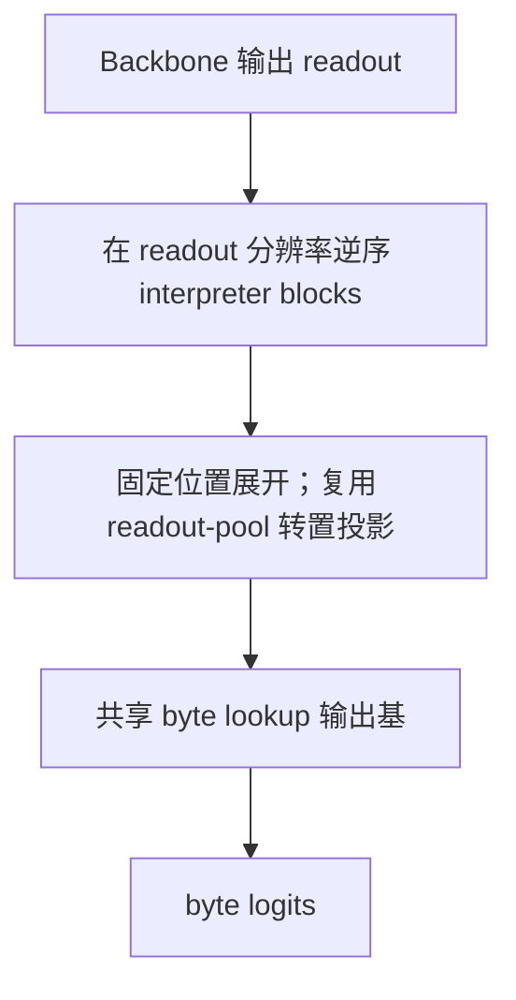

# FLUED v3.4 核心路径修正与重跑决策

> **历史决策状态：** 本文定义了 2026-07-14 修正版实验的设计与重跑范围，不代表实验完成后的
> 最终推荐。硬盘迁移后实际结果、同预算比较和当前决策统一见
> [`FLUED_V3_4_POST_MIGRATION_EXPERIMENTS_20260715_CN.md`](FLUED_V3_4_POST_MIGRATION_EXPERIMENTS_20260715_CN.md)。
> 尤其是普通 byte lookup、memory 默认地位和共享非严格反向 decoder 的判断，均以该报告为准。

> 日期：2026-07-14。本文接续全量自查，记录用户确认后的正式修正，不覆盖旧检查点的历史语义。

## 1. 最终确认的四项修正

### 1.1 边界由 signed confidence 真正执行

修正版保留固定双阈值：

```text
confidence > 0.90  -> chunk hard cut
0.75 < confidence <= 0.90 -> chunk 内逻辑转折诊断
UTF-8 continuation -> 永不允许切分
```

训练采用：

```text
前向：固定阈值产生离散 chunk
反向：sigmoid((confidence - 0.90) / temperature) 进入 soft boundary bridge
```

课程为：

```text
0-3K：均匀边界，先建立 byte-readout 对齐
3K-5K：正式 20K 配置中，hard 边界仍均匀，soft bridge 从均匀逐渐切到 confidence
5K+：正式配置中 hard 和 soft 都由 confidence 控制
```

为让 5K 筛选实验保留 1.5K 的阈值接管观察窗，5K 矩阵把过渡压缩为 `3K-3.5K`；它只用于筛选，正式 20K 仍使用 2K 平滑过渡。

历史 `marginal_rate_topk` 保留为旧实验复现模式，不再是修正版默认。

### 1.2 编码率改成真正的并行边际近似

历史 `l2`：

```text
0.5 * log(1 + ||z_t||^2 / epsilon^2)
```

只衡量当前位置能量，继续保留但明确命名为历史能量代理。

修正版 `diag` 使用对角协方差近似：

```text
R_t = 0.5 * mean_j log(1 + prefix_sum(z_ij^2) / epsilon^2)
DeltaR_t = R_t - R_(t-1)
```

它是前缀编码率的真实增量近似，复杂度为 `O(B*T*D)`，可用 `cumsum` 完全并行。编码率只作为置信度的专用训练信号和诊断指标，不代替推理时的双阈值控制器。

### 1.3 One-shot 路线保留

segmentor/interpreter 的 one-shot 并行潜空间修正是设计选择，不是缺失组件。当前不引入 4-8 轮推理去噪。文档中应称“one-shot diffusion-style refinement”，不能误写成完整多步扩散生成器，也不能把缺少多步循环列为架构缺陷。

### 1.4 Decoder 复用 interpreter 权重

修正版 decoder 不再训练独立 Q/K/V/FFN：



每个 interpreter block 以一阶近似逆形式执行：先减去共享 FFN 残差，再减去共享 attention 残差。它是 **interpreter-weight-shared first-order inverse**，不是严格数学逆。decoder 不读取 memory，也不复制小 AR 头。

## 2. 小 AR 头没有丢

当前位置：

```text
chunk span
-> 初始 memory/readout pooling
-> 小 AR GRU 修正 memory/readout
-> other-memory 读取
-> one-shot interpreter
-> emit
```

它在 chunk 间并行，只在单个 chunk 的最多 `max_span` 个 byte 内串行。P4 和修正版默认都启用 `use_ar=true`。旧实验支持“RoPE 必须保留，小 AR 只能作为联合修正、不能代替位置编码”；由于 decoder 和边界梯度路径已改变，修正版仍安排 `full / no-AR / no-position` 重新确认贡献。

## 3. Readout 级严格补全恢复

修正版默认先在原始 byte 上 mask，再按 byte offset 映射到对应 extra readout；fallback 永远保留，受影响的 extra readout 即使被 emit controller 判静默，也会在训练补全路径中强制保留可写槽位。

历史 chunk 模式继续作为对照，不能再作为默认。

## 4. 哪些旧实验必须重跑

| 旧结论 | 是否保留 | 原因 |
| --- | --- | --- |
| RoPE 单独优于无位置 | 方向保留，需复核幅度 | 新 decoder 直接复用带 RoPE 的 interpreter |
| RoPE + 小 AR 最好 | 候选保留，必须重跑 | AR 还在，但解码梯度已完全改变 |
| L2 优于 exact | 作废 | 旧 L2 不是边际编码率 |
| 均匀 -> L2 Top-K 课程最好 | 作废 | 修正版由 confidence 执行动态阈值切分 |
| hard emit 优于 soft gate | 保留 | 计算门控事实不受本轮修改影响，定量幅度重跑 |
| structured lookup 优于普通 lookup | 高概率保留 | decoder 输出仍共享 lookup，但梯度更直接，需确认幅度 |
| P4 other-memory 最好 | 降为候选 | decoder、mask 和边界三条路径都变了 |
| current-memory 长期不利 | 降为候选 | 旧 P4 只能说明旧训练动力学 |
| LayerNorm + 0.10 最好 | 不能作为最终结论 | P3 归因不纯且新主梯度改变 memory 塑形 |
| 旧补全困惑度比较 | 仅历史 | chunk 级 mask 与独立 decoder 已退役 |

## 5. 重跑顺序

### 第一轮：5K 单种子归因矩阵

配置：`configs/v3_4/v34_core_corrections_5k.json`

1. 完整历史 P4 参考；
2. 只修 confidence + diag rate；
3. 再切 readout-level mask；
4. 再切 shared-inverse decoder，形成修正版完整组；
5. 修正版关闭 AR；
6. 修正版关闭位置；
7. 修正版关闭 memory；
8. 修正版关闭 rate alignment。

这组矩阵可以分别定位四项修正带来的变化，不能直接把新旧完整组的差值归给单一组件。

### 第二轮：20K 长程确认

配置：`configs/v3_4/v34_core_corrections_20k.json`。只有 5K 满足以下条件才启动：

- 无 NaN、无 byte 截断；
- `segmentor_head_grad_norm > 0`；
- 3K 后置信度与执行边界接管成功；
- forced max-span chunk 不长期支配切分；
- 重建、补全和实际 latent/byte 没有不可逆共同退化。

20K 首轮至少比较历史参考、修正版完整组和修正版 no-memory。随后只对 Pareto 前沿候选跑三种子。

所有评估现在使用独立的 `eval_mask_seed=1042`，并通过 RNG fork 与训练随机数流隔离。不同结构即使训练期间消耗不同数量的随机数，也会看到相同评估掩码；旧日志不具备这一保证。

### 第三轮：语义 ROI 和规模扩展

在固定中英文、代码、实体密集、重复文本和 UTF-8 场景中检查 confidence、hard cut、逻辑转折和 emit。完成后才进入 2048/4096，再决定是否启动 300M。

## 6. 新增必看日志

```text
segmentor_head_grad_norm
boundary_confidence_controls_execution
boundary_confidence_controls_soft_bridge
confidence_rate_correlation
boundary_rate_alignment_loss
requested_hard_cut_fraction
hard_cut_fraction
forced_max_span_chunks_per_byte
cut_capacity_overflow
truncated_tokens
soft_readout_units_per_byte
actual_backbone_units_per_byte
backbone_padded_units_per_byte
masked_byte_pseudo_ppl
```

这轮改动需要从零训练；旧 checkpoint 只保留用于历史复现和固定权重干预，不能续训成修正版模型。

## 7. 2026-07-14 闸门试跑与新增结论

五项结构修正完成后没有直接启动 5K 矩阵，而是先用相同种子、512 byte、batch 8 做 0.5K--1.5K 闸门试跑。该步骤发现了旧日志无法显示的边界训练闭环问题。

| 试跑 | 关键变化 | 结果 | 结论 |
| --- | --- | --- | --- |
| R2，500 step | confidence 直接执行，无计算价格 | 普通边界均值约 0.95，请求切分约 55%，容量溢出约 1971 | 主任务通过多切 chunk 免费取得 fallback readout，边界饱和 |
| R3，500 step | 增加批次级对偶计算价格 | confidence 全部饱和到 +1，segmentor 梯度归零 | 单加成本不能修复 `tanh` 死区 |
| R4，500/1500 step | 前向 `tanh`，反向保持可塑梯度 | continuation 恢复到约 -0.95；但对偶项按等式施压后转为欠切分 | 预算是上限，不是需要填满的目标 |
| R5，1500 step | 单边预算上限 | 软计费接近目标，但硬执行请求仍约为软计费两倍 | 成本账本也必须硬前向、软反传 |
| R6，1500 step | 硬执行计费、连续梯度 | 容量溢出为 0，但硬边界约 0.20%，编码率相关性仍低 | 旧 `0.02/1.0` 信号比例不足以标定边界 |
| 信号探针，500 step | bridge 梯度 0.1，rate 对齐 0.2 | 相关性 0.641；请求硬边界 3.99%；rate 目标跨阈值 3.71%；continuation -0.995 | 已学到信息位置排序，且短程幅度接近目标 |
| 同探针续到 1500 | 不改配置 | 相关性 0.705，但硬边界回落到 0.44% | 排序稳定，置信度幅度校准仍未闭环 |
| 先验总权重 0.2，500 step | continuation/标点/普通均值共同放大 | 标点约 0.43，但硬边界归零 | 三类专用先验不能继续共享一个总权重调节 |

对应存档：

```text
L:\FLUED_archive\v34_core_correction_pilot_r2_20260714
L:\FLUED_archive\v34_core_correction_pilot_r3_dual_20260714
L:\FLUED_archive\v34_core_correction_pilot_r4_plastic_20260714
L:\FLUED_archive\v34_core_correction_pilot_r5_hinge_20260714
L:\FLUED_archive\v34_core_correction_pilot_r6_hard_st_budget_20260714
L:\FLUED_archive\v34_boundary_signal_probe_scale01_rate02_20260714
L:\FLUED_archive\v34_boundary_signal_probe_scale01_rate02_prior02_20260714
```

当前默认配置先采用 `boundary_bridge_gradient_scale=0.1` 和 `boundary_rate_alignment_weight=0.2` 作为下一轮候选，不把它写成最终超参。5K 矩阵前新增一个边界标定关卡：必须同时检查 rate 排序相关性、rate 目标跨阈值比例、实际跨阈值比例和三类结构先验。若排序高而实际切分持续回落，应拆分 continuation、标点和普通字符均值的专用监督，或增加连续的阈值幅度校准；不得重新用固定 Top-K 掩盖问题。

新增必看日志：

```text
boundary_rate_target_cut_fraction
requested_budget_chunks_per_byte
requested_soft_chunks_per_byte
boundary_target_chunks_per_byte
boundary_compute_constraint
boundary_compute_dual
boundary_compute_budget_loss
```
