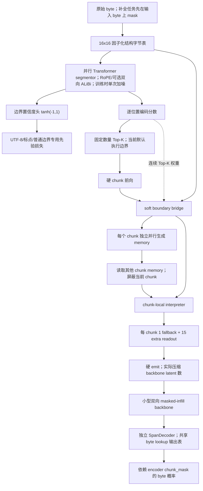

# FLUED v3.4 全量自查：实际决策路径、实现边界与结论可靠性

> **时效说明：** 本文是 2026-07-14 开训前的代码与证据审计，仍用于解释为什么必须重跑，
> 但不再是实验结论的最高优先级口径。硬盘迁移后的修正版结果与当前组件决策见
> [`FLUED_V3_4_POST_MIGRATION_EXPERIMENTS_20260715_CN.md`](FLUED_V3_4_POST_MIGRATION_EXPERIMENTS_20260715_CN.md)。

> 日期：2026-07-14  
> 审计对象：本目录全部 10 份文档、`flued/v34/`、v3.3 依赖组件、v3.4 训练/评估入口、P0-P4 配置、训练日志和最终检查点。  
> 本文曾是 v3.4 开训前最高优先级口径。旧文档保留实验发生时的观察，但不能覆盖本文对实现语义和证据强度的修正；实验后的组件结论不能覆盖 2026-07-15 总报告。

## 1. 总结

v3.4 不是“组件齐全、只差扩大规模”的状态。审计最初识别出五项差异；用户复核后确认 one-shot 是有意设计而非缺失，其余四项已经进入修正版代码：

1. 默认边界由固定数量的编码分数 Top-K 决定，`[-1, 1]` 边界置信度不直接决定执行边界，也不承接默认路径的主任务软桥梯度。
2. 名为 `l2` 的“边际编码率”实际是逐位置投影能量，不是前缀新增信息量。
3. one-shot 并行潜空间修正是正式路线，不要求多步推理去噪；应精确称为 one-shot diffusion-style refinement。
4. decoder 原本是独立跨度解码骨架；修正版已改成逆序复用 interpreter/readout-pool 权重的一阶近似逆路径。
5. v3.3 已实现的 readout 级严格掩码映射曾在 v3.4 退化；修正版已恢复为默认，chunk 级模式只用于历史复现。

因此，现有 20K 实验证明的是：**在 38M FLUED + 4.8M 双向掩码补全主干、512 byte、单种子的特定实现下，均匀预热、逐位置 L2 能量 Top-K、硬发声和 other-memory 联合训练能得到较好的重建/补全端点。**它尚未证明完整 v3.4 设计、动态语义切分、真正扩散式编码、完整可逆 decoder 或 300M/4096 的扩展性。

## 2. 当前代码真实数据流



必须注意：上图中置信度头 `C` 与默认执行边界 `K` 是两条支路。只有 `boundary_mode=threshold` 时，`tau_cut=0.90` 才直接执行切分；P4 和当前默认配置在 3K 后使用 `marginal_rate_topk`，不走这条路径。

固定种子 42 的最小反向传播探针进一步确认：只用 readout 主任务损失反传时，segmentor 共享注意力块梯度绝对值和为 `0.0311`，编码分数投影为 `1.4131`，而 `segmentor_head` 梯度为 `None`。也就是说主任务能训练共享上下文和编码分数，但不能塑形默认路径中的 signed-confidence 输出头；该头目前主要由专用边界先验损失训练。

## 3. 组件逐项核对

| 组件 | 当前实现 | 与设计一致性 | 判定 |
| --- | --- | --- | --- |
| 结构化 byte lookup | 行嵌入 + 列嵌入 + byte 类型嵌入 + LayerNorm | 保留 16x16 坐标先验，但不是 256 个独立二维点 | 已实现，命名需精确 |
| Segmentor | 多层并行自注意块，输出 `tanh` 置信度 | one-shot 是正式设计，不以多步扩散循环为验收条件 | 已实现，训练目标重跑 |
| 双阈值 | `0.90` hard cut、`0.75` transition | 只在 threshold 模式真正控制 hard cut；transition 当前仅诊断 | 默认路径旁路 |
| UTF-8 continuation | hard guard 禁止切分，并有先验损失 | 与设计一致 | 已实现 |
| L2 coding score | `0.5*log1p(||Wz_t||^2/eps^2)` | 是逐位置能量，不是边际新增编码率 | 命名错误 |
| exact coding rate | 前缀协方差 log-det 差分 | 更接近边际编码率，但计算昂贵 | 已实现对照 |
| chunk 数 | 由 `bytes_per_chunk_budget=16` 得到固定数量 | 不是动态 chunk 数；简单/复杂样本预算相同 | 未实现动态预算 |
| 容量保护 | 所有边界模式现在都预留 max-span 强制切分容量 | 修复前仅 threshold 生效，4096 配置存在静默截断风险 | 本次已修复 |
| Memory summarizer | 每个 chunk 只看自身 byte span，所有 chunk 并行 | 不互相递归，符合 v3.4 | 已实现 |
| Memory 读取 | interpreter 读取 other-memory，排除当前 chunk；未来 memory 可见 | 符合双向 encoder 设定 | 已实现 |
| Interpreter | 全局 memory 残差后，chunk 内并行细化 | 符合当前编码器路径 | 已实现 |
| 小 AR 修正 | chunk 间并行，chunk 内 GRU 串行 | 可修正局部顺序，但不是 DSpark 接受率机制 | 已实现简化版 |
| Readout emit | fallback 永开，extra 使用 hard straight-through gate | 真正减少送入 backbone 的 latent 数 | 已实现 |
| 严格输入掩码 | 先 mask 原始 byte，再编码 | 无 clean 信息侧漏 | 已实现 |
| 掩码到 readout 映射 | 历史模式标记整 chunk；修正版按 byte offset 映射 extra readout | v3.3 槽位级路径已恢复 | 已修复，需重跑 |
| 临时 backbone | 双向 Transformer encoder做 masked infill | 不是 AR、ELF 或扩散 backbone | 已实现验证骨架 |
| Decoder | 历史模式独立；修正版复用 readout-pool 转置投影和逆序 interpreter blocks | 非严格数学逆；仍依赖 encoder chunk_mask | 核心路径已修复，需重跑 |
| 4096/300M 配置 | 337.7M FLUED + 107.1M backbone | 本次已对齐 P4 的机械配置，但上述架构语义和长序列行为仍未验证 | 禁止直接正式训练 |

## 4. 决策路径复原

### 4.1 v3.3 到早期 v3.4

目标从串行历史 memory 转向：每个 chunk 并行总结 memory，interpreter 一次性读取其他 chunk 的 memory；同时加入结构化 byte lookup、位置编码、小 AR 修正和 readout 发声控制。这一方向本身没有在后续实验中被推翻。

### 4.2 1K/5K 组件筛选

早期实验确认：

- 结构化 byte lookup 明显优于普通 lookup；
- RoPE 是顺序恢复的必要组件，小 AR 不能单独替代位置编码；
- 软 gate 只缩放表示，不降低 backbone 计算；hard emit 才是计算门控；
- 仅重建不能训练出可用的补全主干；
- 固定全程噪声带来短期重建/补全张力。

这些结论仍具有方向性，但部分矩阵运行在后来修正前的跨 chunk 路径上，只能作为候选筛选，不能作为最终定量结论。

### 4.3 均匀边界到 L2 课程

20K 对照显示均匀预热后切换 L2 的课程有训练价值。但其准确解释是：

```text
0-3K：固定均匀 chunk 数和位置
3K+：固定 chunk 数不变，位置改由逐位置 L2 能量 Top-K 选择
```

它没有验证动态压缩率，也没有证明置信度阈值学会了语义边界。日志中 hard cut 比例长期固定为 `32/512=0.0625`，正是固定预算的直接结果。

### 4.4 P0-P4 串行位置/memory 实验

P0/P1 是 5K 单种子筛选，且各组实际 latent/byte 不一致，因此只能确定候选，不足以声称同计算预算支配。P3 又把 other-memory 与 detached current-memory 混在同一组中，不能单独证明 `LayerNorm + 0.10` 对 other-only 最优。

P4 从零训练 20K 的跨模型结果可信地说明：在该训练设置下，other-only 路径比 no-memory 和 detached current-memory 得到更好的联合训练端点。但它仍混合了“结构的即时使用价值”和“改变优化轨迹的正则化价值”。

## 5. 新增同检查点 Memory 因果审计

检查点：`p4_b_other_memory_only/latest.pt`。固定模型、数据批次和掩码，只在推理时切换 `use_memory`，共 8 个掩码种子。

`off - on` 的均值：

| 指标 | 均值 | 解释 |
| --- | ---: | --- |
| 重建准确率 | -0.00056 | memory 提高约 0.056 个百分点 |
| 补全准确率 | -0.00246 | memory 提高约 0.246 个百分点 |
| 补全交叉熵 | -0.00857 | 关闭 memory 反而略低；标准差 0.00877 |
| 可见字节保持率 | -0.00158 | memory 提高约 0.158 个百分点 |
| 实际 latent/byte | +0.00161 | 几乎不变 |

结论：同一权重中，memory 对 argmax 准确率存在很小的即时因果贡献，但没有稳健降低交叉熵。P4 跨模型的较大提升更可能主要来自训练轨迹、正则化和表示塑形，不能直接解释成“推理时 memory 内容提供了丰富全局语义”。

这不会把 memory 判死刑，但会把它从“已证实核心组件”降级为“有联合训练价值、内容价值待干预实验确认的候选组件”。

## 6. 结论可靠性分级

| 等级 | 可以保留的结论 |
| --- | --- |
| A：代码事实/直接测试 | 结构化 lookup、并行局部 memory、other-memory 排除当前 chunk、硬 emit 真正压缩 backbone 输入、严格 byte 先掩码、RoPE 和小 AR 的实际位置 |
| B：当前实验条件内可信 | 结构化 lookup 优于普通 lookup；RoPE 必要；hard emit 必要；重建与补全需联合训练；P4 other-only 的单种子联合训练端点最好 |
| C：仅候选 | 双向 ALiBi、memory 位置、LayerNorm 0.10、固定噪声、L2 能量边界的长期优势、memory 的语义内容质量 |
| D：当前不能声称 | 动态语义切分已经解决；历史 L2 是严格边际编码率；decoder 可脱离 chunk 元数据自由生成；300M/4096 已验证可扩展 |

## 7. 必须重做或补做的实验

优先级按“先修语义，再烧算力”排列：

1. readout 级掩码已恢复并设为修正版默认；历史 chunk 级模式只用于重跑归因。
2. signed confidence 已同时控制固定阈值执行和连续边界桥；新增批次级硬前向/软反传计算上限。当前 blocker 已从“路径缺失”转为“高编码率位置的置信度幅度标定不稳定”。
3. 旧 `l2` 已正式降级为“逐位置 L2 能量代理”；新增 `diag` 前缀对角协方差增量，作为并行低成本边际编码率近似。精确行列式仍保留为对照。
4. 固定评估语料与掩码库。当前 16 个流式评估批次方差足以让 masked-byte 困惑度明显漂移。
5. 对 memory 做同检查点 `zero/shuffle/stale/patching`，再做至少三种子从零训练；只有两类证据一致，才能判断内容价值。
6. decoder 已改为 interpreter 共享权重、逆残差顺序的非严格反向路径，并移除独立可训练 decoder；仍依赖 encoder 产生的 chunk 元数据，因此不能声称自由长度解码。
7. 在 38M/512 修正通过后，再做 2048/4096 长度外推；最后才启动 300M 配置。

## 8. 当前建议默认口径

```text
v3.4 已实现并通过代码/短程闸门验证：
并行上下文切分骨架 + 因子化字节先验 + 并行 chunk memory +
chunk-local interpreter + RoPE + 小 AR 修正 + 硬 readout 发声 +
严格 byte-mask/readout-mask 联合训练 + interpreter 共享非严格反向 decoder +
固定置信度阈值的硬前向/连续反传 + 对角边际编码率近似。

v3.4 尚未完成：
动态边界的长期置信度幅度标定、语义 ROI、memory 内容价值、
自由长度解码、5K/20K 修正版归因矩阵和大规模长上下文验证。
```

这条口径比“完整 v3.4 已经验证，只差 scaling”保守，但与代码和日志完全一致，也给下一轮实验留下可证伪的清晰接口。
