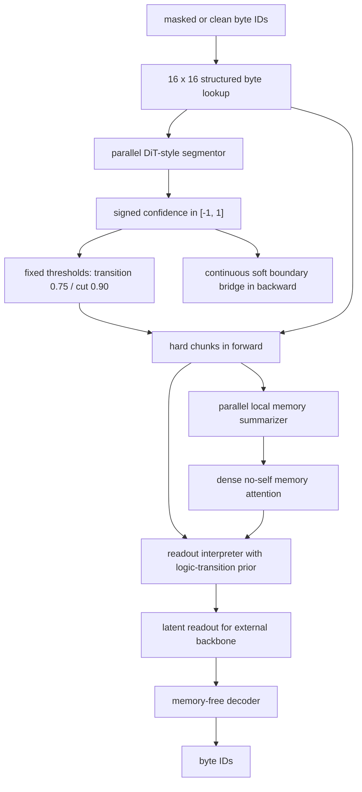

# FLUED v3.4 实现基线与位置/小自回归实验

## 1. 本轮目的

v3.4 不再延续 v3.3 的串行历史记忆队列。它首先把每个 chunk 的局部 memory 并行生成，再由 interpreter 在一次并行前向中读取除当前 chunk 之外的 memory。当前实验只回答一个问题：**显式位置编码与小型自回归修正头，哪一种更有效地补足 chunk 内字节顺序信息。**

## 2. 已定结构



必须保持：

1. segmentor 是并行 DiT 风格上下文模型，不是逐字节 MLP。
2. `tau_cut=0.90`、`tau_trans=0.75` 固定，不学习阈值。
3. 前向采用硬切分；反向通过连续置信度的软分配桥更新 segmentor。
4. UTF-8 continuation byte 永远禁止切分，其置信度先验目标为 `-1`。
5. 标点和空白是弱先验，置信度目标为 `0.5`；其余字符级候选边界只约束均值接近 `0`。
6. chunk payload 从结构化 byte lookup 构建，不直接把 segmentor 隐状态冒充语义 payload。
7. 逻辑转折标记进入 interpreter 作为弱先验，不进入 byte lookup 本身。
8. 每个 chunk 的 local memory 只由当前 chunk 内容并行产生；memory 之间不串行更新。
9. interpreter 可看其他 chunk 的 memory，但屏蔽当前 chunk 自身的 memory；默认使用稠密注意力，不使用 top-k。
10. decoder 只执行 readout 到 byte 的逆翻译，不直接读取 memory。
11. 严格补全任务必须先在原始 byte 输入上 mask，FLUED 不得接触 clean 输入。
12. memory 内容暂不加直接目标；只把 interpreter 的 memory 使用门控约束在 `0.20-0.50`。
13. 历史探针曾错误地最大化全局 readout 分散度；该损失已废止。当前采用 byte 位置的前缀边际编码率，并在固定/长度分桶 chunk 预算内 Top-K 选边界。
14. `128 byte/chunk` 是无损硬兜底；超出 chunk 容量的请求切分在执行前被裁掉，但连续置信度和请求切分率仍保留用于训练与诊断，禁止通过截断文本处理溢出。
15. 每个 chunk 产生 1 个必开的 fallback readout 和最多 15 个 extra readout；emit controller 使用硬前向、连续直通反传。
16. emit 的思想借鉴 Qwen gated attention 的“低价值输出沉默”，但 Qwen 原机制不删除 token；FLUED emit 是新的计算门控设计。

## 3. 已废止口径

- 不采用 KDA 式串行 memory 更新；它与 v3.4 的全 chunk 并行路线冲突。
- 不使用 `tau_keep` 作为第三个执行阈值；负置信度只承担连续训练语义，UTF-8 continuation 由硬结构约束兜底。
- 不把标点目标设置成两个正阈值的中点 `0.825`；固定为弱先验 `0.5`。
- 不让 decoder 读取 memory。
- 不把 clean readout 作为严格 masked-source 路线的教师目标。

## 4. 监督路径

### Codec identity

对实际送入 FLUED 的输入 `x_observed`：

```text
D(E(x_observed)) = x_observed
```

若输入位置是 MASK，identity decoder 也应还原 MASK。这条路径监督 readout 的忠实可逆性，不负责猜测缺失内容。

### Backbone completion

临时 backbone 只改写受 mask 影响 chunk 的 readout，组合后的 latent 经同一个 decoder 还原 clean bytes。损失包含：

- 被 mask byte 的交叉熵与准确率；
- 同一受影响 chunk 内可见 byte 的保持损失；
- 实时困惑度，它等价于 masked-byte 交叉熵的指数形式，主梯度由交叉熵同时更新 backbone 与 FLUED。

这里验证的不只是补全准确率，还要验证 FLUED 是否形成更平滑、信噪比更高、对新 backbone 更易学习的潜空间。

### Boundary

专用先验只塑造 segmentor：continuation `-1`、标点/空白 `0.5`、普通候选均值 `0`。Codec 与 backbone 主损失则通过软边界桥间接塑造置信度，避免硬切分断开梯度。

### Readout 与 memory

memory 暂不接受内容标签、与 readout 的直接相似度或信息量比例监督。memory 只由主任务缓慢塑形，另用区间损失把 interpreter 的 memory 使用门控约束在 20%-50%。

readout emit 的监督值为：

```text
extra value
= 移除该 readout 后的重建/补全损失增量
 + 所属 chunk 的边际编码率收益
 - 当前 backbone 长度下的边际计算成本
```

训练时轮换抽取 extra slot，比较强制开启/关闭的反事实损失。fallback 永远开启。日志必须同时报告 `soft_readout_units_per_byte`、`actual_backbone_units_per_byte` 和批内压紧后的 `backbone_padded_units_per_byte`。

## 5. 位置编码与小自回归 2 x 2

四组模型参数完全相同；小自回归模块在四组都实例化，只切换是否执行。

| 组别 | RoPE | 小自回归修正 |
|---|---:|---:|
| A | 关 | 关 |
| B | 开 | 关 |
| C | 关 | 开 |
| D | 开 | 开 |

小自回归头在最终 pooling 前读取 chunk 内有序 byte slots，并对 local memory 与 readout 施加有界小残差。它不串行处理 chunk，所有 chunk 仍可并行。

验收不只看重建：

1. 相邻字母交换相对字符替换的 memory/readout 变化比例；
2. masked-byte 补全交叉熵、准确率和困惑度；
3. 可见 byte 保持准确率；
4. identity 重建及 MASK identity；
5. hard cut、chunk/byte、截断量和置信度分布；
6. segmentor 是否持续收到主任务梯度；
7. 参数量、吞吐和显存。

## 6. 当前实现与规模

- 模型：`flued/v34/model.py`
- 训练：`tools/train/v3_4/train_v34_pos_ar_probe.py`
- 矩阵：`configs/v3_4/v34_pos_ar_40m_probe.json`
- 启动器：`tools/launcher/v3_4/run_v34_pos_ar_matrix.py`
- 回归测试：`tests/test_v34_architecture.py`
- 本轮 FLUED 约 36.3M 参数，临时 backbone 约 4.6M，总计约 40.9M。
- 这是约 1/10 规模的结构筛选，不是 v3.4 最终 300M-400M 训练结论。

## 7. 组件消融

在完整的 RoPE + 小自回归组上继续逐项关闭：跨 chunk memory、逻辑转折弱先验、软边界反传桥、边界专用先验、编码率约束、memory 使用区间约束、backbone 补全主任务和单步扩散噪声；另将 `16 x 16` 结构化字节表替换为普通 258 项 lookup。消融只关闭执行路径或损失，两套 lookup 和其他相关参数仍全部实例化；完整组复用位置/小自回归矩阵中的同种子结果。
