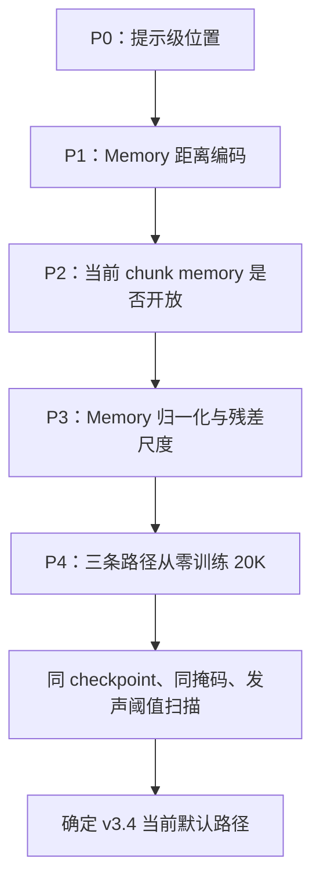
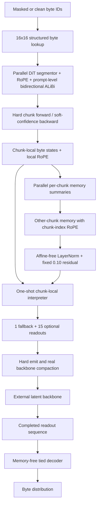

# FLUED v3.4 位置与 Memory 严格串行实验：5K 筛选和 20K 确认

> 本文是 2026-07-13 完成的当前规范结论。早期 1K/5K 文档继续保留为研究过程，但涉及 memory 默认路径、位置编码和注入尺度时，以本文为准。

## 1. 为什么重做

旧 v3.4 消融存在四个归因问题：

1. interpreter 曾在 flatten 后跨 chunk 全局自注意，使 no-memory 组仍能跨 chunk 通信；
2. no-memory 组没有真正跳过全部 memory 计算；
3. 提示级位置、chunk 内位置和 memory 位置曾被混在同一套索引中；
4. memory 原始上下文范数远高于 readout，固定残差会把“是否需要 memory”和“尺度是否匹配”混为一谈。

代码纠偏后，本轮严格按 `P0 -> P1 -> P2 -> P3 -> P4` 串行决策。每一轮只让胜者进入下一轮，避免一次改变多个因素。

## 2. 固定实验条件

| 项目 | 设置 |
| --- | --- |
| FLUED | 38,312,983 参数 |
| 临时主干 | 4,783,232 参数 |
| 总参数 | 43,096,215 |
| 序列 | 512 bytes，stride 256 |
| batch | 8 |
| 随机种子 | 42，确定性算法开启 |
| 掩码 | 5%，先在原始 byte 输入上掩码 |
| 边界课程 | 0-3K 均匀边界；3K 后 L2 边际编码率 Top-K |
| readout | 每 chunk 1 个 fallback + 15 个可选向量 |
| 发声 | 硬前向、连续分数直通反传，阈值默认 0.5 |
| 优化器 | fused AdamW，学习率 2e-4 |
| 评估 | 相同数据、随机掩码和阈值扫描协议 |

训练任务同时包含忠实重建和严格 masked-source 补全。补全困惑度由被掩码 byte 的交叉熵计算；主损失的交叉熵同时更新临时主干和 FLUED。

## 3. 串行决策链

P0/P1 的短实验确定：

- segmentor 在原有 RoPE 上叠加基于原始 byte 距离的双向 ALiBi；P0 评估的是增量贡献，不是纯 ALiBi 替代 RoPE；
- chunk 内 query/readout/interpreter 保留局部 RoPE；
- other-memory 使用 chunk-index RoPE；
- 不把提示级绝对位置向量重复加到 payload 和 memory。

P2 的 5K 筛选曾显示：独立、停止梯度的 current-memory 通道有较好的短期困惑度；但这只是进入 P3/P4 的候选，不是最终结论。

## 4. P3：Memory 尺度与归一化，5K 筛选

| 组别 | Memory 处理 | 重建 | 补全 | 困惑度 | 实际 latent/byte | 定位 |
| --- | --- | ---: | ---: | ---: | ---: | --- |
| A | no-memory | 56.67% | 13.76% | 39.26 | 0.70 | 严格局部下限 |
| B | 原始 memory，固定 0.10 | 69.52% | **14.37%** | 37.78 | 0.99 | 有效，但注入尺度污染明显 |
| **C** | **无仿射 LayerNorm，固定 0.10** | **79.26%** | 14.02% | **37.69** | 0.84 | **P3 胜者** |
| D | LayerNorm，固定 0.03 | 59.21% | 13.90% | 39.88 | 0.64 | 0.03 注入过弱 |
| E | LayerNorm，有界可学习 0.03-0.10 | 36.00% | 11.66% | 54.54 | 0.72 | L2 切换后坍缩 |

关键观察：

- 原始 memory 上下文范数约为 `92`，无仿射 LayerNorm 后稳定到 `sqrt(512)=22.63`；
- 固定 `0.10` 明显优于固定 `0.03`；
- 可学习标量没有自动解决多目标耦合，反而在边界课程切换时形成更差的联合解；
- 因此 P4 固定使用无仿射 LayerNorm 和 `0.10` 历史 memory 残差。

## 5. P4：20K 从零训练

三组具有相同参数量、优化器、数据、种子和 20K 学习率计划：

| 组别 | Memory 路径 | 重建 | 补全 | 困惑度 | 实际 latent/byte | 速度 |
| --- | --- | ---: | ---: | ---: | ---: | ---: |
| A | no-memory | 87.43% | 11.64% | 45.05 | **0.44** | 7.81 step/s |
| **B** | **仅历史 other-memory；no-self** | **96.89%** | **13.80%** | **35.76** | 0.58 | 7.46 step/s |
| C | other-memory + detached current-memory | 85.44% | 12.95% | 38.63 | 0.53 | 7.34 step/s |

默认评估使用训练结束时的随机评估流。下节的阈值扫描使用固定评估种子，因此数值略有差异；横向公平比较应优先使用阈值扫描表。

### 5.1 5K 结论为什么被反转

在 5K，独立 current-memory 通道一度表现更好；延长到 20K 后，它的重建长期停在约 85%，没有形成足够的补全收益。仅历史 other-memory 则经历 9K-12K 的表示重组，在 15K 后恢复并取得最好的长期端点。

这不是简单的欠训练或过训练：

- no-memory 在 12K 附近达到较好点，之后发声与边界共同收缩，补全退化；
- other-only memory 在中期明显变差，但随后恢复到更好的率失真前沿；
- current-memory 通道早期快、长期上限低，是典型的优化捷径，而不是最终结构优势。

### 5.2 20K 固定掩码阈值扫描

| 组别 | 阈值 | 重建 | 补全 | 困惑度 | 实际 latent/byte |
| --- | ---: | ---: | ---: | ---: | ---: |
| no-memory | 0.3 | 90.12% | 11.70% | 46.18 | 0.59 |
| no-memory | 0.5 | 87.70% | 12.48% | 42.76 | 0.43 |
| no-memory | 0.7 | 80.34% | 11.81% | 45.85 | 0.30 |
| other-only memory | 0.3 | **98.37%** | 13.47% | 36.52 | 0.92 |
| **other-only memory** | **0.5** | **96.52%** | **13.72%** | **35.36** | **0.58** |
| other-only memory | 0.7 | 57.13% | 13.20% | 37.62 | 0.11 |
| other + current detached | 0.3 | 91.09% | 13.03% | 36.44 | 1.00 |
| other + current detached | 0.5 | 84.90% | 12.51% | 36.54 | 0.53 |
| other + current detached | 0.7 | 49.81% | 12.24% | 41.59 | 0.08 |

在约 `0.58-0.59 latent/byte` 的接近预算点，other-only memory 同时显著提高重建并降低补全困惑度。它不是只靠增加 latent 数量取得收益。

## 6. 当前默认 v3.4 路径

当前默认：

1. segmentation 不读 memory；
2. 每个 memory 只总结自己的 chunk，所有 chunk 并行生成；
3. interpreter 只读其他 chunk 的 memory，不读当前 chunk memory；
4. memory 注入前做无仿射 LayerNorm，固定残差比例 `0.10`；
5. current-memory 独立通道保留为消融接口，默认关闭；
6. logic-transition 向量注入和 memory 使用率区间损失退役；
7. decoder 不读 memory；
8. hard emit 决定实际进入 backbone 的 latent 数量。

## 7. 仍未解决的问题

1. 结论仍是单种子、512-byte、38M FLUED + 4.8M 临时主干，不能外推到 300M/4096-byte。
2. 9K-12K 的中期重组说明边界、发声和补全目标仍存在明显非平稳耦合。
3. other-memory 的原始范数训练到约 `1850`，虽然归一化后的注入稳定为 `22.63`，但 summarizer 内部尺度增长仍需诊断。
4. 当前固定 Top-K chunk 数尚未实现批次级动态计算预算。
5. 边界的任务有效性已被测量，但语义自然度仍需 ROI、扰动稳定性和人工样本审计。
6. 当前结果支持 memory 改善小主干的联合训练难度，不证明它对所有下游主干或长上下文任务都有效。

## 8. 可复现材料

- 配置：`configs/v3_4/v34_p0_prompt_position_5k.json` 至 `v34_p4_memory_20k.json`
- 训练入口：`tools/train/v3_4/train_v34_pos_ar_probe.py`
- 长度/位置评估：`tools/eval/v3_4/eval_v34_position_generalization.py`
- 原始 P3/P4 日志和阈值轨迹：[`results/v3.4/memory_position_20k_20260713/`](../../../results/v3.4/memory_position_20k_20260713/README.md)
- 本机检查点归档：`L:\FLUED_archive\v34_serial_experiments_20260713`

检查点不进入 Git 仓库；公开目录保留原始训练日志、配置、汇总 JSON 和全部 21 个里程碑阈值扫描。
