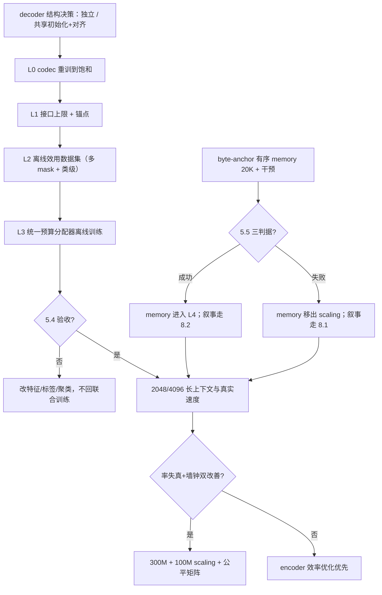

# FLUED v3.5 设计草案：分级冻结训练与离线效用决策层

> 日期：2026-07-17（晚，交接复核后）
> 状态：**设计草案，未并入主线**。本文自成体系；若后续实验（尤其 byte-anchor 有序 memory、
> emit 连续退火、离线 CBIU 复测）支持其命题，改名并入主线文档即可。
> 前置阅读：`FLUED_HANDOFF_20260717_CN.md`、
> `docs/versions/v3.4/FLUED_V3_4_FOLLOWUP_EXPERIMENTS_20260717_CN.md`（三组证伪实验）。

---

## 1. 本文回答什么问题

v3.4 结束时，FLUED 的单个模块几乎全部能在隔离条件下工作，但联合训练反复失败。
本文回答：

1. 为什么失败是**问题层级**错误而不是工程量不足；
2. 系统的哪些部分必须留在联合主循环，哪些必须降级为冻结主体上的离线决策层；
3. 每一层的训练目标、监督信号和验收门槛；
4. FLUED 相对于 H-Net 的原创性边界在哪里，什么实验结果决定它是
   "H-Net 思想向大模型语言接口的迁移"还是"有独立方法论贡献的接口系统"。

本文不修改 v3.4 已验证结论；它给出 v3.4 证据推出的训练协议与架构简化方案。

---

## 2. 问题层级诊断：证据一边倒

### 2.1 项目史上所有可信正结论的诞生条件

| 结论 | 条件 | 目标数 |
|---|---|---|
| v1：可微 byte 边界可学、高精度重建 | 纯重建，无下游 | 1 |
| v2：三种子 0.9993±0.0005 | 纯去噪重建（latent consistency 关闭后） | 1 |
| v3.2.1：latent 接口降低小 backbone 补全难度（+0.0458） | 冻结 masked codec + 独立小 backbone，无 memory | 分阶段 |
| CBIU R2/R3：弱但真实的动作效用信号 | 冻结主体，只训 1.5K-34K 参数的控制器 | 1 |
| 07-16：共享逆冻结 readout 1K 拟合 56.28% | 冻结输入表示 | 1 |

### 2.2 所有失败的共同结构

| 失败 | 表面现象 | 共同根因 |
|---|---|---|
| v2 latent consistency 爆炸 | 一致性损失主导 → 边界坍缩 0.52 → 灾难性遗忘 | 多目标在共享权重上量级失衡 |
| v3.0 surprise 规模化退化 | 328M/40K 后边界窄带坍缩 | 辅助信号与主任务共适应漂移 |
| v3.4 两阶段故障 | hard emit 先压垮容量，边界接管再梯度冲击 | 两个离散控制器 + 课程耦合 |
| 共享逆联合拖拽 | 同预算 21% vs 独立 41%/55%；预热/交替/梯度缩放全部证伪 | 逆映射与主任务在同一权重上互相干扰 |
| CBIU R1 联合训练 | 控制器、接口、主干共同漂移，反事实标签非平稳 | 标签分布随策略实时变化 |

### 2.3 诊断结论

系统的可训练性问题不是"某个模块学不会"，而是：

> **5 个模块在约 10 个损失项与 3 套课程调度下共适应，其中 3 个模块
> （boundary、emit、memory）同时学习离散决策，且它们的效用都通过同一个
> 下游风险定义。这是一个非平稳多决策问题，用单主体 SGD 调度技巧
> （warmup、交替、梯度缩放）打补丁已被实验证明无效。**

因此需要迁移问题层级：把"权重空间的联合共适应"拆成"一串各自平稳的权重问题"
加"冻结主体上的决策空间学习"。

---

## 3. 架构裁决（基于 v3.4 全部证据）

| 组件 | 裁决 | 依据 |
|---|---|---|
| 可微边界 + SoftBoundaryBridge | 保留在主循环 | v1/v2/v3.2.1 反复验证 |
| strict masked-source 协议 | 保留，所有补全评估的底线 | v3.2 纠偏后全部正证据依赖它 |
| RoPE + 小 AR | 保留在主循环 | 四组消融 + CBIU V0 直接效用 +0.73 |
| plain byte lookup | 保留为默认 | 07-15 同预算反超 structured |
| hard emit | 保留，但**引入协议错误**：阶跃接管直接造成坍缩（0.808→0.146），必须连续预算退火 | followup 实验 C |
| legacy emit 价值监督 | 废弃，由离线效用层取代 | emit_value_mean 20K 退化到≈0；legacy 校准 AUC≈0.50 |
| memory | **降级为隔离研究分支**，不进主循环默认；byte-anchor 有序变体实验是其最后举证机会 | 直接内容效应弱；主要效应为训练路径正则化与 emit 容量中介 |
| 共享逆 decoder | **判死**。接受独立 decoder 的参数代价，或共享初始化+独立参数+周期对齐 | 同预算大幅落后，三种廉价解耦证伪；且共享逆路径的 chunk 内顺序探针退化到 0.039（独立 decoder 1.17，见第 3.1 节补注） |
| boundary×emit 双控制器 | **合并为统一预算分配器** | 两者是同一 latent 预算的乘性旋钮，独立监督互相博弈（V0 中介实锤、实验 C 接管冲击） |

合并后的主循环只剩：byte lookup → segmentor → interpreter → 独立 decoder，
以及单一预算变量。其余全部移到冻结层。

### 3.1 补注：chunk 内顺序敏感性与 decoder 路径的关系（2026-07-17 晚）

仓库的 `order_probe` 在每次评估时测量同一 chunk 内两字符互换（swap）与两字符替换
（substitute）对 readout 的相对扰动，`order_readout_swap_to_substitute` 接近 0 表示
bag-of-bytes（v3.3 曾实锤 diff=0.0），接近或超过 1 表示顺序变化被完整注册。
20K 终点各臂实测：

| 臂（均 RoPE + 小 AR） | swap/subst | 解读 |
|---|---:|---|
| d0 共享逆 baseline（canonical 基座） | **0.039** | 近 bag-of-bytes，顺序通道被联合训练抹掉 |
| d1 独立 decoder | **1.170** | 顺序完整注册，swap 扰动甚至大于替换 |
| d2 预热 2K | 0.697 | 部分恢复 |
| d3 交替 500 | 0.841 | 部分恢复 |
| d4 梯度缩放 0.3 | 0.832 | 部分恢复 |
| mo_control（共享逆，refined 基座） | 0.961 | 配置细节也能保住顺序 |
| mo_byte_alibi | 0.840 | 中 |
| mo_chunk_rope | 0.950 | 高 |
| mo_set_nopos | 0.751 | 低 |

含义：

1. RoPE + 小 AR 提供顺序**能力**（1K 四组消融 0.00→0.64），但能力是否兑现取决于
   训练路径——共享逆联合优化可以把已具备的能力重新抹掉（d0=0.039）；
2. 这为独立 decoder 判决增加了机制层证据：共享逆很可能通过学习位置不变的池化
   捷径来降低逆映射难度，这与其 21% vs 55% 的重建差距互为表里；
3. "顺序对翻译不重要"是误读：翻译（chunk 内字节序）在健康配置下完全注册；
   不重要的是"跨 chunk memory 集合的顺序"（见 5.5 诚实边界）。

---

## 4. 核心命题：分级冻结 + 离线决策学习

> 把系统训练从"一次联合训练"改为"一串各自平稳的阶段 + 冻结主体上的离线决策学习"。
> 每一层的输出是下一层的冻结输入；决策组件（边界预算、emit、memory 使用）
> 在冻结风险地貌上用离线反事实数据训练，部署即冻结。

```
L0 codec 本体      byte→boundary(uniform/L2 固定)→readout→独立 decoder
                   单目标重建到饱和；不引入 emit/memory/动态边界
L1 接口质量        冻结 L0，训练临时 backbone（strict masked 协议）
                   确立 latent 接口的质量上限与三风险锚点
L2 离线效用数据    全冻结，多次 mask 采样 × 动作开/关，收集反事实效用
                   （CBIU offline audit 已有原型，需加多次平均与类级聚合）
L3 统一预算分配器  离线训练：boundary 与 emit 合并的预算政策
                   部署即冻结；在线只做 hard 前向
L4 memory 举证     独立赛道：有序 memory 变体在冻结 L0/L1 上做因果拆分
                   达标才允许进入 L5
L5 联合微调        可选。全系统小学习率短程微调；仅在 L0-L4 全部达标后允许
```

关键性质：

- 每一层都是平稳问题：被训练组件面对的风险地貌不随其自身策略改变；
- 每层独立归因：指标恶化可以定位到唯一在变的组件；
- 回滚成本低：任何一层不达标，只丢弃该层，不污染下游起点。

---

## 5. 各层详细设计

### 5.1 L0：codec 本体

- 结构：plain lookup + DiT segmentor + interpreter + **独立 decoder**（不再共享逆）；
- 边界：uniform 或 L2 固定策略（不学习动态边界）；
- 目标：clean 重建 + strict masked 重建（mask 先作用于 byte）；
- 验收：重建 ≥ 当前独立 decoder 参照（48.08% @ 20K 或同预算更优），UTF-8
  continuation 零硬切，无容量溢出；
- 明确禁止：动态边界学习、emit、memory、共享逆。

### 5.2 L1：接口质量与锚点

- 冻结 L0，训练临时 backbone（strict masked completion + visible preservation）；
- 产出：三风险（recon/fill/keep）的 rich/null 锚点与接口质量上限；
- 验收：重复 v3.2.1 式判定——同预算 fresh backbone 在 latent 上的补全
  显著优于 byte baseline；锚点在多 mask seed 下稳定。

### 5.3 L2：离线反事实效用数据集

在冻结 L0+L1 上构建版本化数据集。每个样本：

```json
{
  "sample_id": "corpus_v3:offset:len",
  "chunk_features": {
    "byte_len": 7, "utf8_class_hist": [...], "punct_ratio": 0.14,
    "chunk_index": 12, "byte_anchor": 231.5,
    "local_entropy_proxy": 3.81, "rate_curvature": 0.22
  },
  "action": {"type": "emit_slot", "slot": 8},
  "mask_draws": 8,
  "risk_on":  {"recon": 3.81, "fill": 5.44, "keep": 4.36},
  "risk_off": {"recon": 3.92, "fill": 5.50, "keep": 4.41},
  "cost": 0.0078,
  "utility_mean": 0.041, "utility_std": 0.019,
  "body_version": "L0+L1 checkpoint sha256"
}
```

与 v3.4 CBIU 的三个关键差异：

1. **多 mask 采样平均**（≥8 次），直接压低标签方差——v3.4 单次采样的标签
   噪声是校准上限的主要嫌疑；
2. **类级聚合**：按 (chunk 长度桶, 熵桶, 位置桶, slot) 聚类，同时报告实例级与
   类级效用；类级标签信噪比更高，先训练类级头，实例级作为残差；
3. **特征离线化**：chunk 内容特征（熵代理、UTF-8 类别直方图、rate 曲率、
  位置）显式入库，控制器不再需要从 hidden state 现场学出这些特征。

### 5.4 L3：统一预算分配器

合并 boundary 与 emit 为一个预算政策：

- 状态：每个 (chunk, slot) 候选的效用估计 + 全局预算约束（latent/byte 目标）；
- 政策：按效用降序开启，直到预算耗尽；fallback 恒开；
- 前向：hard 执行（真实 compact）；反向：仅在联合微调（L5）需要梯度时启用 ST；
- 训练：L2 数据集上离线监督（效用回归 + 预算拉格朗日对偶）；
- 验收（替代原准入线，适配类级标签）：多种子下
  - 类级 Spearman ≥ 0.40、AUC ≥ 0.70、ECE ≤ 0.10；
  - 同预算新鲜 backbone 上三风险最坏项不差于均匀基线 1%；
  - 实际 latent/byte 相对均匀基线降低 ≥ 20%。

### 5.5 L4：memory 举证赛道（实验已执行，结果见下）

memory 不进主循环；在冻结 L0/L1 上做因果拆分：

- 变体：无位置集合 / chunk RoPE / **byte-anchor ALiBi**（有序）；
- 干预：zero / shuffle-within / shuffle-across / stale / 顺序反转；
- 判据（全部需满足）：
  1. 同预算 fresh backbone 上，有序 memory 显著优于无位置集合与 no-memory；
  2. 有序变体对顺序反转/打乱显著敏感（证明编码了顺序结构而非仅 bag-of-content）；
  3. 固定 emit 后直接效应为正（排除容量中介）；
- 任一判据失败：memory 从 scaling 配置中移除，仅保留为论文附录的机制分析。

**2026-07-17 举证结果（38M/512/20K/单种子，usage weight 0.05，共享逆）：举证失败。**

归档：`L:\FLUED_archive\v34_memory_order_variants_20k_20260717`。
配置：`configs/v3_4/v34_memory_order_variants_20k.json`。

任务指标（20K 终点固定评估）：

| 臂 | 重建 | 补全 | PPL | 保持 | actual latent/byte |
|---|---:|---:|---:|---:|---:|
| no-memory 对照 | **0.2100** | 0.1128 | 44.30 | 0.1455 | 0.204 |
| 无位置集合 w0.05 | 0.1931 | 0.1152 | 43.61 | 0.1362 | 0.204 |
| chunk RoPE w0.05 | 0.2074 | 0.1141 | **43.49** | 0.1482 | 0.191 |
| byte-anchor ALiBi w0.05 | 0.2007 | 0.1124 | 44.71 | 0.1409 | 0.240 |

干预 ΔPPL（相对各自 normal，32 eval 批次配对）：

| 臂 | zero | shuffle_chunk | stale_batch |
|---|---:|---:|---:|
| 无位置集合 | +0.108 | **-0.005** | +1.129 |
| chunk RoPE | +0.306 | **+0.031** | +0.256 |
| byte-anchor ALiBi | +0.173 | **+0.022** | +0.549 |

判据核对：

1. 有序显著优于无序：**未达**。chunk RoPE 的 PPL 优势（-0.81 vs no-memory）与
   07-16 无位置集合的 -0.81 完全相同，有序化未带来任何额外增益；byte-anchor
   变体全面最差且多用 18% latent。
2. 有序变体对打乱显著敏感：**未达**。三者 shuffle Δ 均≈0（-0.005/+0.031/+0.022），
   有序变体没有学到顺序-内容配对，或者说 memory 通道（残差比仅约 5%）弱到
   顺序信号无法被利用。
3. 直接效应：zero Δ +0.11~+0.31（总效应口径）与 V0 的 +0.01~+0.03（固定 emit）
   量级一致，弱正。

诚实边界：本结果不能区分"有序 memory 无用"与"memory 通道太弱测不出有序性"
（memory_residual_ratio≈0.05）。更根本的结构性问题是：**512 byte 协议下 backbone
可以看到全部 readout（约 100 个），跨 chunk 上下文完全不经过 memory——memory
在构造上就是冗余通道**，有序与无序自然无差别。因此 5.5 的失败裁决的准确含义是
"backbone 全可见时 memory 冗余"，不是"memory 本质无用"。要真正判死或翻案，
必须满足以下任一条件后复测：(a) 截断 backbone 可见 readout 数，使 memory 成为
远距离内容的唯一通道；(b) 2048/4096 长度 + 受限 backbone latent 预算；
(c) streaming/prefill 场景，历史 readout 被淘汰、memory 是唯一持久状态。
按本设计判据，当前结论为 **memory 举证失败，走 8.1 叙事**：memory 移出 scaling
配置，保留为附录机制分析；有序 memory 投稿叙事（8.2）搁置。

### 5.6 L5：联合微调（可选）

仅当 L0-L4 全部达标：全系统小学习率（≤2e-5）短程（≤1K）联合微调，
监控任何组件指标的 1% 回退红线。预期收益有限，默认不做。

---

## 6. emit 连续预算退火（独立于 L 层，可立即实施）

followup 实验 C 证明坍缩由容量阶跃直接造成。在 v3.4 现有框架内先实现：

```text
budget(step) = 1.0 - (1.0 - target) * clip((step - start) / anneal, 0, 1)
hard 阈值随预算移动，或按 emit score 的预算分位数截断
对偶变量 λ 按预算缺口上升/下降（与 boundary_compute_dual 同构）
```

建议参数：uniform 边界预热（0-3K）保持 budget=1.0；3K-8K 渐减到目标
（如 0.2 latent/byte）；之后由 L3 分配器接管。验收：4K-6K 窗口重建不再出现
>20pp 的阶跃式下跌，且终态三风险不差于 f0 baseline 同预算点。

---

## 7. 评估标准重塑

当前三风险 BPB 全部经由最弱组件（共享逆 decoder + 4.9M backbone）度量，
既是评估也是噪声源。调整为：

| 层级 | 主指标 | 辅助指标 |
|---|---|---|
| 接口质量（L1） | 同预算 fresh backbone 补全 BPB vs byte baseline | 三风险 BPB、visible 保持 |
| 决策质量（L3） | 类级校准（Spearman/AUC/ECE，多种子） | 实例级校准、top-quartile 重合 |
| 计算真实性 | actual latent/byte、KV/1KB、分模块 runtime | soft latent（仅日志） |
| memory（L4） | 干预敏感度差分（有序 vs 无序变体） | 注意力比例（不作证据） |

原则：任何"接口好"的 claim 必须经由 fresh backbone 而非训练时 backbone；
任何"决策好"的 claim 必须给类级校准；任何"memory 有用"的 claim 必须给
固定 emit 的直接效应。

---

## 8. 原创性定位：D 会与 B 会的分界线

### 8.1 如果有序 memory 举证失败

FLUED 的可辩护贡献收缩为：

> H-Net 式动态分块思想，从"内置在单一 byte LM 中"迁移为"面向任意 backbone 的
> 可逆语言接口"，附加真实计算门控与严格无泄漏评估协议。

这仍有工程与评估方法论价值（strict masked-source、CBIU 反事实效用框架），
但分块机制本身是对 H-Net/BLT 的迁移与严格化，属于扎实的会议工程赛道（D 会级别
的系统贡献），方法新颖性有限。

### 8.2 如果有序 memory 举证成功（5.5 三判据全部满足）

FLUED 的方法论叙事变为：

> 语言接口可以在预填充阶段并行构建**有序、可干预、面向未来 chunk 的结构化
> 摘要记忆**，且该记忆与边界、计算预算由统一反事实效用监督。这是 H-Net
> （无记忆）与 BLT（熵边界、无内部状态）都不具备的组件，配合 CBIU 的
> 统一效用归因，构成"接口系统的决策学习"这一独立方法论贡献。

此时 CBIU + 有序 memory + 可逆接口三位一体，具备冲击更高层级会议（B 会及以上）
的完整故事线：问题（tokenizer-free 接口的决策监督）新、方法（反事实统一效用）新、
组件（有序并行 memory）新。

### 8.3 判定时间线

byte-anchor 有序变体 20K 实验（含干预探针）即 5.5 的执行；其结果直接决定
8.1 还是 8.2 的叙事路线，应在投稿策略确定前完成。

**2026-07-17 判定：5.5 举证失败（详见 5.5 结果表），当前走 8.1 叙事。**
FLUED 的投稿主张相应定位为：可逆 byte-to-latent 语言接口 + strict masked-source
评估协议 + CBIU 反事实统一效用归因（含分级冻结训练协议本身作为工程方法论）。
分块机制严格表述为对 H-Net/BLT 谱系的迁移与严格化，不主张机制原创。
若 memory 强化配置复测翻案，再升级回 8.2。

---

## 9. 实验决策链（v3.5 版）



与 handoff §15 的关系：本链不推翻 handoff，而是把 P0-P4 重组为 L0-L5 的
分级协议；emit 连续退火（第 6 节）是唯一在 v3.4 框架内立即实施的改动。

---

## 10. 风险与反对意见（自评）

1. **分级冻结损失共适应收益**。反对：v3.4 的共适应证据几乎全部为负；
   冻结各层已有正证据。风险可接受，L5 保留兜底。
2. **离线效用的分布外问题**：分配器部署时的边界/容量组合可能超出 L2 数据集
   覆盖。缓解：数据集采样覆盖预算网格；部署后只做 hard 前向，不回传在线标签。
3. **独立 decoder 参数量上涨**（约 +2-3M at 38M 规模）。相对其带来的
   21%→55% 重建差距，代价可接受；300M 时占比更低。
4. **类级效用可能掩盖实例差异**。因此类级为主、实例残差为辅，而非纯类级。
5. **多 mask 采样成本**：L2 数据集构建约 8-16 倍前向成本；38M/512 下可接受，
   300M 前必须先验证方法论（本设计链正是如此安排）。
6. **叙事风险**：若 8.1，投稿定位必须克制，不能暗示分块机制原创。

---

## 11. 继承的禁止事项

handoff §16 全部保留，新增：

15. 不允许在未完成 L0/L1 冻结基线前，直接以联合训练结果宣称任何决策组件有效。
16. 不允许用单次 mask 采样的效用标签训练或校准任何控制器（≥8 次平均）。
17. 不允许 boundary 与 emit 以两个独立监督的控制器并行进入同一预算路径。
18. 不允许用训练时 backbone 的指标替代 fresh-backbone 指标支持接口质量 claim。
19. 不允许在 memory 未完成干预敏感度差分前，把"有序 memory"写进投稿叙事。
